# Arquitetura do Monorepo DevFlow Labs

Este repositório é um **monorepo** com pnpm workspaces e Turborepo. Contém múltiplos apps (portal, produtos) e packages compartilhados.

## Ecossistema devflowlabs.com.br

O app **na raiz** (`src/`) é o que tipicamente responde em **devflowlabs.com.br**: marketing, ferramentas, Financeiro, billing, APIs, webhooks e parte das entradas do produto WhatsApp. Os projetos em **`apps/*`** podem ser deployados em hosts separados.

Documentação dedicada (topologia, fluxogramas e rotas):

| Doc | Conteúdo |
|-----|----------|
| [docs/ecossistema/README.md](docs/ecossistema/README.md) | Índice e ordem de leitura |
| [docs/ecossistema/TOPOLOGIA-DEVFLOW.md](docs/ecossistema/TOPOLOGIA-DEVFLOW.md) | Onde cada parte roda |
| [docs/ecossistema/FLUXOGRAMA-DEVFLOW.md](docs/ecossistema/FLUXOGRAMA-DEVFLOW.md) | Requests, usuários e integrações |
| [docs/ecossistema/ROTAS-ECOSSISTEMA-DEVFLOWLABS.md](docs/ecossistema/ROTAS-ECOSSISTEMA-DEVFLOWLABS.md) | Referência de rotas e APIs |

## Visão geral

```mermaid
graph TD
  root["devflow/ (workspace root)"]
  root --> apps
  root --> packages

  apps --> site["apps/site — portal devflowlabs.com.br"]
  apps --> financeiro["apps/financeiro — Financeiro SaaS"]
  apps --> investigamais["apps/investigamais — scaffold"]
  apps --> funklab["apps/funklab — scaffold"]
  apps --> whatsapp["apps/whatsapp-platform — scaffold"]
  apps --> ops["apps/ops — scaffold"]

  packages --> billing_core["packages/billing-core"]
  packages --> analytics_core["packages/analytics-core"]
  packages --> ui["packages/ui"]
  packages --> auth_core["packages/auth-core"]
  packages --> supabase_utils["packages/supabase-utils"]
  packages --> config["packages/config"]
  packages --> whatsapp_core["packages/whatsapp-core"]
  packages --> ai_core["packages/ai-core"]
  packages --> testing_utils["packages/testing-utils"]
```

## Estrutura

| Caminho        | Descrição |
|----------------|-----------|
| `apps/site`    | Portal marketing (homepage, blog, landings, precos, contato). |
| `apps/financeiro` | Produto Financeiro (dashboard, despesas, fontes, regras, billing, admin). |
| `apps/investigamais`, `apps/funklab`, `apps/whatsapp-platform`, `apps/ops` | Scaffolds para produtos futuros. |
| `packages/billing-core` | Adaptadores Stripe (checkout, customer portal, webhook parsing). |
| `packages/analytics-core` | Métricas em memória e utilitários de tracking. |
| `packages/ui` | Componentes compartilhados (Button, Badge, FeatureCard, métricas admin). |
| `packages/auth-core` | Helpers de autenticação Supabase SSR. |
| `packages/supabase-utils` | Clientes Supabase (server, browser, middleware). |
| `packages/config` | tsconfig base compartilhado. |
| `packages/whatsapp-core` | Placeholder para utilitários WhatsApp API. |
| `packages/ai-core` | Placeholder para adaptadores LLM/IA. |
| `packages/testing-utils` | Mocks e helpers de teste. |

A raiz do repo (`devflow/`) continua como um app Next.js que agrega site + produto (compatibilidade e deploy atual). Os apps em `apps/` permitem deploy e domínios separados (ex.: site em devflowlabs.com.br, financeiro em app.devflowlabs.com.br).

## Regras de boundary

1. **Apps não importam de outros apps** — apenas de `packages/*`.
2. **Lógica de produto** (serviços, repositórios, regras de negócio) fica dentro de cada app (ex.: `apps/financeiro/src/modules/`).
3. **Compartilhamento** é via packages: adapters de pagamento em `billing-core`, UI em `ui`, analytics em `analytics-core`, etc.
4. **Cada produto com Supabase/DB** usa projeto e DB próprios; não compartilhar banco entre produtos.
5. **Novos produtos**: criar em `apps/<nome>/` com scaffold padrão; criar `packages/<nome>-core/` só se houver lógica reutilizável.

## Comandos

- **Build de tudo:** `pnpm run build:workspace`
- **Testes:** `pnpm run test:workspace`
- **Lint:** `pnpm run lint:workspace`
- **Dev por app:** `pnpm --filter @devflow/app-site dev` ou `cd apps/site && pnpm dev`

## Onboarding

1. Clonar o repo e rodar `pnpm install`.
2. Configurar `.env.local` na raiz e/ou em cada app conforme necessário (ex.: `apps/financeiro` usa `DATABASE_URL`, Stripe, Supabase).
3. Build: `pnpm run build:workspace`.
4. Testes: `pnpm run test:workspace`.
5. Ver decisão arquitetural: `docs/ADR-001-monorepo.md`.
