# Arquitetura do Monorepo DevFlow Labs

Este repositório é um **monorepo** com pnpm workspaces e Turborepo. Contém múltiplos apps (portal, produtos) e packages compartilhados.

## Ecossistema devflowlabs.com.br

O app **na raiz** (`src/`) responde em **devflowlabs.com.br**: marketing, SEO, hub de ferramentas, **Financeiro** sob `/ferramentas/financeiro`, billing/upgrade onde aplicável, APIs de dados do Financeiro e **camada de entrada** para outros produtos.

O **runtime operacional do WhatsApp Platform** (auth JWT, Stripe, webhook Meta, inbox, admin do produto) está em **`apps/whatsapp-platform`**, tipicamente em domínio próprio (ex.: `https://whatsapp.devflowlabs.com.br`). Com **`NEXT_PUBLIC_WHATSAPP_APP_URL`** no deploy do portal, o **`src/middleware.ts`** aplica **308** para esses paths antes da proteção JWT, usando **`@devflow/whatsapp-routes`** e leitura explícita da env no middleware (bundle Edge). Landings de marketing WhatsApp permanecem na raiz.

Os projetos em **`apps/*`** podem ter deploy e domínio separados na Vercel ou outro host.

### Documentação relacionada

| Doc | Conteúdo |
|-----|----------|
| [docs/ecossistema/README.md](docs/ecossistema/README.md) | Índice: topologia, fluxograma, rotas |
| [docs/architecture/CUTOVER-WHATSAPP-RUNBOOK-MAIN.md](docs/architecture/CUTOVER-WHATSAPP-RUNBOOK-MAIN.md) | Cutover WhatsApp (portal × app) |
| [docs/architecture/CUTOVER-FINANCEIRO-RUNBOOK-MAIN.md](docs/architecture/CUTOVER-FINANCEIRO-RUNBOOK-MAIN.md) | Cutover Financeiro |
| [docs/architecture/WHATSAPP-CUTOVER-HOMOLOGACAO.md](docs/architecture/WHATSAPP-CUTOVER-HOMOLOGACAO.md) | Script + CI `validate-whatsapp-cutover` |
| [docs/architecture/PLATFORM-STANDARD.md](docs/architecture/PLATFORM-STANDARD.md) | Padrão portal → app, validação pós-deploy |
| [docs/architecture/WHATSAPP_PORTAL_APP_PARITY.md](docs/architecture/WHATSAPP_PORTAL_APP_PARITY.md) | Paridade de rotas portal × app WhatsApp |
| [docs/architecture/WHATSAPP-SPRINT-FECHAMENTO.md](docs/architecture/WHATSAPP-SPRINT-FECHAMENTO.md) | Sprint de fecho: prioridades P0–P2, pacote pré-smoke (blocos A–G) |
| [docs/architecture/WHATSAPP-PRODUCTION-SIGNOFF.md](docs/architecture/WHATSAPP-PRODUCTION-SIGNOFF.md) | Sign-off produção: estado pré-smoke, smoke manual, gate final |
| [docs/architecture/WHATSAPP-AUTH-VALIDATION.md](docs/architecture/WHATSAPP-AUTH-VALIDATION.md) | Auth/sessão: rotas, logs, testes Vitest |
| [docs/architecture/WHATSAPP-WEBHOOK-HARDENING.md](docs/architecture/WHATSAPP-WEBHOOK-HARDENING.md) | Webhook Meta: comportamento GET/POST, retries, testes |
| [docs/architecture/WHATSAPP-BILLING-VALIDATION.md](docs/architecture/WHATSAPP-BILLING-VALIDATION.md) | Billing/Stripe no app dedicado |
| [docs/architecture/WHATSAPP-OBSERVABILITY-MINIMUM.md](docs/architecture/WHATSAPP-OBSERVABILITY-MINIMUM.md) | Prefixos de log e rastreabilidade mínima |
| [docs/architecture/WHATSAPP-ARCHITECTURE-GUARDRAILS.md](docs/architecture/WHATSAPP-ARCHITECTURE-GUARDRAILS.md) | CI: fronteira portal × `whatsapp-platform` |
| [docs/architecture/WHATSAPP-UX-READY-CHECKLIST.md](docs/architecture/WHATSAPP-UX-READY-CHECKLIST.md) | Checklist UX manual pré-homologação |
| [docs/architecture/WHATSAPP-PRE-SMOKE-AUTOMATION.md](docs/architecture/WHATSAPP-PRE-SMOKE-AUTOMATION.md) | Workflows GitHub + baseline `vitest` |

## Visão geral

```mermaid
graph TD
  root["devflow/ (workspace root)"]
  root --> apps
  root --> packages

  apps --> site["apps/site — espelho parcial marketing"]
  apps --> financeiro["apps/financeiro — Financeiro SaaS"]
  apps --> investigamais["apps/investigamais — scaffold"]
  apps --> funklab["apps/funklab — scaffold"]
  apps --> whatsapp["apps/whatsapp-platform — WhatsApp SaaS canónico"]
  apps --> ops["apps/ops — scaffold"]

  packages --> billing_core["packages/billing-core"]
  packages --> analytics_core["packages/analytics-core"]
  packages --> ui["packages/ui"]
  packages --> auth_core["packages/auth-core"]
  packages --> supabase_utils["packages/supabase-utils"]
  packages --> config["packages/config"]
  packages --> whatsapp_core["packages/whatsapp-core"]
  packages --> whatsapp_routes["packages/whatsapp-routes"]
  packages --> financeiro_routes["packages/financeiro-routes"]
  packages --> ai_core["packages/ai-core"]
  packages --> testing_utils["packages/testing-utils"]
```

## Estrutura

| Caminho | Descrição |
|---------|-----------|
| **`src/` (raiz)** | Next.js do **portal** em devflowlabs.com.br: páginas públicas, ferramentas, Financeiro (UI + parte das APIs), middleware (cutover 308 Financeiro + WhatsApp), `next.config.ts` na raiz. |
| `apps/site` | Variante / espelho parcial de marketing; o canónico de rotas públicas costuma ser a raiz. |
| `apps/financeiro` | Produto Financeiro com deploy próprio; mesmo base path `/ferramentas/financeiro` quando aplicável. |
| `apps/whatsapp-platform` | Produto **WhatsApp Platform**: auth, Stripe, webhook, dashboard, Prisma/DB dedicados. |
| `apps/investigamais`, `apps/funklab`, `apps/ops` | Scaffolds ou apps com ciclo independente. |
| `packages/billing-core` | Adaptadores Stripe (checkout, portal, parsing de webhook). |
| `packages/analytics-core` | Métricas e tracking. |
| `packages/ui` | Componentes compartilhados. |
| `packages/auth-core` | Helpers Supabase SSR. |
| `packages/supabase-utils` | Clientes Supabase. |
| `packages/config` | tsconfig base compartilhado. |
| `packages/whatsapp-core` | Núcleo / utilitários WhatsApp API. |
| `packages/whatsapp-routes` | Cutover e prefixos JWT (`getWhatsappCutoverRedirectUrl`, constantes de path). |
| `packages/financeiro-routes` | Cutover e paths do Financeiro no portal. |
| `packages/ai-core` | Adaptadores LLM compartilhados. |
| `packages/testing-utils` | Mocks e helpers de teste. |

## CI — validação de rotas (smoke)

| Workflow | Ficheiros | Objetivo |
|----------|-----------|----------|
| **Validate routes (post-deploy)** | `validate-routes-after-deploy.yml` → `validate-routes-after-deploy-reusable.yml` | Portal + Financeiro (`scripts/ops/validate-routes.sh`) |
| **Validate WhatsApp cutover** | `validate-whatsapp-cutover.yml` → `validate-whatsapp-cutover-reusable.yml` | Redirects 308 + app + webhook (`scripts/ops/validate-whatsapp-cutover.sh`) |

Variáveis opcionais do repositório (Actions → Variables): `ROUTE_VALIDATE_*`; secret opcional `WHATSAPP_VERIFY_TOKEN` para handshake Meta no CI.

## Regras de boundary

1. **Apps não importam de outros apps** — apenas de `packages/*`.
2. **Lógica de produto** fica dentro de cada app (ex.: `apps/financeiro/src/modules/`).
3. **Compartilhamento** via packages (`billing-core`, `ui`, `whatsapp-routes`, etc.).
4. **Cada produto com Supabase/DB** usa projeto e DB próprios quando aplicável.
5. **Novos produtos**: `apps/<nome>/` + package `-core` só se houver reuso claro.

## Comandos

- **Build de tudo:** `pnpm run build:workspace`
- **Testes:** `pnpm run test:workspace`
- **Lint:** `pnpm run lint:workspace`
- **Portal (raiz):** `pnpm dev` (porta padrão 3000)
- **App por filtro:** `pnpm --filter @devflow/app-financeiro dev` ou `cd apps/whatsapp-platform && pnpm dev` (porta 3004)

## Onboarding

1. Clonar o repo e `pnpm install`.
2. Configurar `.env.local` na raiz e/ou em cada app (ver `.env.example`, `docs/ENV_STRUCTURE.md`).
3. `pnpm run build:workspace` e `pnpm run test:workspace`.
4. Decisão de monorepo: [docs/shared/ADR-001-monorepo.md](docs/shared/ADR-001-monorepo.md).

*Última revisão: alinhado ao cutover WhatsApp (middleware + `whatsapp-routes`) e workflows de validação em `.github/workflows/`.*
