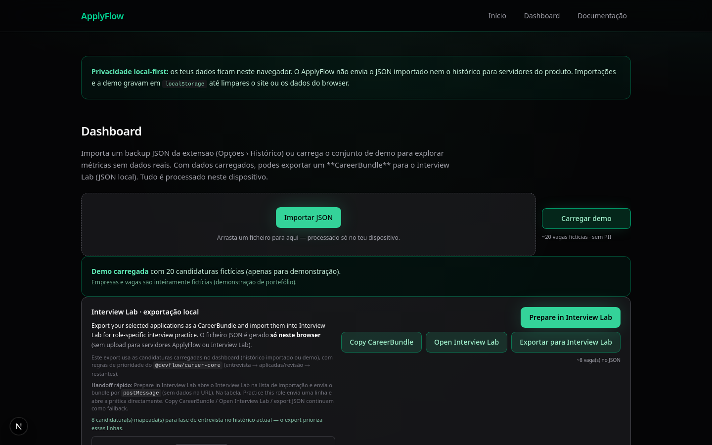
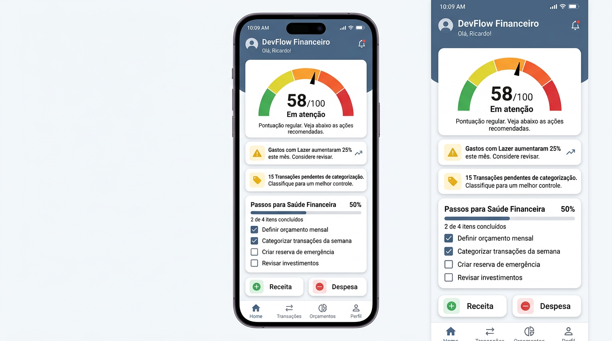
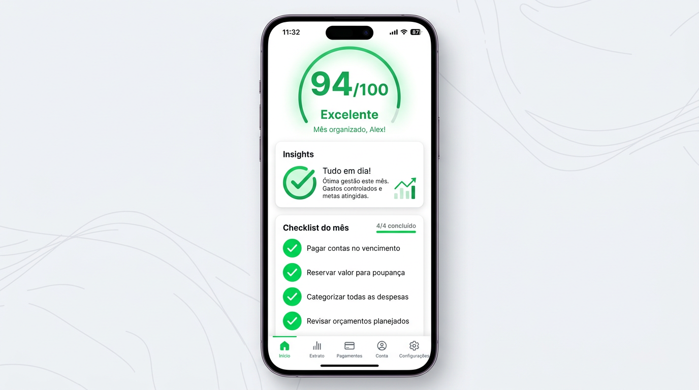

# DevFlow

**Hub central do ecossistema DevFlow** — sob `devflowlabs.com.br`, o foco público atual é **automação de atendimento no WhatsApp** (com demo e páginas de produto) e o **Financeiro** como segunda ferramenta SaaS ativa. O monorepo inclui também a **Career Suite** como case de portfólio de produto e engenharia (ApplyFlow + Interview Lab).

---

## Career Suite — product & engineering case

**One-liner:** Local-first career workflow — organize applications, review provider-derived signals, compose a typed `CareerBundle`, and hand off to Interview Lab — human-reviewed, privacy-first, no auto-apply.

[](docs/career-suite/CAREER-SUITE-PRODUCT-AND-ARCHITECTURE-CASE.md)

| | |
|--|--|
| **Full case** | [`docs/career-suite/CAREER-SUITE-PRODUCT-AND-ARCHITECTURE-CASE.md`](docs/career-suite/CAREER-SUITE-PRODUCT-AND-ARCHITECTURE-CASE.md) |
| **Launch package** | [`docs/career-suite/CAREER-SUITE-PORTFOLIO-LAUNCH-PACKAGE.md`](docs/career-suite/CAREER-SUITE-PORTFOLIO-LAUNCH-PACKAGE.md) |
| **Landing** | [`docs/career-suite/README.md`](docs/career-suite/README.md) |
| **Public narrative** | [`docs/public-cases/CAREER-SUITE.md`](docs/public-cases/CAREER-SUITE.md) |

**Modules:** ApplyFlow · Interview Lab · `@devflow/career-core` · `@devflow/career-sync` · ApplyFlow Extension

**Agent layer (PRs #114–#118):** deterministic, policy-gated stack — `metadata → signals → timeline → orchestrator → tool permission → chat adapter → controlled LLM → approved automation`. See [`docs/career-suite/ARCHITECTURE.md`](docs/career-suite/ARCHITECTURE.md) and the demo [`docs/career-suite/DEMO.md`](docs/career-suite/DEMO.md). Principles: deterministic-first · server-authoritative · human-in-the-loop · no auto-apply · no silent persistence · temporary approvals · LLM without authority · automation without permanent autonomy.

**Trust:** read-only provider-derived lifecycle complete · export/handoff explicit · **Apply deferred** (ADR-003) · **import deferred** (ADR-002)

```bash
pnpm install
pnpm --filter @devflow/career-core build && pnpm --filter @devflow/career-sync build
pnpm --filter applyflow dev                    # http://localhost:3010/dashboard
pnpm --filter @devflow/app-interview-lab dev   # http://localhost:3015
```

**Tests:** 1,045 Vitest tests across Career Suite packages (`career-sync` 443 · `career-core` 54 · `applyflow` 396 · `interview-lab` 152). No ApplyFlow Playwright E2E — see case doc.

---

```
devflowlabs.com.br
├── /                          # Landing — Automação WhatsApp (proposta de valor)
├── /automacao-whatsapp-*      # Páginas de nicho (SEO)
├── /demo                      # Demo interativa (WhatsApp)
├── /produtos/whatsapp-platform
├── /ferramentas/
│   ├── /financeiro            # App Financeiro (Supabase Auth)
│   └── /divisao-de-contas     # Calculadora
├── /pricing , /upgrade        # Planos e checkout (contexto produto)
├── /blog                      # Conteúdo e SEO
├── /admin/metrics             # Métricas internas (growth)
├── /admin/leads               # CRM comercial outbound (interno)
└── /admin/lead-finder         # Atalho Maps → criar lead (interno)
```

Rotas adicionais (ex. `/produtos/funklab-studio`, ferramentas experimentais) podem existir no código; **não** fazem parte do posicionamento de lançamento descrito neste README. Detalhes de rotas: [`docs/ecossistema/ROTAS-ECOSSISTEMA-DEVFLOWLABS.md`](docs/ecossistema/ROTAS-ECOSSISTEMA-DEVFLOWLABS.md).

---

## Stack

| Camada | Tecnologia |
|--------|-----------|
| Framework | Next.js 16 (App Router) |
| UI | React 19 + Tailwind CSS v4 + shadcn/ui |
| Linguagem | TypeScript (strict) |
| ORM | Prisma 6 + PostgreSQL (Supabase) |
| Auth | Supabase Auth (SSR) |
| Pagamentos | Stripe (Checkout + Webhooks) |
| WhatsApp | Meta Cloud API (webhook + robô) |
| Testes | Vitest |
| Deploy | Vercel |

---

## Início rápido

```bash
pnpm install
cp .env.example .env.local   # editar com suas credenciais
pnpm db:migrate
pnpm dev
```

Acesse [http://localhost:3000](http://localhost:3000).

Toda a documentação técnica está em **[`docs/README.md`](docs/README.md)** (por produto: financeiro, WhatsApp, shared, etc.).

---

## Scripts

| Comando | Descrição |
|---------|-----------|
| `pnpm dev` | Servidor de desenvolvimento |
| `pnpm build` | Build de produção |
| `pnpm test` | Rodar testes (Vitest) |
| `pnpm test:watch` | Testes em modo watch |
| `pnpm db:migrate` | Criar e aplicar migrations |
| `pnpm db:generate` | Gerar Prisma Client |
| `pnpm deploy:preview` | Deploy preview (Vercel) |
| `pnpm deploy:prod` | Deploy produção (Vercel) |

---

## Variáveis de ambiente

Copie `.env.example` para `.env.local`:

### Supabase / Banco
```env
NEXT_PUBLIC_SUPABASE_URL=
NEXT_PUBLIC_SUPABASE_PUBLISHABLE_DEFAULT_KEY=
DATABASE_URL=          # pooler porta 6543 (runtime)
DIRECT_URL=            # conexão direta porta 5432 (migrations)
```

### Stripe (Pagamentos)
```env
STRIPE_SECRET_KEY=         # sk_live_... (produção)
STRIPE_TEST_SECRET_KEY=    # sk_test_... (dev — usa automaticamente)
STRIPE_WEBHOOK_SECRET=     # whsec_... do endpoint cadastrado
STRIPE_PRICE_PRO=          # price_... live plano PRO
STRIPE_PRICE_TEAM=         # price_... live plano TEAM
STRIPE_TEST_PRICE_PRO=     # price_... teste plano PRO
STRIPE_TEST_PRICE_TEAM=    # price_... teste plano TEAM
```

### WhatsApp Cloud API
```env
WHATSAPP_ACCESS_TOKEN=
WHATSAPP_PHONE_NUMBER_ID=
WHATSAPP_BUSINESS_ACCOUNT_ID=
WHATSAPP_VERIFY_TOKEN=
WHATSAPP_DEMO_MODE=false
```

### Outros
```env
NEXT_PUBLIC_WHATSAPP_NUMBER=      # Número público (botões wa.me)
NEXT_PUBLIC_META_PIXEL_ID=        # Meta Pixel
ADMIN_METRICS_SECRET=             # Proteção /api/admin/metrics e rotas admin sensíveis (ex.: leads) em produção
```

---

## Produto 1 — WhatsApp Platform (foco principal)

Robô e operação de atendimento via **WhatsApp Cloud API**, com narrativa no portal e produto canónico no app `whatsapp-platform`:

- Fluxo conversacional configurável e handoff humano
- Demo em `/demo` e páginas de nicho para SEO
- Meta Pixel (PageView, ViewContent, Contact) onde configurado

**Visão de produto:** [`docs/whatsapp/WHATSAPP-PLATFORM-OVERVIEW.md`](docs/whatsapp/WHATSAPP-PLATFORM-OVERVIEW.md) · **Setup técnico:** [`docs/whatsapp/WHATSAPP-SETUP.md`](docs/whatsapp/WHATSAPP-SETUP.md)

### CRM comercial interno (portal)

Ferramentas **internas** no mesmo Next da raiz (acesso restrito):

- **`/admin/leads`** — lista, funil, follow-up derivado, templates WhatsApp, conversão e `conversationRef`
- **`/admin/lead-finder`** — atalho Google Maps + criação rápida com origem `lead_finder_google_maps`

Documentação: [`docs/crm/README.md`](docs/crm/README.md)

---

## Case de portfólio — ApplyFlow

**ApplyFlow** é um copiloto **local-first** / **privacy-first** para candidaturas no **LinkedIn Easy Apply**, com **dashboard Next.js**, **extensão Chrome MV3**, histórico local, import/export JSON, métricas, documentação e **IA opt-in**. É um **case de produto autoral** dentro deste monorepo — **não** faz parte do go-to-market público actual do hub `devflowlabs.com.br` (WhatsApp + Financeiro acima).

- **Sem backend ApplyFlow obrigatório** no MVP · **sem auto-submit** · dados no **navegador** (`chrome.storage.local` na extensão, `localStorage` no dashboard após import).

**Onde aprofundar**

| | |
|--|--|
| Dashboard | [`apps/applyflow/README.md`](apps/applyflow/README.md) |
| Extensão | [`apps/applyflow-extension/README.md`](apps/applyflow-extension/README.md) |
| Documentação de produto | [`docs/applyflow/`](docs/applyflow/) |
| Screenshots oficiais | [`docs/applyflow/assets/README.md`](docs/applyflow/assets/README.md) |

### DevFlow Career Suite

**ApplyFlow** organiza candidaturas; **Interview Lab** prepara entrevistas. Integração **local-first** via **`CareerBundle`** JSON (`@devflow/career-core`).

| Documento | Conteúdo |
|-----------|----------|
| **Case completo** | [`docs/career-suite/CAREER-SUITE-PRODUCT-AND-ARCHITECTURE-CASE.md`](docs/career-suite/CAREER-SUITE-PRODUCT-AND-ARCHITECTURE-CASE.md) |
| Landing Career Suite | [`docs/career-suite/README.md`](docs/career-suite/README.md) |
| Case público (recruiters) | [`docs/public-cases/CAREER-SUITE.md`](docs/public-cases/CAREER-SUITE.md) |

Provider-derived enrichment: read-only até export/handoff. Apply e import **explicitly deferred** (ADR-002, ADR-003).

---

## Outros produtos no monorepo (não foco do lançamento público actual)

O repositório inclui, além do **ApplyFlow** (case de portfólio — ver secção anterior), apps e documentação para **Investigamais** (CNPJ / BI, produto com repositório próprio) e **FunkLab** (experiências musicais). Mantêm utilidade técnica e histórico; **não** entram na mensagem principal de go-to-market do hub neste momento.

- ApplyFlow: [`docs/applyflow/ARCHITECTURE.md`](docs/applyflow/ARCHITECTURE.md) · pacotes `packages/applyflow-core`, `packages/applyflow-linkedin`  
- Investigamais: [`docs/investigamais/README.md`](docs/investigamais/README.md)  
- FunkLab (`apps/funklab`): [`apps/funklab/README.md`](apps/funklab/README.md)

---

## Produto 2 — Ferramentas Financeiras

### 💰 Financeiro — Smart Dashboard

Sistema de controle financeiro com **leitura instantânea** do mês:

- **Score** (0–100) — organização do período num único número + faixa
- **Insights automáticos** — receitas faltando, gastos fora do padrão, dados desatualizados
- **Checklist de fechamento** — passos claros até o mês “fechado” na cabeça

#### Destaques técnicos

- Motores **determinísticos** (sem IA no núcleo)
- **Consistência** entre score, insights e checklist (testada)
- Navegação com **retomada** (última ação / contexto no dispositivo)
- **Mobile-first** no dashboard operacional

#### Screenshots (mockups de produto — mobile)

| Vazio / primeiro uso | Em progresso | Organizado |
|----------------------|--------------|------------|
|  |  |  |

Arquivos: [`estado-1-vazio.png`](docs/financeiro/screenshots/estado-1-vazio.png) · [`estado-2-em-progresso.png`](docs/financeiro/screenshots/estado-2-em-progresso.png) · [`estado-3-organizado.png`](docs/financeiro/screenshots/estado-3-organizado.png) — contexto em [`docs/financeiro/screenshots/README.md`](docs/financeiro/screenshots/README.md).

#### Resultado

Transforma **dados financeiros** em **decisões rápidas** — menos telas, mais clareza.

**Live:** [`devflowlabs.com.br/ferramentas/financeiro`](https://devflowlabs.com.br/ferramentas/financeiro) · **README produto:** [`apps/financeiro/README.md`](apps/financeiro/README.md) · **Changelog:** [`docs/financeiro/CHANGELOG.md`](docs/financeiro/CHANGELOG.md)

---

### O que é o Financeiro (resumo)

O Financeiro da DevFlow não é apenas um controle de gastos. É um sistema que:

- resume seu mês em um **score** claro
- mostra o que precisa de atenção com **insights** objetivos
- guia suas ações com um **checklist** simples

**Em menos de 1 minuto, você entende seu financeiro e sabe o que fazer.**

Narrativa completa, pilares e roteiro de demo na landing: [`/ferramentas/financeiro`](https://devflowlabs.com.br/ferramentas/financeiro).

---

App SaaS completo de gestão financeira pessoal e familiar:

- **Dashboard** — score de saúde do mês, insights, checklist, resumo mensal e projeção de fluxo de caixa
- **Despesas / Rendas / Fontes** — controle completo
- **Regras de rateio** — divisão automática por percentual ou valor fixo
- **Casas (Households)** — multi-casa com convites por e-mail
- **Ciclos** — periodos de controle por mês/ano
- **Simulador público** — ferramenta de atração no `/ferramentas/financeiro`

### Arquitetura do produto Financeiro

**Canónico:** `apps/financeiro/src/modules/financeiro/` — services, adapters, events, schemas, UI do produto, APIs de dados.

**Portal (raiz):** `src/modules/financeiro/` — apenas aquisição (landing `/ferramentas/financeiro`, leads, simulador público, cookies de navegação); Prisma do schema raiz do portal em `src/lib/prisma-root.ts` (não confundir com a BD do app).

Documentação: [`docs/financeiro/FINANCEIRO-MODULE-ARCHITECTURE.md`](docs/financeiro/FINANCEIRO-MODULE-ARCHITECTURE.md)

---

## Billing / Planos

| Plano | Casas | Regras | Features |
|-------|-------|--------|----------|
| FREE | 1 | 3 | — |
| PRO | 5 | 50 | Regras avançadas, Exports, Analytics |
| TEAM | 20 | 500 | Todas |

Integração Stripe com arquitetura substituível (Lemon, Paddle, Mercado Pago):

```bash
# Testar pagamento localmente
stripe listen --forward-to localhost:3000/api/billing/webhook
```

Documentação: [`docs/shared/DEVFLOW-PAYMENTS.md`](docs/shared/DEVFLOW-PAYMENTS.md)

---

## Growth Analytics

Pipeline de métricas do funil de aquisição completo (em memória, preparado para ferramenta externa):

```
visitor_landed → simulator_used → lead_submitted → signup → household_created → first_expense
```

Dashboard interno: `http://localhost:3000/admin/metrics`. CRM de leads: `/admin/leads` (ver [`docs/crm/README.md`](docs/crm/README.md)).

Documentação: [`docs/shared/DEVFLOW-GROWTH-ANALYTICS.md`](docs/shared/DEVFLOW-GROWTH-ANALYTICS.md)

---

## Testes

```bash
pnpm test
```

A contagem de testes **varia** por app e pacote; para o número actual no teu clone, corre `pnpm test` ou `pnpm test:workspace` (Vitest em todo o monorepo, quando configurado).

---

## Deploy

Recomendado: **Vercel**

```bash
pnpm deploy:preview   # preview (branch / PR)
pnpm deploy:prod      # produção
```

Após deploy, registre o webhook Stripe no Dashboard:
```
https://seu-dominio.vercel.app/api/billing/webhook
```

Documentação: [`docs/shared/DEPLOYMENT.md`](docs/shared/DEPLOYMENT.md)

---

## Documentação

**Índice completo:** [`docs/README.md`](docs/README.md) · rotas do ecossistema: [`docs/ecossistema/ROTAS-ECOSSISTEMA-DEVFLOWLABS.md`](docs/ecossistema/ROTAS-ECOSSISTEMA-DEVFLOWLABS.md)

| Arquivo | Conteúdo |
|---------|----------|
| [`docs/whatsapp/WHATSAPP-PLATFORM-OVERVIEW.md`](docs/whatsapp/WHATSAPP-PLATFORM-OVERVIEW.md) | Visão de produto WhatsApp (lançamento) |
| [`docs/crm/README.md`](docs/crm/README.md) | CRM `/admin/leads` e Lead Finder |
| [`docs/shared/ARQUITETURA-FERRAMENTAS-DEVFLOW.md`](docs/shared/ARQUITETURA-FERRAMENTAS-DEVFLOW.md) | DevFlow como hub de ferramentas |
| [`docs/financeiro/FINANCEIRO-MODULE-ARCHITECTURE.md`](docs/financeiro/FINANCEIRO-MODULE-ARCHITECTURE.md) | Arquitetura do módulo financeiro |
| [`docs/financeiro/FINANCEIRO-API-MAP.md`](docs/financeiro/FINANCEIRO-API-MAP.md) | Mapa de todas as APIs |
| [`docs/financeiro/FINANCEIRO-DATA-MODEL.md`](docs/financeiro/FINANCEIRO-DATA-MODEL.md) | Modelo de dados |
| [`docs/financeiro/FINANCEIRO-DOMAIN-EVENTS.md`](docs/financeiro/FINANCEIRO-DOMAIN-EVENTS.md) | Sistema de domain events |
| [`docs/financeiro/FINANCEIRO-FEATURE-STANDARD.md`](docs/financeiro/FINANCEIRO-FEATURE-STANDARD.md) | Padrão para novas features |
| [`docs/financeiro/FINANCEIRO-APP-VS-GROWTH.md`](docs/financeiro/FINANCEIRO-APP-VS-GROWTH.md) | Separação app vs. growth |
| [`docs/financeiro/FINANCEIRO-PRODUCT-ANALYTICS.md`](docs/financeiro/FINANCEIRO-PRODUCT-ANALYTICS.md) | Product analytics |
| [`docs/financeiro/CHANGELOG.md`](docs/financeiro/CHANGELOG.md) | Changelog do Financeiro |
| [`docs/financeiro/FINANCEIRO-ARCHITECTURE.md`](docs/financeiro/FINANCEIRO-ARCHITECTURE.md) | Motores score / insights / checklist |
| [`docs/financeiro/FINANCEIRO-POSICIONAMENTO.md`](docs/financeiro/FINANCEIRO-POSICIONAMENTO.md) | Posicionamento e mercado |
| [`apps/financeiro/README.md`](apps/financeiro/README.md) | README de produto |
| [`docs/financeiro/FINANCEIRO-PRODUCT-SPEC.md`](docs/financeiro/FINANCEIRO-PRODUCT-SPEC.md) | Especificação do produto |
| [`docs/shared/DEVFLOW-GROWTH-ANALYTICS.md`](docs/shared/DEVFLOW-GROWTH-ANALYTICS.md) | Growth analytics end-to-end |
| [`docs/shared/DEVFLOW-METRICS-DASHBOARD.md`](docs/shared/DEVFLOW-METRICS-DASHBOARD.md) | Dashboard interno de métricas |
| [`docs/shared/DEVFLOW-MONETIZATION.md`](docs/shared/DEVFLOW-MONETIZATION.md) | Camada de monetização |
| [`docs/shared/DEVFLOW-PAYMENTS.md`](docs/shared/DEVFLOW-PAYMENTS.md) | Integração Stripe |
| [`docs/shared/PRISMA-SUPABASE-SETUP.md`](docs/shared/PRISMA-SUPABASE-SETUP.md) | Setup Prisma + Supabase |
| [`docs/financeiro/RELATORIO-PADROES-DESIGN-PARA-FINANCEIRO.md`](docs/financeiro/RELATORIO-PADROES-DESIGN-PARA-FINANCEIRO.md) | Padrões de design |
| [`docs/whatsapp/WHATSAPP-SETUP.md`](docs/whatsapp/WHATSAPP-SETUP.md) | Setup WhatsApp Cloud API |
| [`docs/shared/META_ADS.md`](docs/shared/META_ADS.md) | Configuração Meta Pixel / Meta Ads |
| [`docs/shared/DEPLOYMENT.md`](docs/shared/DEPLOYMENT.md) | Deploy Vercel |

---

## Licença

Projeto privado — DevFlow.
