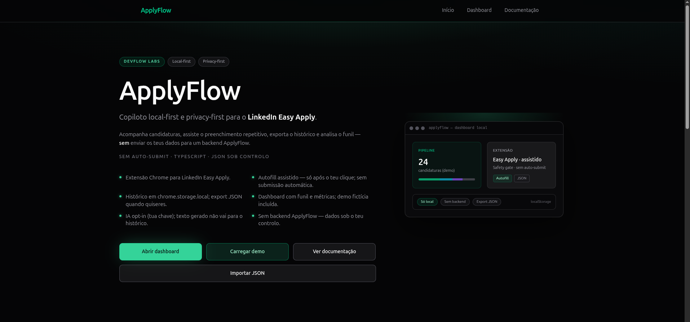
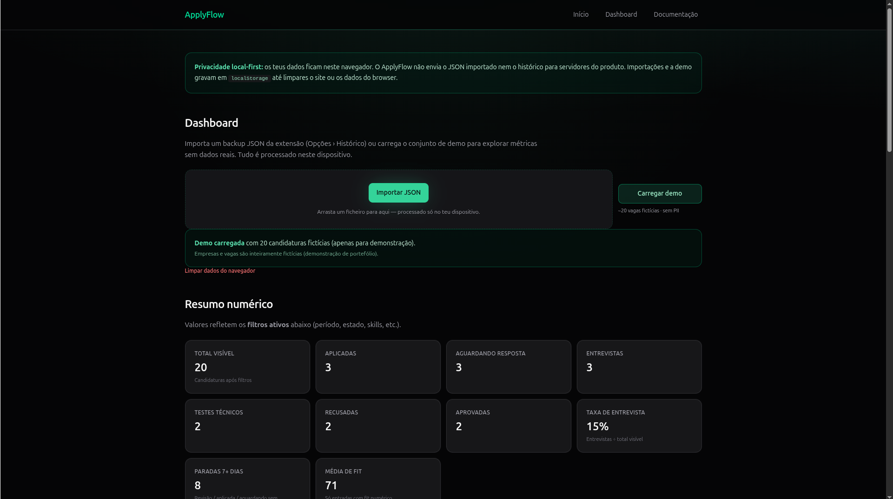
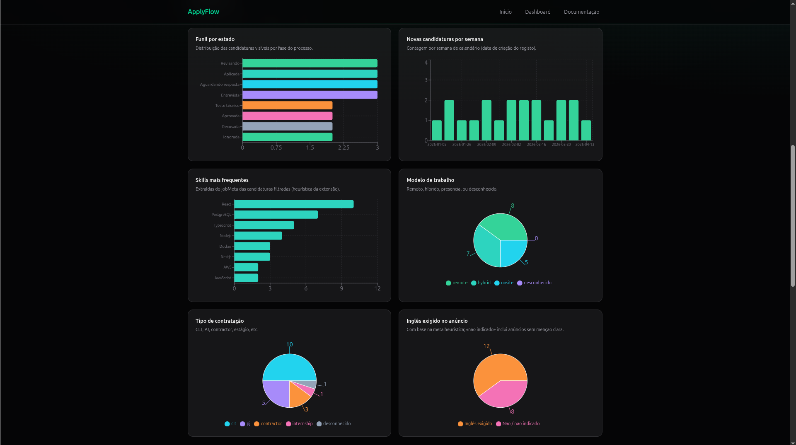
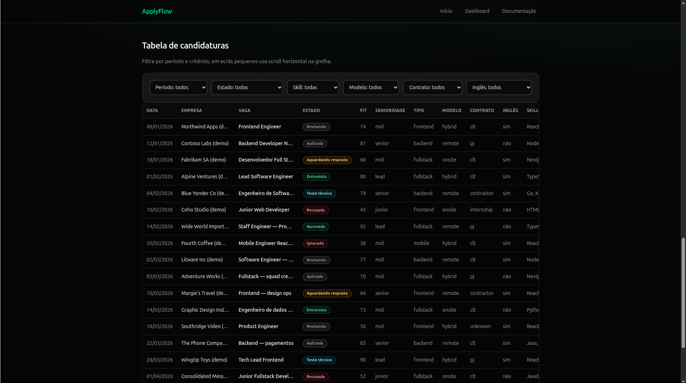
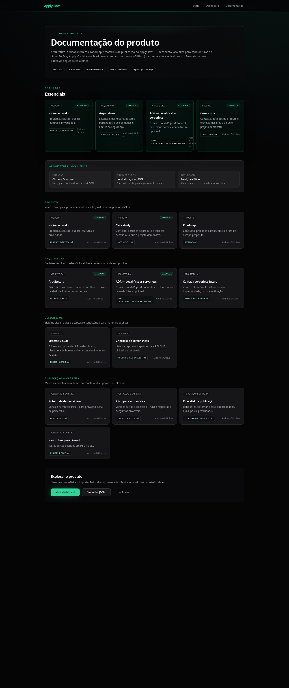
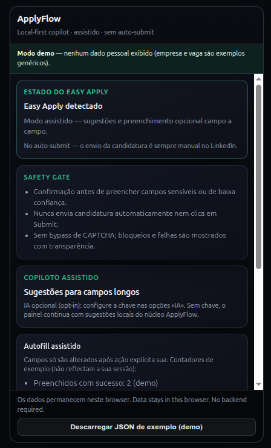

# ApplyFlow

**Copiloto local-first / privacy-first para candidaturas no LinkedIn Easy Apply** — produto autoral no monorepo **DevFlow Labs**: **dashboard Next.js** para análise no browser, **extensão Chrome (MV3)** para o fluxo no LinkedIn, pacotes TypeScript partilhados e documentação de produto em `docs/applyflow/`.



*Sem backend ApplyFlow obrigatório · sem auto-submit · dados no dispositivo · IA apenas opt-in.*

### Leitura rápida

| Pergunta | Resposta curta |
|----------|----------------|
| **O que é?** | Copiloto **local-first** / **privacy-first** para **LinkedIn Easy Apply**: extensão MV3 + dashboard Next.js no monorepo **DevFlow Labs**. |
| **Porque existe?** | Reduzir repetição no Easy Apply e dispersão do histórico **sem** mass apply, auto-submit nem SaaS obrigatório com os teus dados. |
| **Como corro?** | `pnpm install` → `pnpm --filter @devflow/applyflow-core build` → `pnpm --filter applyflow dev` (ver secção «Correr localmente»). Extensão: `apps/applyflow-extension/README.md`. |
| **Como valido?** | Comandos na secção **Validação**; gates em [`PUBLICATION_CHECKLIST.md`](../../docs/applyflow/PUBLICATION_CHECKLIST.md). |
| **Privacidade?** | Histórico na extensão em `chrome.storage.local`; dashboard usa `localStorage` após import ou **demo fictícia**; **sem** API ApplyFlow a persistir o teu histórico no MVP. |
| **Fora do escopo do MVP** | Backend obrigatório, sync cloud, login, billing, loja Chrome como *promessa* de produto — ver [`ROADMAP.md`](../../docs/applyflow/ROADMAP.md). |

---

## O que é o ApplyFlow?

O ApplyFlow é um **case de produto** que combina:

1. **Extensão Chrome** — painel no Easy Apply com sugestões, autofill **assistido** (ação tua em cada campo), safety gate, histórico local em `chrome.storage.local`, export JSON e **IA opcional** (chave tua nas opções).
2. **Dashboard web** (`apps/applyflow`) — importas o JSON exportado (ou carregas uma **demo fictícia**), e vês funil, métricas, tabelas e filtros **só no browser** (`localStorage` após import).

Não existe **servidor ApplyFlow** no caminho crítico do MVP: o dashboard não envia o teu histórico para uma API nossa; a extensão não substitui o envio humano no LinkedIn.

---

## Porque existe

- **Easy Apply** repete perguntas e metadados — desgaste e erros.
- **Histórico disperso** (abas, notas, folhas) dificulta funil e follow-ups.
- Ferramentas agressivas (**mass apply**, **auto-submit**, scraping irresponsável) aumentam risco de política da plataforma e de privacidade.

O ApplyFlow prioriza **controlo**, **transparência** e **dados no dispositivo** em vez de centralizar candidaturas num SaaS obrigatório.

---

## Funcionalidades principais

| Área | O que entrega |
|------|-----------------|
| **Extensão** | Deteção do modal Easy Apply, sugestões alinhadas ao perfil (`@devflow/applyflow-core`), classificação de campos (`@devflow/applyflow-linkedin`), autofill com confirmações, histórico local, opções de perfil e **Preview (captura)** para screenshots sem PII. |
| **Dashboard** | Import / drag-and-drop de JSON, validação com o core, **Carregar demo**, gráficos (Recharts), métricas, tabela filtrável. **Interview Lab · exportação local:** **Prepare in Interview Lab** (lista/importação via `postMessage` + ACK, fallback clipboard), **Practice this role** por linha (prática directa no Interview Lab), **Copy CareerBundle**, **Open Interview Lab**, export JSON. |
| **Documentação** | Rota `/documentacao` — índice com atalhos para Markdown em `docs/applyflow/` no GitHub (arquitectura, ADR, roadmap, checklists). |
| **IA** | **Opt-in** na extensão: só com chave configurada pelo utilizador; não é requisito para o resto do fluxo. |

---

## Screenshots (conjunto oficial)

Os ficheiros abaixo vivem em [`docs/applyflow/assets/`](../../docs/applyflow/assets/) — nomes canónicos para README, portefólio e posts. Índice, nomes exactos e regras de privacidade: [`assets/README.md`](../../docs/applyflow/assets/README.md). Para capturas e vídeo: [`SCREENSHOTS_CHECKLIST.md`](../../docs/applyflow/SCREENSHOTS_CHECKLIST.md) · [`DEMO_SCRIPT.md`](../../docs/applyflow/DEMO_SCRIPT.md).

### 01 — Hero (landing)


### 02 — Dashboard (visão geral)



### 03 — Analytics



### 04 — Tabela de candidaturas



### 05 — Hub de documentação



### 06 — Extensão Chrome (preview controlado)



*O print 6 deve ser obtido na extensão (**Opções → Preview (captura)**), sem depender do DOM do LinkedIn, para material público sem mensagens ou contactos reais.*

---

## Arquitectura

| Caminho | Papel |
|---------|--------|
| [`apps/applyflow`](.) | App **Next.js** (App Router): `/`, `/dashboard`, `/documentacao`; import JSON + demo; persistência em `localStorage`. |
| [`apps/applyflow-extension`](../applyflow-extension) | **Content script** no LinkedIn, **opções** em tab, **service worker** MV3; `chrome.storage.local`; build Vite (`content` + `options`). |
| [`packages/applyflow-core`](../../packages/applyflow-core) | Tipos (`CandidateProfile`), validação, métricas, parse de import — partilhado entre dashboard e extensão. |
| [`packages/applyflow-linkedin`](../../packages/applyflow-linkedin) | Heurísticas / classificação de campos no contexto LinkedIn — consumido sobretudo pela extensão. |
| [`docs/applyflow`](../../docs/applyflow) | Produto, ADR, roadmap, checklists de publicação e **assets** oficiais de screenshot. |

Diagrama lógico:

```
apps/applyflow-extension  →  chrome.storage.local, export JSON (manual)
         │ ficheiro
         ▼
apps/applyflow            →  Next.js, localStorage após import
         ▲
packages/applyflow-core   →  tipos, validação, métricas, filtros
packages/applyflow-linkedin →  domínio LinkedIn / campos
```

Mais detalhe: [`docs/applyflow/ARCHITECTURE.md`](../../docs/applyflow/ARCHITECTURE.md).

### Handoff com Interview Lab (clipboard)

No **dashboard**, o cartão *Interview Lab · exportação local* inclui **Prepare in Interview Lab** (abre o Interview Lab na importação/lista e envia o `CareerBundle` por `postMessage`, com fallback para clipboard), **Practice this role** em cada linha da tabela (bundle de uma vaga + `intent=practice`, abre a prática directamente), **Copy CareerBundle**, **Open Interview Lab** e export **.json**. Opcional no build do ApplyFlow: `NEXT_PUBLIC_INTERVIEW_LAB_URL` (URL base do Interview Lab; default `http://localhost:3015`).

---

## Modelo local-first e privacidade

- **Sem backend ApplyFlow obrigatório** — o MVP não depende de API nossa para histórico ou dashboard.
- **Sem auto-submit** — o envio da candidatura no LinkedIn é **sempre** humano; a extensão não automatiza o clique final de submissão.
- **Dados no navegador** — extensão: `chrome.storage.local`; dashboard: `localStorage` após import ou demo; o JSON exportado é **teu** — trata-o como sensível se tiver candidaturas reais.
- **IA opt-in** — só corre com configuração explícita; não é pilar de privacidade “escondida”.

Leituras: [`ADR-LOCAL_FIRST_VS_SERVERLESS.md`](../../docs/applyflow/ADR-LOCAL_FIRST_VS_SERVERLESS.md) · [`CASE_STUDY.md`](../../docs/applyflow/CASE_STUDY.md).

---

## Stack técnica

- **Next.js 16** · **React 19** · **TypeScript** estrito · **Tailwind CSS v4** · **Recharts**
- **Workspace:** `pnpm` + `@devflow/applyflow-core` + `@devflow/career-core` (build dos pacotes antes do `next build` do dashboard)

---

## Correr localmente (dashboard)

Na raiz do monorepo:

```bash
pnpm install
pnpm --filter @devflow/applyflow-core build
pnpm --filter @devflow/career-core build
pnpm --filter applyflow dev
```

O dev server usa por omissão a porta **3010** — confirma no output do terminal (`next dev --webpack`).

Build e servidor de produção local:

```bash
pnpm --filter @devflow/applyflow-core build
pnpm --filter @devflow/career-core build
pnpm --filter applyflow build
pnpm --filter applyflow start
```

### Middleware e monorepo

Não adicionar `middleware.ts` copiado do portal raiz: este dashboard é **local-first**, sem auth Supabase neste fluxo. O alias `@/` resolve só para `apps/applyflow/src`. O `pnpm dev` usa **webpack** alinhado ao `next build --webpack` para evitar conflitos com o resto do monorepo.

### Overlay «1 issue» / hidratação no `<body>`

Atributos como `cz-shortcut-listen` injectados por **outras extensões** do Chrome podem causar *hydration mismatch* — não vêm do `layout.tsx` do ApplyFlow. Para capturas estáveis: **janela anónima sem extensões** ou `pnpm --filter applyflow build` + `pnpm --filter applyflow start`. Ver [`docs/applyflow/PUBLICATION_CHECKLIST.md`](../../docs/applyflow/PUBLICATION_CHECKLIST.md) e [`SCREENSHOTS_CHECKLIST.md`](../../docs/applyflow/SCREENSHOTS_CHECKLIST.md).

---

## Extensão Chrome

- Código e instruções: [`apps/applyflow-extension/README.md`](../applyflow-extension/README.md).
- Build: `pnpm --filter applyflow-extension build` (gera `dist/` com `content.js`, `options`, `background`).
- **Preview (captura)** nas opções: painel demo para **Print 6** sem dados reais do LinkedIn.

Fluxo típico com o dashboard: exportar JSON nas opções da extensão → **Importar** no `/dashboard` (ou arrastar o ficheiro).

---

## Validação (comandos)

```bash
pnpm --filter @devflow/applyflow-core build
pnpm --filter @devflow/career-core build
pnpm --filter applyflow lint
pnpm --filter applyflow test
pnpm --filter applyflow build
pnpm --filter applyflow-extension test
pnpm --filter applyflow-extension build
```

---

## Demo no dashboard

1. Abre `/dashboard`.
2. **Carregar demo** (dataset público fictício em `public/demo/`).
3. Se já existir import, confirmação antes de substituir.

---

## Interview Lab export (CareerBundle)

Em **`/dashboard`**, com candidaturas carregadas, usa **Interview Lab · exportação local** → **Exportar para Interview Lab** para descarregar um JSON **`CareerBundle`** (`schemaVersion` **1.0**). Requer build de `@devflow/career-core` antes do `next build` / `next dev` do dashboard.

Narrativa completa (fluxo, privacidade, demo script): [`docs/career-suite/README.md`](../../docs/career-suite/README.md) · [`docs/career-suite/DEMO-CHECKLIST.md`](../../docs/career-suite/DEMO-CHECKLIST.md).

---

## Documentação relacionada

| Documento | Conteúdo |
|-----------|------------|
| [`PRODUCT_OVERVIEW.md`](../../docs/applyflow/PRODUCT_OVERVIEW.md) | Visão de produto |
| [`DESIGN_SYSTEM.md`](../../docs/applyflow/DESIGN_SYSTEM.md) | Tokens e UI |
| [`ROADMAP.md`](../../docs/applyflow/ROADMAP.md) | Evolução; **fora de escopo**: auto-submit, mass apply agressivo |
| [`PUBLICATION_CHECKLIST.md`](../../docs/applyflow/PUBLICATION_CHECKLIST.md) | Antes de tornar materiais públicos |
| [`SCREENSHOTS_CHECKLIST.md`](../../docs/applyflow/SCREENSHOTS_CHECKLIST.md) | Conjunto oficial `01`–`06`, rotas, PII e browser limpo |
| [`LINKEDIN_POST.md`](../../docs/applyflow/LINKEDIN_POST.md) | Copy de lançamento (LinkedIn + bloco técnico GitHub) |
| [`ISSUE_28_CLOSE.md`](../../docs/applyflow/ISSUE_28_CLOSE.md) | Texto sugerido para fechar a issue #28 no GitHub |
| [`DEMO_SCRIPT.md`](../../docs/applyflow/DEMO_SCRIPT.md) | Roteiro de vídeo 60–90 s (demo, import, preview, fecho) |
| [`docs/career-suite/README.md`](../../docs/career-suite/README.md) | Ponte JSON ApplyFlow ↔ Interview Lab (local-first) |

---

## Estado do projecto

**MVP técnico** demonstrável: extensão + core + dashboard + testes + documentação. **Não** implica listagem na Chrome Web Store nem deploy público gerido pelo repositório — distribuição conforme build local e políticas da equipa.

---

## Roadmap

[`docs/applyflow/ROADMAP.md`](../../docs/applyflow/ROADMAP.md) — polish, materiais de portefólio; evolução cloud opcional documentada à parte (`SERVERLESS_FUTURE.md`), não como requisito do MVP.

---

## Autoria

**ApplyFlow** é uma peça de produto **DevFlow Labs** no monorepo DevFlow ([README na raiz do repositório](../../README.md); estrutura `apps/*`, `packages/*`). Case autoral focado em **responsabilidade de plataforma**, **privacidade por desenho** e **utilidade sem dependência de servidor**.
