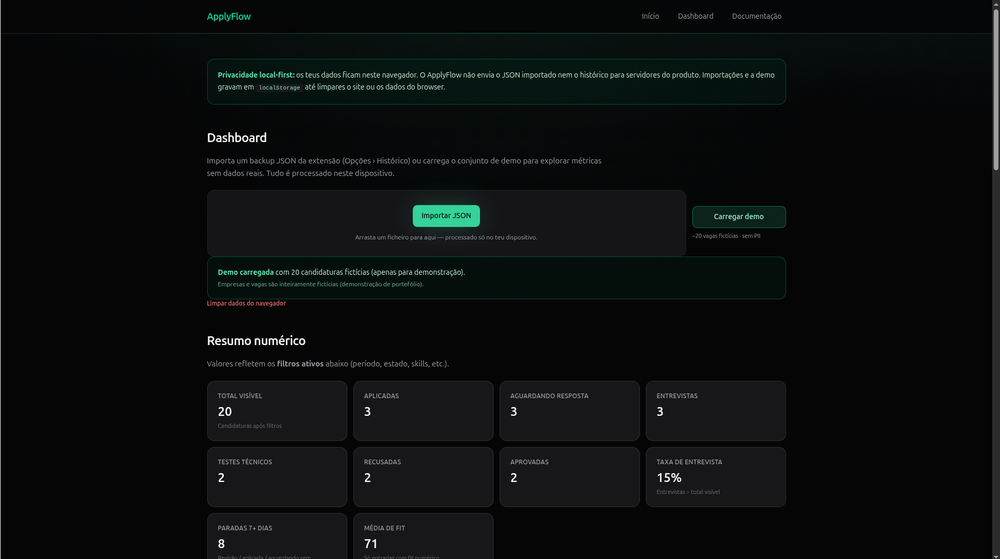
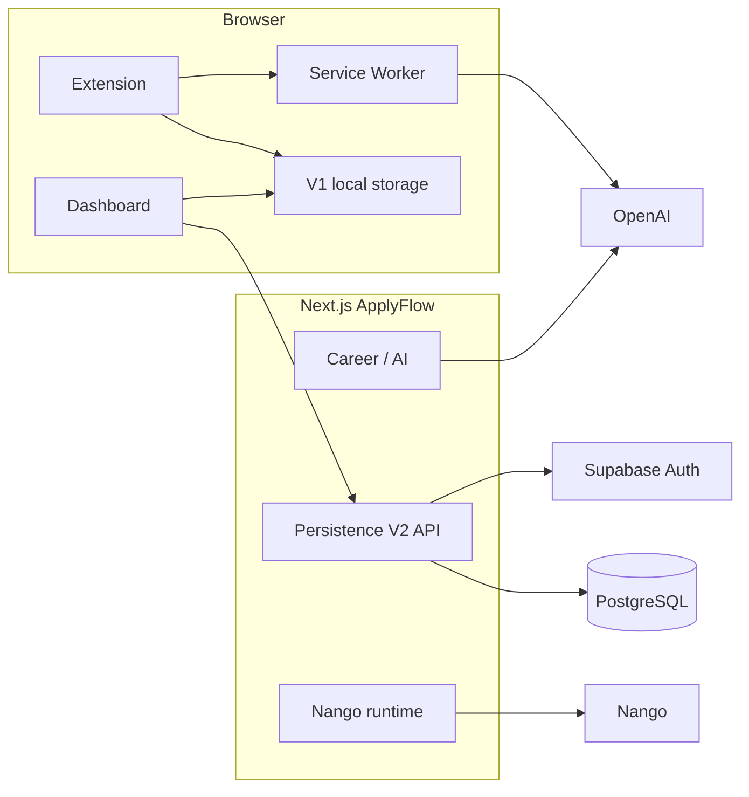
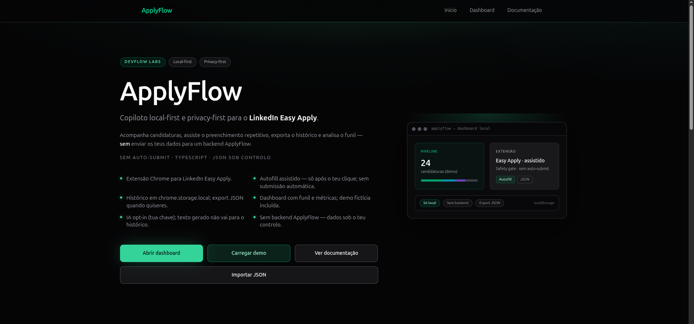
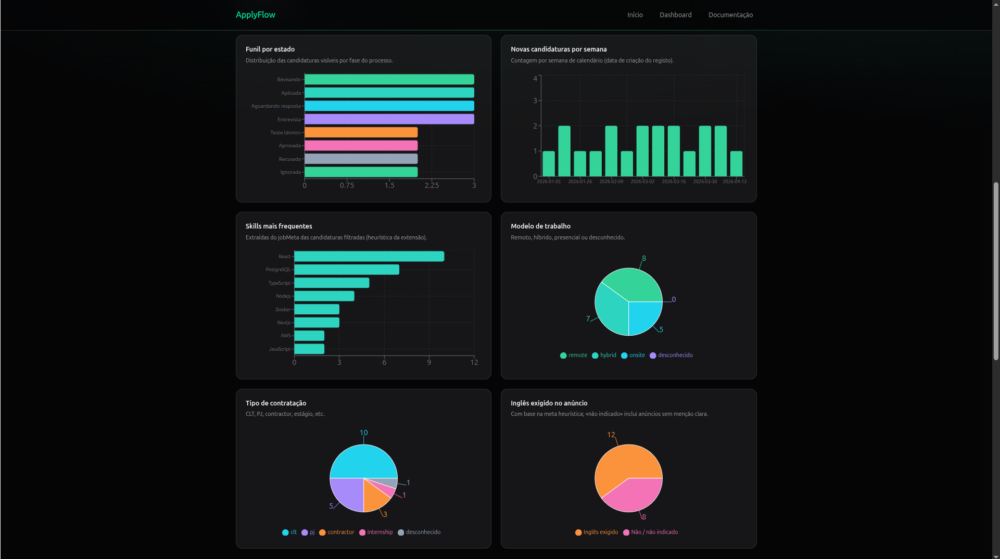
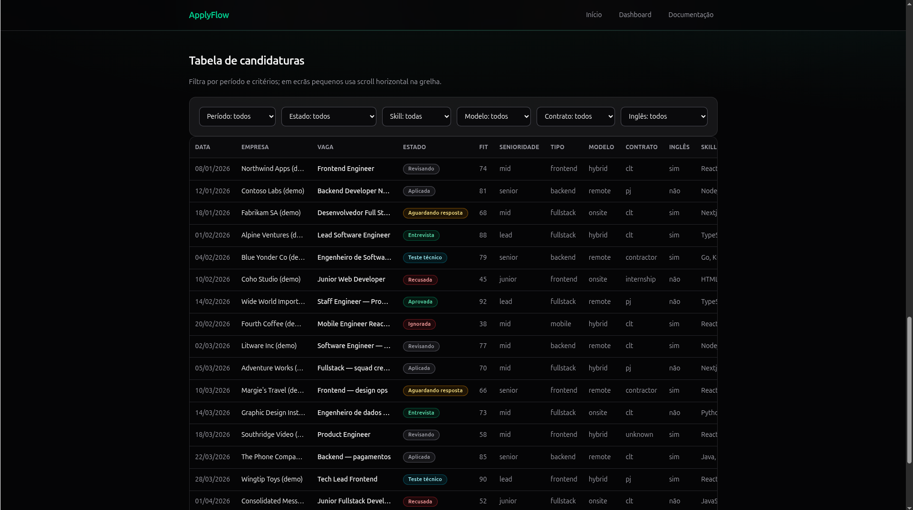
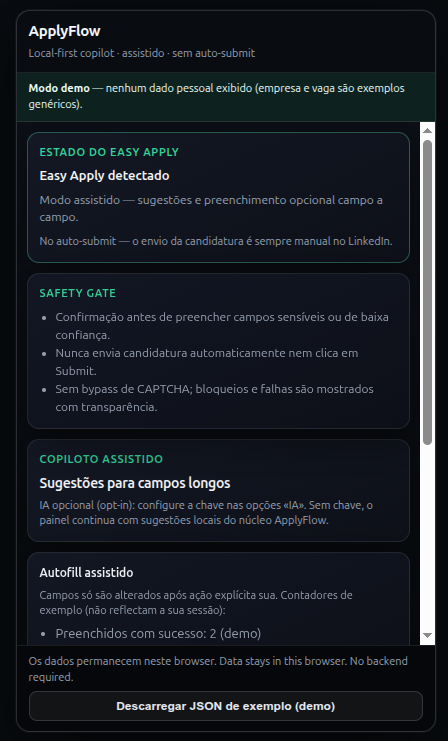

# ApplyFlow

**Local-first Career copiloto for LinkedIn Easy Apply** — Chrome MV3 extension + Next.js dashboard (DevFlow Labs). Human-gated autofill, no mass-apply, no auto-submit. Persistence V2, AI, and provider integrations are documented as an evidence-backed **engineering case**, not as Production readiness.



*Demo data · local-first by default · engineering depth in concurrency, migration, and trust boundaries.*

**Deep dive:** [`docs/applyflow/APPLYFLOW_ENGINEERING_CASE.md`](../../docs/applyflow/APPLYFLOW_ENGINEERING_CASE.md)

---

## What it solves

Easy Apply repeats the same fields. History scatters across tabs and notes. Aggressive tools push mass-apply and auto-submit.

ApplyFlow is a **copilot**, not a bot: suggest and fill **field by field** after your action, keep history on-device by default, and analyze a JSON export (or fictional demo) in the browser.

---

## Product workflow

1. Configure the extension profile (optional opt-in AI key in options).
2. Open a LinkedIn Easy Apply modal → panel suggests / assists fill → **you** submit.
3. Save history locally; export JSON when you want analytics.
4. Import JSON (or **Load demo**) on `/dashboard` → funnel, filters, CareerBundle handoff to Interview Lab.

```text
Extension (local)  --JSON export-->  Dashboard (browser)
        |                                    |
   chrome.storage.local                 localStorage / demo
```

---

## Architecture


```mermaid
flowchart LR
  subgraph Browser
    EXT[Extension]
    SW[Service Worker]
    DASH[Dashboard]
    V1[V1 local storage]
  end
  subgraph Next["Next.js ApplyFlow"]
    V2[Persistence V2 API]
    AI[Career / AI]
    PR[Nango runtime]
  end
  PG[(PostgreSQL)]
  SB[Supabase Auth]
  OAI[OpenAI]
  NG[Nango]

  EXT --> SW
  SW --> OAI
  EXT --> V1
  DASH --> V1
  DASH --> V2
  V2 --> SB
  V2 --> PG
  AI --> OAI
  PR --> NG
```

| Path | Role |
|------|------|
| **V1 local-first** | Default product SoT for extension/dashboard without mandatory cloud |
| **V2 pilot** | Authenticated Jobs/Applications, migration, OCC — see Engineering Case |

---

## Engineering Challenges

| Challenge | Essence |
|-----------|---------|
| **Concurrent Applications** | “Check then create” races; invariant enforced by PostgreSQL partial unique index on `(accountId, sourceJobId)` — local `c2`–`c20` verification |
| **Optimistic concurrency** | `expectedVersion` on PATCH → success or `version_conflict` (no silent lost update in tested paths) |
| **Resumable migration** | Partial durable staging allowed; **V1 stays canonical** until verified promotion; product GET blocked while offering |
| **Extension AI boundary** | Content script requests capability; **service worker** owns OpenAI credential |
| **Account / trust isolation** | Server-derived account; scoped repositories (HTTP auth often mocked in unit tests — see Engineering Case) |

Nango Gmail/Calendar identity is a **browser/device-scoped pilot** (not account sync). Details in the Engineering Case.

---

## Key Architecture Decisions

| Decision | Why | Trade-off |
|----------|-----|-----------|
| Local-first default | Sensitive career data; low friction demo | Manual JSON handoff, not realtime sync |
| DB-enforced `sourceJobId` uniqueness | Survive concurrent creates | Index/migration discipline |
| Partial-resumable migration | Short transactions + resume | Staging may remain (no automatic GC yet) |
| SW-owned OpenAI key | Shrink content-script surface | Storage not claimed encrypted |
| Browser-scoped Nango caller | Honest pilot semantics | No multi-device provider continuity |

ADRs: [partial-resumable migration](../../docs/applyflow/ADR-PERSISTENCE_V2_PARTIAL_RESUMABLE_MIGRATION.md) · [Nango browser-scoped identity](../../docs/applyflow/ADR-NANGO-BROWSER_SCOPED_PROVIDER_IDENTITY.md) · [local-first](../../docs/applyflow/ADR-LOCAL_FIRST_VS_SERVERLESS.md)

---

## Security & Trust Boundaries

- Server-derived ApplyFlow account (never trust client `accountId`)
- Account-scoped repositories / composite ownership
- Offering mode: normal V2 Jobs/Applications **product reads denied** until promotion
- Extension: content ≠ credential owner
- Nango: HttpOnly caller cookie, Origin allowlist; logout ≠ disconnect ≠ Google revoke
- LLM: structured outputs; model output is not product authority

No “zero vulnerabilities” or “Production secure” claim.

---

## AI Engineering

- **Extension:** opt-in user key; SW-owned fetch; fixed provider destination
- **Career path (verified):** structured outputs, no provider tools, server-owned instructions where applicable
- **Interview Lab:** sanitized provider errors (stable taxonomy; no raw upstream body in UI)

Not claimed here: RAG, embeddings, or vector databases.

---

## Validation

| Concern | Evidence |
|---------|----------|
| Concurrent uniqueness | Local PostgreSQL race suite |
| OCC | Service + concurrent patch tests |
| Migration crash/retry | Contract suite |
| Offering authority | HTTP capability + route tests |
| Extension credentials | Content isolation tests |
| Nango caller isolation | Provider-runtime tests |
| LLM / provider errors | Career + Interview Lab suites |

ApplyFlow Vitest (engineering closure measurement): **1283 passed / 22 skipped** — secondary context only.

```bash
pnpm --filter applyflow test
pnpm --filter applyflow-extension test
```

---

## Tech Stack

| Area | Tech |
|------|------|
| Frontend | Next.js (App Router), React, TypeScript, Tailwind, Recharts |
| Extension | Chrome MV3, Vite, content script + service worker |
| Backend | Next.js route handlers, service + repository layers |
| Persistence | Prisma, PostgreSQL (V2 pilot); local storage (V1 default) |
| Auth | Supabase Auth (V2 / account paths) |
| AI | OpenAI (opt-in / Career paths) |
| Integrations | Nango → Gmail/Calendar (pilot) |
| Testing | Vitest |
| Tooling | pnpm workspaces, Turborepo monorepo |

---

## Repository Structure

```text
apps/applyflow/              # Next.js dashboard + Persistence V2 API
apps/applyflow-extension/    # Chrome MV3 extension
apps/interview-lab/          # Interview practice (CareerBundle consumer)
packages/applyflow-core/     # Shared types, validation, metrics
packages/career-core/        # CareerBundle contracts
packages/career-sync/        # Sync / provider-derived contracts
docs/applyflow/              # Product + engineering case + ADRs + screenshots
```

---

## Running Locally

From the monorepo root:

```bash
pnpm install
pnpm --filter @devflow/applyflow-core build
pnpm --filter @devflow/career-core build
pnpm --filter applyflow dev          # http://localhost:3010
```

**Tests / build**

```bash
pnpm --filter applyflow test
pnpm --filter applyflow build
pnpm --filter applyflow-extension build
pnpm --filter applyflow-extension test
```

**Persistence V2 (optional pilot)** — see `apps/applyflow/.env.example` (`DATABASE_URL`, `DIRECT_URL`, `APPLYFLOW_PERSISTENCE_V2`, Supabase, `NANGO_SECRET_KEY`, `OPENAI_API_KEY`). Local DB helpers: `pnpm --filter applyflow db:up`, `db:migrate`, `db:generate`. Never point destructive tests at Production.

**Extension:** [`apps/applyflow-extension/README.md`](../applyflow-extension/README.md)

---

## Screenshots

| | |
|--|--|
| Landing |  |
| Dashboard |  |
| Analytics |  |
| Applications |  |
| Extension preview |  |

Use **Options → Preview (captura)** for extension shots — no real LinkedIn DOM / API keys. Index: [`docs/applyflow/assets/README.md`](../../docs/applyflow/assets/README.md).

---

## Current Limitations

- No exactly-once / all-or-nothing migration guarantee
- Staging GC not implemented
- Nango pilot is browser/device-scoped (not multi-device account Gmail)
- Multi-replica behavior not established
- Real Nango sandbox / dual-session Supabase isolation not part of the published case evidence
- Dependency and operational hardening = **Production Readiness backlog**
- **Production readiness is not claimed**

---

## Engineering Case Status

| | |
|--|--|
| **Engineering case** | **READY** |
| **Production readiness** | **Not claimed** |

Architecture ADRs, automated tests, and local PostgreSQL concurrency evidence support the engineering narrative. Shipping as operated Production SaaS is a separate backlog.

---

## Author

**Gustavo Marques** · Senior Full Stack / Product Engineer · **DevFlow Labs**

ApplyFlow lives in the DevFlow monorepo ([root README](../../README.md)): product ownership, architecture trade-offs, failure modes, and validation—not “another CRUD demo.”
