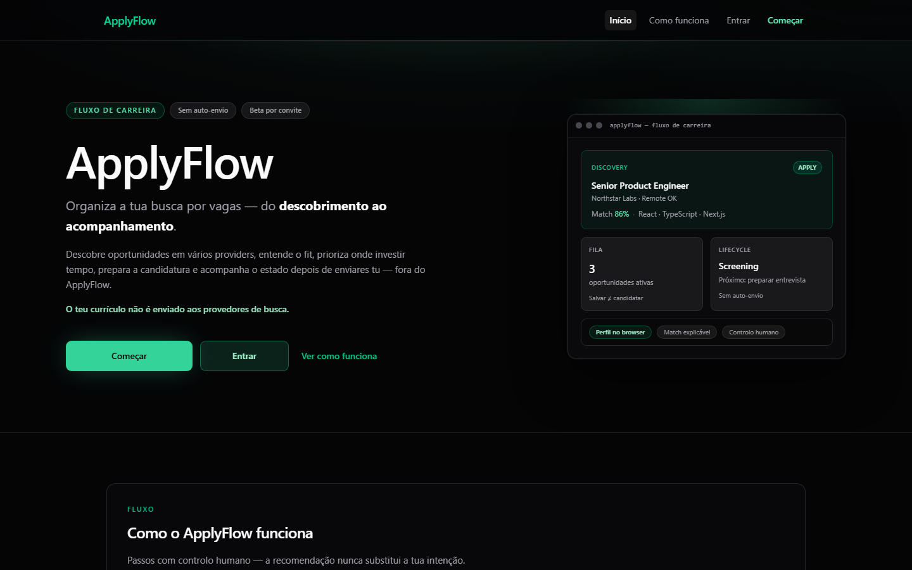
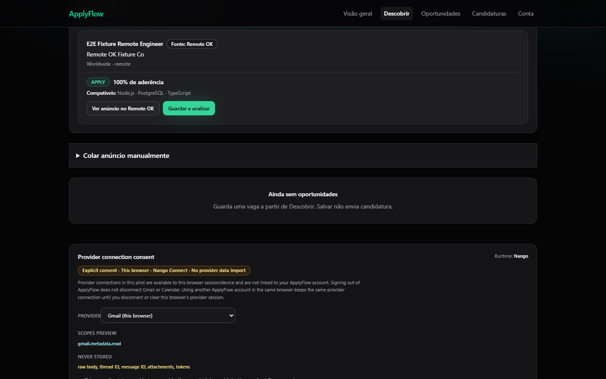
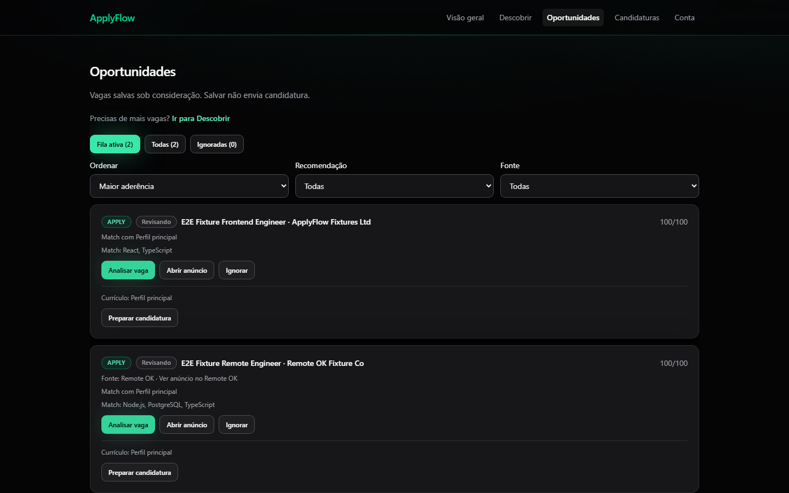
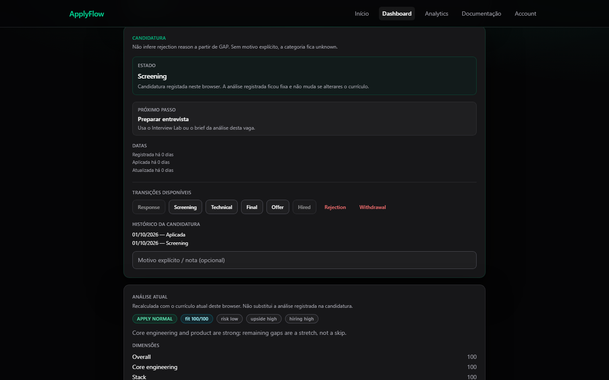

# ApplyFlow

Local-first career workflow for discovering opportunities, evaluating fit, prioritizing jobs, preparing applications, and tracking their lifecycle — with optional authenticated V2 cloud persistence for invite-only closed beta.

**Status:** Closed Beta — Invite Only · **Public signup is not approved.** Paid production SaaS is not claimed. Capacity technically approved for **10–50** invitees (not a claim of that many active users).

Start here (~3 minutes). Case study: [`docs/applyflow/CASE_STUDY.md`](../../docs/applyflow/CASE_STUDY.md) · Docs index: [`docs/applyflow/README.md`](../../docs/applyflow/README.md).



---

## What it does

ApplyFlow helps a candidate:

1. Search job providers (Jobgether, Remote OK; TheirStack only when explicitly enabled and never by default on shared deploy)
2. Preview fit with a **deterministic, local Match Engine** (not an LLM)
3. Explicitly save a job into an opportunity queue
4. Check application readiness (derived guidance)
5. Register an application, mark it sent after a real external submit, then track lifecycle

It does **not** auto-apply, auto-submit, or send CV/profile to discovery providers.

---

## Product flow

```text
Discovery → Match Preview → Explicit Save → Opportunity Queue
  → Application Readiness → Register Application → Mark Sent
  → Application Lifecycle → Derived Next Action
```

| Step | Meaning |
|------|---------|
| Preview | Transient fit only — **does not persist** |
| Save | Creates/updates **Job**, not Application |
| Match decision | Advisory (`apply` / `stretch` / `needs_info` / `skip`) — not user intent |
| Register | Creates **Application** locally/cloud — does **not** submit externally |
| Mark sent | User asserts external submission happened |
| Next action | Derived UI guidance — **not persisted**, not a task/scheduler |

Full detail: [`PRODUCT_FLOW.md`](../../docs/applyflow/PRODUCT_FLOW.md).







More surfaces (readiness, applications table, architecture): [`docs/applyflow/assets/`](../../docs/applyflow/assets/) · [`CASE_STUDY.md`](../../docs/applyflow/CASE_STUDY.md).

---

## Why it exists

Aggressive job tools push volume and auto-submit. ApplyFlow separates **recommendation** from **human intent**, keeps sensitive resume data local by default, and treats Jobs and Applications as different domain objects.

---

## Core capabilities

- Multi-provider discovery adapters (server-side secrets only)
- Deterministic Match Engine (`@devflow/applyflow-core`)
- Derived opportunity queue (`Job.status === reviewing`) — no Shortlist entity
- Application readiness checklist (guidance, not a hard gate)
- Canonical application lifecycle + Job sync
- Local-first persistence **and** V2/Postgres (pilot)
- Chrome extension path for LinkedIn Easy Apply assist (companion; no auto-submit)

---

## Architecture (short)

```text
Browser
 ├─ Resume / profile (local)
 ├─ Overview · Discover · Opportunities · Applications
 ├─ Local persistence (default)
 └─ V2 API (pilot) → PostgreSQL (tenant-scoped, OCC)
```


Canonical design: [`ARCHITECTURE.md`](../../docs/applyflow/ARCHITECTURE.md) · UX/IA: [`PRODUCT_UX_IA.md`](../../docs/applyflow/PRODUCT_UX_IA.md).

---

## Tech stack

Next.js App Router · React · TypeScript · Tailwind · Prisma/PostgreSQL (V2) · Supabase Auth (V2) · Vitest · Playwright · pnpm monorepo.

---

## Privacy model

CV/profile stay in the browser for discovery and matching. Search requests carry filters only — **not** resume text. Provider API keys are server-only. See [`PRIVACY_SECURITY.md`](../../docs/applyflow/PRIVACY_SECURITY.md).

---

## Providers

| Provider | Closed-beta posture |
|----------|---------------------|
| Jobgether | Default free discovery |
| Remote OK | Cached catalog; attribution required |
| TheirStack | Credit-based; **disabled on shared Vercel** without distributed limiter |

Details: [`JOB_DISCOVERY.md`](../../docs/applyflow/JOB_DISCOVERY.md).

---

## Local-first vs V2

| | Local-first | V2 / cloud |
|--|-------------|------------|
| Auth | Optional for many flows | Required; server-derived account |
| Jobs / Applications | Browser storage | PostgreSQL, tenant-scoped |
| Resume / profile | Local | Still local (browser) |
| Gate | Default | `APPLYFLOW_PERSISTENCE_V2` + `pilotEligible` + activation |

V2 is a **persistence mode**, not “sync everything.”

---

## Quality / testing

Latest cited baseline (**commit `f599ea03`** — UI consolidation; product semantics aligned with prior closed-beta gate):

| Layer | Result |
|-------|--------|
| `@devflow/applyflow-core` | 475 passed |
| ApplyFlow Vitest | 1419 passed (30 skipped) |
| Local Playwright E2E | 2 passed |
| V2 Playwright E2E | 2 passed (Account A persistence, B isolation, pilot gate, TheirStack off) |
| Typecheck / lint / build | PASS |

Re-validate after material code changes. See [`TESTING.md`](../../docs/applyflow/TESTING.md).

---

## Closed-beta status

- **Approved:** invite-only 10–50 users (operator-owned backups, TheirStack OFF shared, pilot gate, error DSN operator action)
- **Not approved:** public signup, paid production

Ops: [`CLOSED_BETA_RUNBOOK.md`](../../docs/applyflow/CLOSED_BETA_RUNBOOK.md) · readiness: [`PRODUCTION_READINESS.md`](../../docs/applyflow/PRODUCTION_READINESS.md).

---

## Engineering highlights

- Local-first privacy boundary (CV not on discovery provider payloads)
- Multi-provider discovery adapter architecture
- Deterministic Match Engine (not an LLM)
- Tenant-scoped V2 persistence + cross-tenant E2E
- OCC + transactional Application↔Job lifecycle
- Playwright local / V2 E2E
- TheirStack shared-host fail-safe
- Backup/restore drill + closed-beta release gates

---

## Trade-offs

| Decision | Why | Cost |
|----------|-----|------|
| Local CV by default | Privacy / low friction | Cloud convenience limited for resume |
| TheirStack OFF shared | Avoid multi-instance credit burn without Redis | Richer discovery unavailable on shared hosts |
| Derived queue / readiness | Fewer entities, clearer Job vs Application | No persisted Shortlist/Preparation |
| Match ≠ intent | Humans control lifecycle | Extra UI education |
| Current-state cloud lifecycle | Smaller schema | No server event timeline yet |
| Explicit Mark Sent | No auto-apply | User must confirm external submit |
| Provider-specific URLs | Honest contracts | `directApplyUrl` not always available |

---

## Running locally

### Quick start (local-first)

```bash
pnpm install
pnpm --filter @devflow/applyflow-core build
pnpm --filter @devflow/career-core build
pnpm --filter @devflow/career-sync build
pnpm --filter applyflow dev          # http://localhost:3010
```

Copy `apps/applyflow/.env.example` → `.env.local` as needed. Discovery fixtures for E2E are separate from day-to-day use.

### Tests

```bash
pnpm --filter @devflow/applyflow-core test
pnpm --filter applyflow test
pnpm --filter applyflow test:e2e
```

### V2 / Postgres (optional)

```bash
pnpm --filter applyflow db:up
pnpm --filter applyflow db:migrate   # force-local Docker 127.0.0.1:5434
pnpm --filter applyflow test:e2e:v2
```

Never point destructive scripts at production databases.

### Extension

See [`apps/applyflow-extension/README.md`](../applyflow-extension/README.md).

---

## Screenshots & demo

| Asset | Surface |
|-------|---------|
| [`applyflow-landing.png`](../../docs/applyflow/assets/applyflow-landing.png) | Landing |
| [`applyflow-discovery.png`](../../docs/applyflow/assets/applyflow-discovery.png) | Discovery + match |
| [`applyflow-queue.png`](../../docs/applyflow/assets/applyflow-queue.png) | Opportunity queue |
| [`applyflow-readiness.png`](../../docs/applyflow/assets/applyflow-readiness.png) | Readiness |
| [`applyflow-lifecycle.png`](../../docs/applyflow/assets/applyflow-lifecycle.png) | Lifecycle |
| [`applyflow-applications.png`](../../docs/applyflow/assets/applyflow-applications.png) | Applications |
| [`applyflow-architecture.svg`](../../docs/applyflow/assets/applyflow-architecture.svg) | Architecture |

Asset index: [`docs/applyflow/assets/README.md`](../../docs/applyflow/assets/README.md) · demo script: [`DEMO_SCRIPT.md`](../../docs/applyflow/DEMO_SCRIPT.md).

---

## Documentation index

| Doc | Purpose |
|-----|---------|
| [`docs/applyflow/README.md`](../../docs/applyflow/README.md) | Index |
| [`CASE_STUDY.md`](../../docs/applyflow/CASE_STUDY.md) | Portfolio case study |
| [`PRODUCT_FLOW.md`](../../docs/applyflow/PRODUCT_FLOW.md) | End-to-end domain flow |
| [`ARCHITECTURE.md`](../../docs/applyflow/ARCHITECTURE.md) | System design |
| [`JOB_DISCOVERY.md`](../../docs/applyflow/JOB_DISCOVERY.md) | Providers, match, queue, readiness |
| [`APPLICATION_LIFECYCLE.md`](../../docs/applyflow/APPLICATION_LIFECYCLE.md) | Lifecycle + Job sync |
| [`PRIVACY_SECURITY.md`](../../docs/applyflow/PRIVACY_SECURITY.md) | Engineering privacy model |
| [`TESTING.md`](../../docs/applyflow/TESTING.md) | Tests / E2E / CI |
| [`PRODUCTION_READINESS.md`](../../docs/applyflow/PRODUCTION_READINESS.md) | Release gate |
| [`CLOSED_BETA_RUNBOOK.md`](../../docs/applyflow/CLOSED_BETA_RUNBOOK.md) | Operator runbook |
| [`BACKUP_RESTORE.md`](../../docs/applyflow/BACKUP_RESTORE.md) | Backup drill + cadence |

---

## Author

**Gustavo Marques** · DevFlow Labs · Monorepo: [root README](../../README.md)
