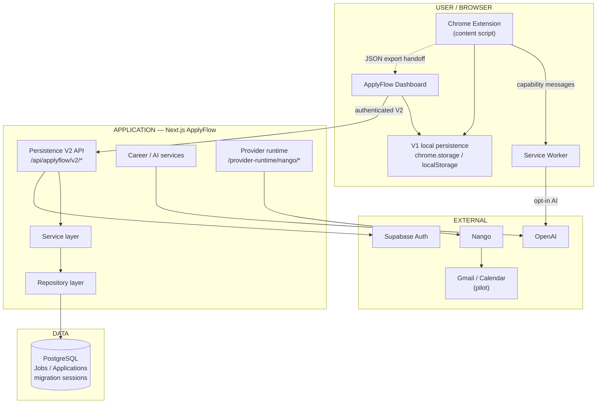

# ApplyFlow — Engineering Case

**Author:** Gustavo Marques · Senior Full Stack / Product Engineer · DevFlow Labs
**Status:** Engineering case **READY** · Production readiness **not claimed**

Deep technical companion to [`apps/applyflow/README.md`](../../apps/applyflow/README.md). Product narrative: [`PUBLIC_CASE_STUDY.md`](./PUBLIC_CASE_STUDY.md).

---

## Executive Summary

**ApplyFlow** is a **local-first** career copiloto for **LinkedIn Easy Apply**: a Chrome MV3 extension plus a Next.js dashboard that help candidates stay consistent without mass-apply or auto-submit.

Beyond the default on-device product path, the repository includes a **Persistence V2 pilot**—authenticated, account-scoped Jobs/Applications on PostgreSQL, optimistic concurrency, a **partial-resumable** migration with atomic canonical promotion, AI/provider trust boundaries, and an explicit **browser-scoped** Nango identity model for a Gmail/Calendar pilot.

This document explains **why** those decisions exist, what evidence backs them, and what the architecture intentionally does **not** guarantee.

---

## Product Context

| Surface | Role |
|---------|------|
| Chrome MV3 extension | Easy Apply panel, assisted autofill (human-gated), local history, optional AI |
| Next.js dashboard | Import JSON / demo, funnel metrics, CareerBundle handoff to Interview Lab |
| Shared packages | `@devflow/applyflow-core`, LinkedIn heuristics, Career Suite contracts |

**Defaults:** local-first · no mandatory ApplyFlow cloud for the core Easy Apply loop · **no auto-submit** · **no mass-apply**.

**Pilot depth (optional flags / auth):** Persistence V2 cloud modes, Nango provider runtime, Career LLM paths.

---

## Architecture



**Trust note:** ApplyFlow account identity (Supabase → `ApplyFlowAccount`) is **independent** of Nango browser-caller identity. Content scripts never own provider credentials.

---

## Trust Boundaries

| Boundary | Rule |
|----------|------|
| Account identity | Server-derived from session — never from client `accountId` |
| Nango caller | HttpOnly cookie → server HMAC → `end_user_id` (browser-scoped pilot) |
| Extension | Content script requests **capabilities**; service worker owns OpenAI calls |
| LLM | Structured outputs / labeled context; model output is not product authority |
| Providers | Origin allowlist + CSRF controls on Nango routes; read-only scopes in pilot |

---

## Persistence Model

### Default product path (V1)

Extension history and dashboard analytics stay on-device (`chrome.storage.local` / `localStorage` after JSON import). No mandatory cloud account for that loop.

### Persistence V2 pilot

| Concept | Behavior |
|---------|----------|
| Jobs / Applications | Account-scoped rows in PostgreSQL |
| OCC | `expectedVersion` on PATCH; conflict → typed error |
| `sourceJobId` | At most one Application per non-null `sourceJobId` **per account** (DB unique index) |
| Modes | `v1` · `v2_offering` · `v2_active` · `v2_read_only` · `v2_paused` |
| Authority | `canonicalPersistence` stays `v1_local` until successful promotion to `v2_cloud` |

Detail: [`PERSISTENCE_V2.md`](./PERSISTENCE_V2.md) · [`ADR-PERSISTENCE_V2_PARTIAL_RESUMABLE_MIGRATION.md`](./ADR-PERSISTENCE_V2_PARTIAL_RESUMABLE_MIGRATION.md).

---

## Engineering Challenges

### 1. Concurrent Application creation

**Problem:** “Check then create” at the application layer races under parallel inserts for the same `sourceJobId`.

**Decision:** Enforce the invariant in PostgreSQL with a **partial unique index** on `(accountId, sourceJobId)` where `sourceJobId IS NOT NULL`, plus domain mapping of unique violations to a stable conflict error.

**Why:** Only the database can serialize concurrent writers reliably.

**Evidence:** Local PostgreSQL concurrency suite (`c2`–`c20`: exactly one persisted row; others conflict). Service + repository race tests.

**Trade-off:** Requires migration/index discipline; not an “exactly-once across the network” claim.

---

### 2. Optimistic concurrency

**Problem:** Two tabs can overwrite each other’s Job/Application edits.

**Decision:** Require `expectedVersion` on PATCH; update succeeds only when the stored version matches.

```text
read version N
  → mutate expecting N
  → UPDATE … WHERE version = N
  → success (N+1) OR version_conflict
```

**Evidence:** Service tests + adversarial concurrent patch harness (memory).

**Trade-off:** Clients must handle conflicts; not distributed locking.

---

### 3. Account isolation

**Problem:** Cross-account IDOR via forged IDs or body fields.

**Decision:** Resolve account from authenticated session; repositories always scope by that `accountId`; reject mass-assigned ownership fields.

**Evidence:** Cross-account not-found paths, migration tenancy tests, route/service suites.

**Qualification:** HTTP identity-provider paths commonly **mock** auth in unit tests. Local PostgreSQL validates uniqueness/cross-account `sourceJobId` allowance. **Real Supabase dual-session isolation is not claimed** in this case closure.

---

### 4. Resumable migration

**Problem:** Moving browser V1 material to cloud cannot pretend every failure leaves zero durable rows—or flip authority early.

**Decision:** **Partial-resumable** import with session fingerprint; durable staging allowed; **atomic complete + promote** flips `canonicalPersistence` only after verification.

```text
V1 local
  → migration session
  → partial durable staging
  → verification
  → atomic canonical promotion
  → V2 cloud
```

Until promotion: **V1 remains canonical**. During `v2_offering`, normal Jobs/Applications **product GET** is denied (`persistence_v2_migration_required`). Migration / session / activation surfaces remain available.

**Evidence:** Crash/retry contract tests; response-loss idempotent proof; offering capability matrix.

**Explicitly:** **NOT** all-or-nothing physical import · **NOT** exactly-once over the network.

ADR: [`ADR-PERSISTENCE_V2_PARTIAL_RESUMABLE_MIGRATION.md`](./ADR-PERSISTENCE_V2_PARTIAL_RESUMABLE_MIGRATION.md).

---

### 5. Extension AI credential boundary

**Problem:** Content scripts share the page world risk; plaintext API keys must not live there.

**Decision:** Service worker owns credential + fixed OpenAI destination; content requests a typed **generate** capability; authority-smuggling fields rejected.

```text
Page → Content Script → capability message → Service Worker → OpenAI
```

**Evidence:** Content isolation tests; extension Vitest + production build.

**Trade-off:** Browser storage is **not** claimed encrypted—privileged context ownership is the boundary.

---

### 6. Provider error sanitization

**Problem:** Upstream HTTP bodies can leak secrets into UI.

**Decision:** Map failures to a stable taxonomy (e.g. auth failed, rate limited, timeout, unavailable, invalid response, provider error) without surfacing raw provider payloads.

**Evidence:** Interview Lab OpenAI client tests with adversarial response bodies.

---

### 7. Browser-scoped provider identity (Nango pilot)

**Problem:** Gmail/Calendar connections need isolation without implying ApplyFlow-account ownership.

**Decision:** **Browser/device-scoped** caller cookie → server-derived `end_user_id` → Nango. Account switch in the same browser does **not** rotate provider identity. Logout ≠ disconnect ≠ Google revoke. Another browser/device ⇒ another provider identity.

**Evidence:** Nango ADR + caller isolation / contract tests (mocks; real Nango sandbox **not** part of closure evidence).

ADR: [`ADR-NANGO-BROWSER_SCOPED_PROVIDER_IDENTITY.md`](./ADR-NANGO-BROWSER_SCOPED_PROVIDER_IDENTITY.md).

---

## Key Architecture Decisions

| Decision | Why | Trade-off | Doc |
|----------|-----|-----------|-----|
| PostgreSQL uniqueness for `sourceJobId` | Survive concurrent creates | Ops cost of indices/migrations | Persistence V2 docs |
| Optimistic concurrency (`expectedVersion`) | Prevent silent lost updates | Client conflict UX | Service layer |
| Partial-resumable migration | Short transactions + resume | Staging may remain until cleanup backlog | R4 ADR |
| SW owns OpenAI credentials | Shrink content-script attack surface | Not “encrypted storage” | Extension tests |
| Browser-scoped Nango pilot | Honest pilot semantics | No multi-device continuity | Nango ADR |

---

## Validation Strategy

| Concern | Validation |
|---------|------------|
| Concurrent `sourceJobId` uniqueness | Local PostgreSQL races `c2`–`c20` |
| Optimistic concurrency | Service + concurrent patch harness |
| Account isolation | Scoped repos + adversarial tests (auth often mocked) |
| Migration crash / retry | Contract suite (Job/App crash, fingerprint retry, response-loss) |
| Offering authority | Product GET denied; migration/session/activation allowed |
| Extension credentials | Content isolation suite |
| Nango caller isolation | Provider-runtime isolation + contract tests |
| LLM boundary | Structured outputs, no tools on verified Career path |
| Provider errors | Sanitized taxonomy tests |

**Secondary context:** ApplyFlow Vitest suite last measured in the engineering closure at **1283 passed / 22 skipped** (do not treat as a marketing KPI).

---

## Failure Modes

| Mode | Expected behavior |
|------|-------------------|
| Concurrent create same `sourceJobId` | One win; others conflict |
| Stale `expectedVersion` | `version_conflict` |
| Migration crash mid-import | Staging may exist; canonical stays V1; retry can converge |
| Response lost after promote | Idempotent completion proof on same fingerprint |
| Invalid provider 2xx body | Stable invalid-response class; no raw body in UI |
| Lost Nango caller cookie | New browser identity; prior connections may be orphaned |

---

## Residual Risks / Limitations

- No exactly-once migration guarantee
- Migration is resumable, **not** all-or-nothing
- Automatic staging GC not implemented
- Provider pilot is **browser/device-scoped** (not account-bound, not cross-device)
- Multi-replica / horizontal safety not established
- Real Nango cloud sandbox not part of this closure evidence
- Real Supabase dual-session isolation not claimed
- **Production readiness not claimed**
- Dependency and operational hardening remain a **Production Readiness** backlog

---

## Lessons Learned

1. Product ethics (no auto-submit) and engineering honesty (partial staging, browser-scoped providers) belong in the same design conversation.
2. Application-layer checks are not a substitute for database invariants under concurrency.
3. Authority flips (canonical persistence, LLM output, provider cookies) need explicit state machines—and explicit non-goals.
4. Portfolio strength comes from **failure-mode reasoning** and evidence, not from claiming Production SRE maturity.

---

## Recruiter summary (~130 words)

ApplyFlow (DevFlow Labs) is a local-first career copiloto for LinkedIn Easy Apply: a Chrome MV3 extension plus a Next.js dashboard that help candidates stay consistent without mass-apply or auto-submit. I designed and implemented the product end-to-end—TypeScript monorepo packages, extension/service-worker boundaries, and a Persistence V2 pilot with account-scoped Jobs/Applications, optimistic concurrency, and a resumable migration that keeps V1 authoritative until verified cloud promotion. Hard problems included database-enforced uniqueness under concurrent creates, keeping noncanonical staging out of product reads, isolating OpenAI credentials from the content script, and an explicit browser-scoped provider identity for the Gmail/Calendar pilot. The repository is an evidence-backed engineering case with architecture ADRs and automated tests; production operational readiness is intentionally not claimed.

## CV bullets

- Built ApplyFlow (Chrome MV3 extension + Next.js dashboard) as a local-first Easy Apply copiloto with shared TypeScript contracts and human-gated autofill (no auto-submit).
- Designed Persistence V2: account-scoped repositories, `expectedVersion` OCC, PostgreSQL partial unique index for `sourceJobId` under concurrency (local `c2`–`c20` verification), and a partial-resumable migration with atomic canonical promotion.
- Hardened AI/provider boundaries: service-worker-owned OpenAI credentials, structured LLM outputs without tools on the verified Career path, sanitized provider errors, and browser-scoped Nango caller isolation for a Gmail/Calendar pilot.

---

## Evidence Index

| Claim | Implementation / docs | Tests |
|-------|----------------------|-------|
| `sourceJobId` uniqueness | Prisma unique index, application service | `application-source-job-uniqueness.postgres.test.ts`, race tests |
| OCC | Job/Application PATCH services | service tests, race OCC harness |
| Resumable migration | `migration-service`, R4 ADR | `migration-af-rel-002-contract.test.ts` |
| Offering product GET blocked | `http-access.ts` capability matrix | http-access + Jobs/Applications route tests |
| Browser-scoped Nango | `nango-caller-session`, Nango ADR | isolation + browser-scoped contract tests |
| Extension credential boundary | SW generate path | `content-ai-isolation.test.ts` |
| LLM structured / no tools | Career OpenAI provider | `openai-provider.test.ts`, boundary tests |
| Provider error sanitize | Interview Lab provider error map | `openai-chat-json.test.ts` |

---

*DevFlow Labs · ApplyFlow engineering case · 2026*
