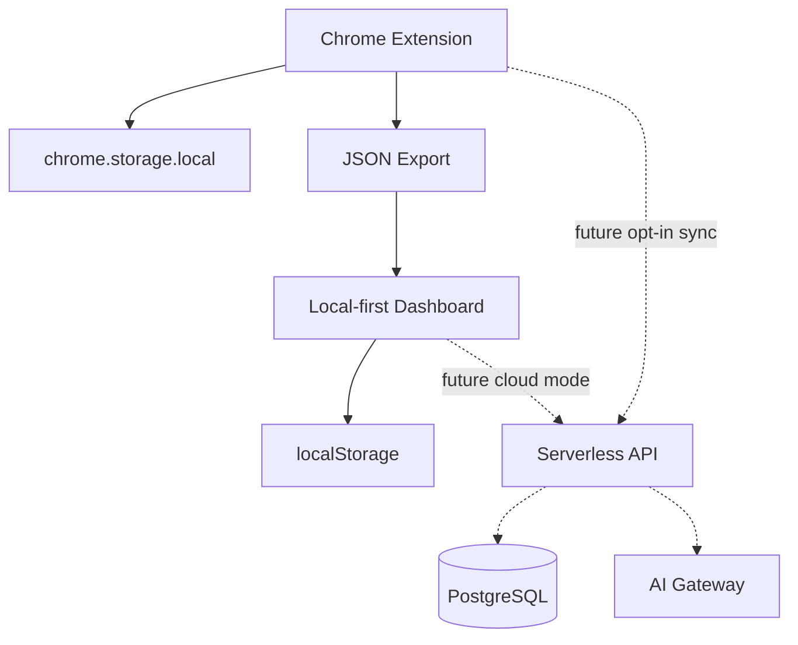

# ApplyFlow — arquitetura

## Componentes

| Caminho | Papel |
|---------|--------|
| `apps/applyflow-extension` | Extensão Chrome MV3: content script (IIFE), painel/UI, página de opções, service worker mínimo; estado em **`chrome.storage.local`**; export manual de JSON. |
| `apps/applyflow` | Next.js 16 (App Router): landing (`/`), dashboard (`/dashboard`), índice **`/documentacao`**; import/demo; Recharts; **`localStorage`**. |
| `packages/applyflow-core` | Perfil, fit, job intelligence, sugestões; **tipos de candidaturas**; **métricas**; **`parseApplyFlowImportJsonString`**; **filtros** do dashboard. Build **`dist/`** via `tsc` para consumo estável pelo Next. |
| `packages/applyflow-linkedin` | Classificação/parser de campos **LinkedIn Easy Apply**; fixtures e testes; consumo principal pela extensão. |

## Local-first by default

Decisão formal: [**ADR — Local-first vs Serverless**](./ADR-LOCAL_FIRST_VS_SERVERLESS.md).

- A **extensão** persiste perfil, histórico, auditoria e definições em **`chrome.storage.local`** — sem servidor ApplyFlow no MVP.
- O **dashboard** persiste o último conjunto importado ou demo em **`localStorage`** (`APPLYFLOW_DASHBOARD_IMPORT_V1`); os dados chegam por **ficheiro JSON** exportado pelo utilizador ou pela **demo** estática no mesmo host.
- **Nenhum histórico de candidaturas** é enviado por defeito a um backend ApplyFlow; processamento do import é só no browser.
- **IA** é **opt-in** no cliente (opções da extensão); não há “IA gerida” obrigatória nem gateway central no MVP.
- **Serverless não é necessário** para entregar valor no MVP: métricas, funil e histórico funcionam offline do ponto de vista ApplyFlow.

> Local-first is a product and architecture decision, not a technical limitation.

## Visão geral do fluxo (Mermaid)

```mermaid
flowchart TD
  LinkedIn[LinkedIn Easy Apply]
  Extension[applyflow-extension]
  ChromeStorage[(chrome.storage.local)]
  ExportJSON[Ficheiro JSON exportado]
  Dashboard[applyflow dashboard Next.js]
  LocalStorage[(localStorage browser)]
  Core[@devflow/applyflow-core]
  LinkedInPkg[@devflow/applyflow-linkedin]

  LinkedIn --> Extension
  Extension --> ChromeStorage
  Extension --> ExportJSON
  ExportJSON --> Dashboard
  Dashboard --> LocalStorage
  Core --> Extension
  Core --> Dashboard
  LinkedInPkg --> Extension
```

## Fluxo de dados (detalhe)

- A extensão **não** envia o histórico ao dashboard por rede: o utilizador **exporta** um ficheiro e o dashboard **importa** localmente (ou usa a **demo** estática servida pelo próprio host Next).
- O único `fetch` típico no dashboard é para **`/demo/applications-demo.json`** (asset em `public/demo/`), ou seja, mesmo origem que a app.
- Pacotes **`applyflow-core`** e **`applyflow-linkedin`** centralizam regras e evitam duplicar lógica entre extensão e site.

## Armazenamento

| Chave / contexto | Conteúdo (exemplos) |
|------------------|---------------------|
| `chrome.storage.local` (extensão) | Perfil, definições, histórico de candidaturas, auditoria, IA opt-in. |
| `localStorage` (`APPLYFLOW_DASHBOARD_IMPORT_V1`) | Último conjunto importado ou carregado como demo no web app. |
| Ficheiro JSON | Backup portável; deve ser tratado como dado sensível se for real. |

## JSON export/import

- Formato validado no core (array de candidaturas ou envelope com versão); registos inválidos são **ignorados** com contagem.
- O dashboard **não** persiste em servidor; apenas memória do browser + `localStorage`.

## IA opt-in

- Configuração na **página de opções** da extensão; chamadas no **cliente** com credencial fornecida pelo utilizador.
- Não substitui o fluxo core quando desligada; texto gerado **não** entra no histórico de candidaturas como persistência de IA.

## Boundaries de segurança

| Área | Decisão |
|------|---------|
| Login LinkedIn | Mantido no site oficial; a extensão não simula login. |
| CAPTCHA / gates da plataforma | Não são contornados. |
| Submit / “Enviar candidatura” | **Não automatizado** pela extensão (*sem auto-submit*). |
| Backend ApplyFlow | Inexistente neste desenho: não há ingestão central de PII. |
| Dados importados no dashboard | Processamento só no browser; sem upload para APIs DevFlow. |

## Por que local-first

- Menor superfície de confiança: não há servidor ApplyFlow a armazenar histórico de candidaturas.
- Coerência com **responsabilidade de plataforma** (LinkedIn): posicionamento explícito **contra** mass apply e submissão automática.
- Demo e portefólio **sem conta** nem backend.

## Optional serverless future

Uma camada **cloud opcional** (Pro/sync/IA gerida) poderia existir **sem substituir** o modo local-first como narrativa por defeito. Visão exploratória: [`SERVERLESS_FUTURE.md`](./SERVERLESS_FUTURE.md).



**Nota:** linhas tracejadas representam **roadmap opcional**, não componentes do MVP actual.

## Por que sem auto-submit

- Reduz risco de violação de termos e de fricção com recrutadores (qualidade vs. volume).
- Mantém o utilizador **no controlo** da revisão final antes de cada envio.
- Alinha o produto com “**copiloto**”, não com bot de candidatura.

## Limites adicionais

- O content script só observa o DOM das páginas permitidas pela extensão; não “raspa” a rede agressivamente além do necessário ao Easy Apply.
- Chave de API (IA) no dispositivo: risco se o equipamento estiver comprometido — documentar nas opções/`IA_OPT_IN.md`.
