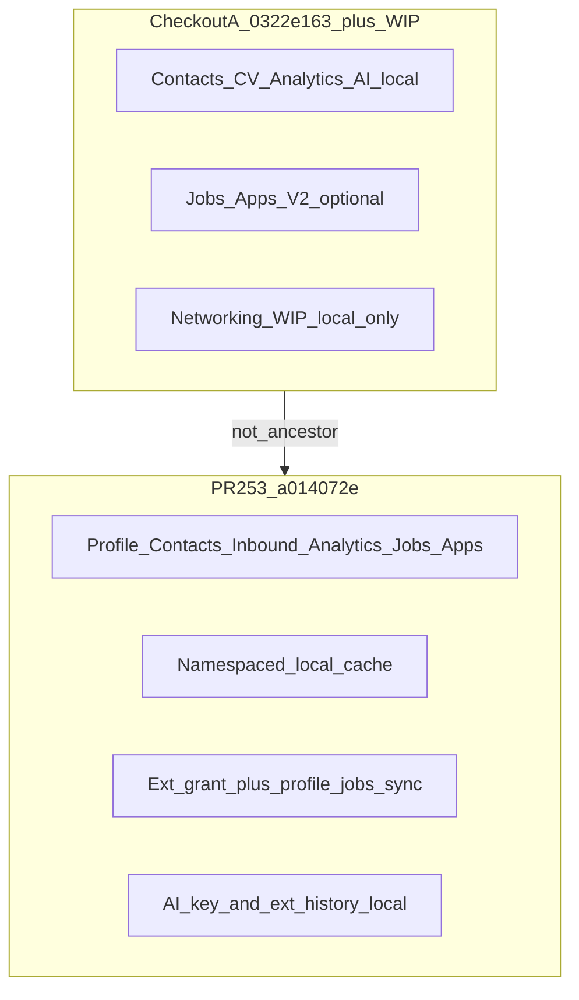

# ApplyFlow — Local vs Account (data locality)

Corrected inventory of what is browser-local versus account-scoped (Persistence V2 / personal persistence).

**Nature:** static code audit. Production was **not** consulted.

**Local active mode:** real env flags were **not** verified — effective local mode remains **NÃO COMPROVADO** (only `.env.example` defaults were noted). Do not infer activation from Preview/CI.

**Do not** treat “table/route exists” as “cloud is active”, or “localStorage key exists” as “always local only”.

**Doc history:** the original audit was read-only and did not write this file. `DATA_LOCALITY.md` (plus index links in `README.md` / `PERSISTENCE_V2.md`) was added later as an explicit consolidation of that audit. Matrices below keep Checkout A (`0322e163…`) and Checkout B (`a014072e…`) in **separate** sections.

Related: [`PERSISTENCE_V2.md`](./PERSISTENCE_V2.md), [`PRIVACY_SECURITY.md`](./PRIVACY_SECURITY.md), [`ADR-PERSISTENCE_V2_LOCAL_AND_CLOUD.md`](./ADR-PERSISTENCE_V2_LOCAL_AND_CLOUD.md).

## States used in this doc

| State | Meaning |
| --- | --- |
| IMPLEMENTADO E CONECTADO | Code path exists and UI/extension call it |
| IMPLEMENTADO, MAS NÃO CONECTADO AO FLUXO | Storage/API exists but primary UI path does not use it |
| LOCAL | Canonical authority is the browser (or device) |
| PENDENTE DE ATIVAÇÃO | Code may be connected, but gates/migration/merge block shared use |
| NÃO COMPROVADO | Insufficient evidence in this audit |

## Audited versions

| Ref | Value |
| --- | --- |
| Repo | `devflow-modules/devflow` |
| Checkout A (local observed) | branch `feat/whatsapp-client1-commercial-readiness`, HEAD `0322e1633b6b603d503e1e2709d6f8b10ff8ca94`, dirty with uncommitted networking WIP |
| Checkout B (PR #253) | branch `feat/applyflow-account-persistence-v2`, SHA `a014072ede7d3dea4d56dccaab6b6c74bb232653` |
| PR #253 | OPEN, not merged into `main` (audit snapshot) |
| Ancestry | B is **not** an ancestor of A (`git merge-base --is-ancestor` negative) |
| Later networking work | Originated on Checkout A working tree; absent from `a014072e` (`manualMatchOverride`, `selectNetworkingQueue`, private pipeline import). Preserved on `feat/applyflow-networking-outreach` (`50889dea`). Integration onto B: `feat/applyflow-networking-on-account-persistence` (base `a014072e`) |
| Limitation | Evidence from A and B must not be mixed in the same matrix cell |
| Shared activation / production | Still **PENDENTE** / **NÃO COMPROVADO** |
| Local active mode (flags) | Real `.env*` values **not** read — effective local mode remains **NÃO COMPROVADO** |

Prior inventory that claimed “CV / contacts / extension never use cloud” described Checkout A, not the product as a whole while PR #253 remains open.

## Code vs activation

| Gate | Role |
| --- | --- |
| `APPLYFLOW_PERSISTENCE_V2` | Global flag (`.env.example` default `false`) |
| `pilotEligible` × `canonicalPersistence` | Per-account eligibility / authority |
| Resolver mode | `v2_active` (read+write), `v2_read_only`, offering / paused / v1 |

- **Checkout A:** personal APIs are absent → personal cloud cannot activate on this tree.
- **Checkout B:** code + migration `20261005170000_account_personal_persistence` exist; still needs flag + eligible account + `v2_active` / `cloud_write`.
- Preview/CI green on the PR is **not** production activation.
- On B with `cloud_write`, `personalLocalWritesAllowed() === false` blocks writing account data as a silent local copy; anonymous legacy keys are **not** deleted or copied on account switch.

## Matrix — Checkout A (HEAD + networking WIP)

| Domain | Canonical storage | Local cache / legacy | Connected flow | Gates | Account isolation | Evidence | State |
| --- | --- | --- | --- | --- | --- | --- | --- |
| Jobs | Prisma `ApplyFlowJob` if V2 active | dashboard `localStorage` | V2 dashboard adapters | flag × pilot × canonical | server `accountId`; anonymous legacy | persistence-v2 adapters | PENDENTE DE ATIVAÇÃO / LOCAL if flag off |
| Applications + lifecycle | Prisma `ApplyFlowApplication` if V2 | `localStorage` | dashboard + lifecycle core | same | same | same | PENDENTE DE ATIVAÇÃO / LOCAL |
| Profile / resume variants | browser resume library | `localStorage` | local UI only | n/a cloud | no account namespace | dashboard resume storage | LOCAL |
| Contacts / interactions / drafts | `APPLYFLOW_DASHBOARD_CONTACTS_V1` | same | networking tab → `local-contact-storage` (no `/v2/contacts`) | n/a | **no** `accountId` in key | `apps/applyflow/src/lib/local-contact-storage.ts`; networking tab has no `fetch` | LOCAL |
| SENT / REPLIED / follow-up | Contact fields local | local | HITL Mark Sent → local save | n/a | anonymous | outreach-lifecycle + local storage | LOCAL |
| `jobContext.networking` + `manualMatchOverride` | job local / V2 jobs | jobs `localStorage` | ingest + queue WIP | V2 jobs if active | job row account-scoped only if cloud jobs | uncommitted core WIP | LOCAL (meta) / PENDENTE if jobs cloud |
| Analytics / events / efforts | local | `localStorage` | local dashboard analytics | n/a | anonymous | local analytics modules | LOCAL |
| Inbound responses | local / no cloud model | — | no personal API on this tree | — | — | schema without personal models | LOCAL |
| Extension grants / session | session grant if path exists | `chrome.storage.local` history | options/panel still “no server” UX on A | — | grant vs device-local | extension options | LOCAL (mostly) |
| Settings / audits / AI key | `chrome.storage.local` | same | AI key never server | — | device | AiSettingsPanel | LOCAL |
| Nango | — | — | — | — | — | out of scope for this audit | NÃO COMPROVADO |
| Private pipeline import | merge into `localStorage` on A WIP | gitignored JSON | local import only on A | n/a | writes anonymous keys on A | `import-opportunity-pipeline-local` (A) | LOCAL on A; see integration branch for cloud routing |

## Matrix — Checkout B (PR #253 @ `a014072e`)

| Domain | Canonical storage | Local cache / legacy | Connected flow | Gates | Account isolation | Evidence | State |
| --- | --- | --- | --- | --- | --- | --- | --- |
| Jobs | Prisma account-scoped | cache `KEY::accountId` | remote dashboard adapter + extension sync | `v2_active` write | `accountId` + generation fence | `v2-remote-dashboard-persistence.ts` (`jobContext` round-trip) | IMPLEMENTADO E CONECTADO (code); PENDENTE DE ATIVAÇÃO until gates |
| Applications | Prisma | namespaced cache | V2 CRUD + extension | same | same | same | IMPLEMENTADO E CONECTADO / PENDENTE ATIVAÇÃO |
| Profile / variants | `GET/PUT /api/applyflow/v2/profile` + Prisma | scoped cache | hydrate + profile UI | write capability | `accountId` | migration + profile route | IMPLEMENTADO E CONECTADO / PENDENTE ATIVAÇÃO |
| Contacts / interactions | `/api/applyflow/v2/contacts` + Prisma | `writeAccountScopedCache(CONTACTS…)` | networking `persist()` uses PUT/POST when `!personalLocalWritesAllowed()` | `cloud_write` | scoped cache + stale generation | networking-tab cloud path on B | IMPLEMENTADO E CONECTADO / PENDENTE ATIVAÇÃO |
| SENT / REPLIED | Contact / interaction cloud | cache | same HITL persist | same | same | contacts API | IMPLEMENTADO E CONECTADO / PENDENTE ATIVAÇÃO |
| Networking meta WIP | N/A on this SHA | — | no `manualMatchOverride` / queue | — | — | `git grep` empty on `a014072e` | NÃO COMPROVADO on this SHA |
| Generic `jobContext` | persisted with cloud Job | — | adapter sends `jobContext` | V2 jobs | account | remote adapter | IMPLEMENTADO E CONECTADO for Job fields; networking-specific N/A |
| Analytics / career events | `/v2/analytics` + models | cache | personal hydrate | gates | account | personal routes | IMPLEMENTADO E CONECTADO / PENDENTE ATIVAÇÃO |
| Inbound responses | `/v2/responses` | cache | personal module | gates | account | personal routes | IMPLEMENTADO E CONECTADO / PENDENTE ATIVAÇÃO |
| Extension grants | session grant + `/v2/extension/session` | `chrome.storage.local` profile/history/AI | sync **profile + jobs/apps**; **not** contacts; AI local | grant + V2 | grant account-bound; local device | service-worker grant; options AI | mixed: grants CONECTADO; extension contacts LOCAL; AI LOCAL |
| Personal import API | `/v2/personal-import` | — | route exists | write | account | personal-import route | IMPLEMENTADO E CONECTADO (API); private pipeline WIP on A does **not** call it |
| Settings / AI key | `chrome.storage.local` | — | options UI | — | device | AiSettingsPanel | LOCAL |
| Nango | — | — | — | — | — | outside personal-persistence diff | NÃO COMPROVADO |

## Incorrect claims from the prior inventory

1. “Resume / profile never uses cloud” — **false on B**; true on A.
2. “Contacts never use cloud” — **false on B** (networking tab → `/v2/contacts`); true on A (including networking WIP).
3. “Extension never uses cloud” — **partially false on B** (grant + profile/jobs/apps sync); still true for AI key, local history, and extension contacts.
4. “Canonical cloud = Jobs + Applications only” — **incomplete**: B adds profile, contacts, interactions, inbound, career/analytics, extension session, personal-import, and migration `20261005170000_account_personal_persistence`.
5. Treating Checkout A as the whole product — **incorrect** while #253 is OPEN and not merged.

## Clearing the browser (by mode)

| Mode | Effect |
| --- | --- |
| A, flag off / local | Loses local jobs, apps, contacts, analytics, resume |
| A, V2 jobs active (no personal APIs) | Cloud jobs/apps survive; local contacts/CV/analytics lost |
| B, `cloud_write` active | Cloud profile/contacts/jobs/apps/analytics survive; scoped caches rehydrate; anonymous legacy may remain orphaned; extension AI key + audits lost if `chrome.storage` cleared |
| Extension | Session grant gone; device-local AI/history gone with storage clear |

## Networking and isolation

| Question | Finding |
| --- | --- |
| Do contacts/outreach use personal APIs? | A: no. B: yes when `cloud_write`. |
| Is `jobContext.networking` / `manualMatchOverride` cloud-persisted? | Networking-specific fields only on A WIP; B syncs generic Job `jobContext`. |
| Does private import work on V1 and V2? | A WIP writes localStorage only; does not call `/v2/personal-import`. |
| Does hydrate keep manual score? | `manualMatchOverride` only on A WIP; N/A on B. |
| Does Mark Sent require human confirmation? | Yes (HITL); no auto-DM. |
| Does outreach change Application lifecycle? | Must not; core rule keeps outreach separate from candidacy lifecycle. |
| Logout / account A→B | B: `KEY::accountId` + generation fence; residual anonymous legacy risk if UI falls back to local path. A+WIP: anonymous keys → **same-browser contact bleed risk**. |

## Gaps and recommended corrections (not implemented here)

1. Rebase networking WIP onto #253 so contact dual-write is not lost.
2. Point private pipeline import at personal-import / cloud adapters when `cloud_write`.
3. Align extension “no server” copy with real sync; decide whether contacts sync.
4. Version inventories by SHA/PR; do not claim “never cloud” without gates.
5. Add isolation tests: logout + account switch with cloud contacts + residual legacy.
6. Shared activation checklist (migration + flag + pilot + smoke `/v2/profile`) only with explicit authorization.

## Factual map (summary)

| Layer | Status |
| --- | --- |
| Implemented in code (B) | Account personal persistence + UI/extension wires (except AI key and extension contacts) |
| Active on observed local (A) | Personal cloud impossible on this tree; networking WIP local; Jobs/Apps V2 only if local gates (runtime flag **NÃO COMPROVADO** in this audit) |
| Pending shared activation | Merge #253 + migration + flag/pilot on shared environments — **NÃO COMPROVADO** in production |
| Still local / explicit import | AI key; much of the extension; private pipeline import on A WIP; residual anonymous legacy |

## Evidence class

| Class | Covered here |
| --- | --- |
| Static (`git show` / tree / `git grep`) | Yes |
| Local runtime (flags, adapters selected) | Partial — example env only; no secret inspection |
| Chrome A–L suites | Not repeated |
| Production | Not consulted |
