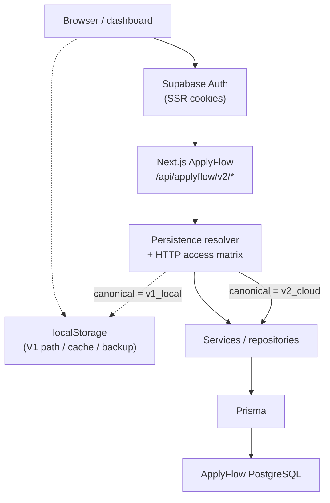

# ApplyFlow Persistence V2 — Engineering Case Study

**Audience:** senior engineers, tech leads, maintainers, technical recruiters  
**Status:** Persistence V2 migration implementation **closed** (`R2_10_PERSISTENCE_V2_MIGRATION_COMPLETE`)  
**Scope of this document:** engineering narrative of a completed Production migration — not an ops runbook and not a product pitch.

> Integrity note: outcomes below are **demonstrable from repository code, tests, and controlled Production validation**. This document does not claim latency SLAs, revenue, conversion, or user-scale metrics.

---

## Executive Summary

ApplyFlow started as a **local-first** product: Jobs and Applications lived in the browser (`localStorage`). That was the right MVP trade-off. As the product needed authenticated accounts, multi-browser continuity, and operational control, browser storage alone could not remain the **canonical** authority for signed-in cloud data.

Persistence V2 introduced:

- Supabase Auth → Next.js server → Prisma → dedicated ApplyFlow PostgreSQL
- An explicit **canonical persistence** field (`v1_local` | `v2_cloud`) separate from feature flags
- Account-scoped **pilot** rollout and a GLOBAL kill switch
- Deterministic migration / empty activation with **one-way** canonical promotion
- Optimistic concurrency via application-level `expectedVersion`
- Validated degradation modes: `v2_read_only` and `v2_paused` **without** silent V1 fallback

A controlled Production pilot completed the path to `v2_active` on `v2_cloud`. During CRUD validation, Production also exposed a transport-level concurrency incident (`If-Match` / Vercel `412`) that forced a protocol correction while preserving DB compare-and-update semantics.

---

## The Original Problem

### What V1 did well

- Fast iteration without a mandatory ApplyFlow backend
- Clear privacy story for anonymous / local workflows
- Simple durability within a single browser profile

### Where V1 hit product limits

- Canonical state was **browser-bound**
- Weak continuity across browsers/devices for the same person
- No server-owned account boundary for Jobs/Applications
- Migration from local history to cloud could not be “just turn on a flag” without authority rules

LocalStorage was not a mistake. The engineering problem was **evolving past its constraints** without destroying the V1 path for accounts that had not transitioned.

---

## Architecture

### Request path (V2)

### Hard boundaries

- The browser **does not** query ApplyFlow PostgreSQL directly.
- `accountId` is **server-derived** from the authenticated session (`auth_provider_sub` → `ApplyFlowAccount`).
- Client-supplied ownership identifiers are not trusted for authorization.
- ApplyFlow uses a **dedicated** Prisma schema — not shared WhatsApp/Financeiro tenancy models.

Evidence lives under `apps/applyflow/src/lib/persistence-v2/` (account bootstrap, HTTP access, Jobs/Applications services, migration/activation, dashboard bootstrap).

---

## Canonical Persistence Model

### Two concerns, deliberately separated

| Concern | Mechanism | Role |
| --- | --- | --- |
| Feature availability | `APPLYFLOW_PERSISTENCE_V2` (GLOBAL) | Whether V2 server paths are enabled |
| Rollout eligibility | `pilotEligible` on `ApplyFlowAccount` | Which authenticated accounts may enter offering/active paths |
| Data authority | `canonicalPersistence` | Whether browser or PostgreSQL is canonical for that account |

`canonicalPersistence`:

| Value | Meaning |
| --- | --- |
| `v1_local` | Browser remains the source of truth for that account |
| `v2_cloud` | PostgreSQL is the source of truth for that account |

### Critical invariant

Once `canonicalPersistence = v2_cloud`, the system must **never** silently promote browser/`localStorage` data back to canonical authority.

That prevents a split-brain where:

- Cloud rows and local rows diverge
- UI “recovers” by preferring whichever store is convenient
- Operators lose a single authoritative timeline after incidents

After promotion, retained local data may exist as **backup/cache** only.

---

## State Machine

Effective mode is resolved from `(GLOBAL, pilotEligible, canonicalPersistence)`:

| GLOBAL | pilot | canonical | effective mode |
| --- | --- | --- | --- |
| false | false | `v1_local` | `v1` |
| false | true | `v1_local` | `v1` |
| true | false | `v1_local` | `v1` |
| true | true | `v1_local` | `v2_offering` |
| false | false | `v2_cloud` | `v2_paused` |
| false | true | `v2_cloud` | `v2_paused` |
| true | false | `v2_cloud` | `v2_read_only` |
| true | true | `v2_cloud` | `v2_active` |

Interpretation:

- **`pilotEligible`** gates progressive delivery
- **`canonicalPersistence`** gates authority
- **GLOBAL** gates V2 runtime availability

They are independent by design. Turning GLOBAL off after `v2_cloud` yields **`v2_paused`**, not V1.

Implementation: `resolveApplyFlowPersistenceMode` / HTTP capability matrix in `http-access.ts`.

---

## Migration Protocol

### Non-empty V1 → cloud

Conceptual flow:

1. Browser reads V1 Jobs/Applications  
2. Normalize a deterministic migration bundle  
3. Compute fingerprint  
4. Open durable `ApplyFlowMigrationSession`  
5. Import Jobs, then Applications (account-scoped, preserved client IDs where supported)  
6. Server verifies completion proof (status, fingerprint, counts, session identity)  
7. Browser cutover marker is a **reference**, not authority  
8. Canonical promotion to `v2_cloud`

Properties validated in code/tests:

- Idempotent retries on the same fingerprint  
- Conflict when a preserved ID already exists with divergent content (`migration_conflict`) — no force overwrite  
- Chunked / session-backed import rather than a single fragile fire-and-forget POST  
- Legacy local keys retained; not deleted as part of promotion

### Empty V1 → cloud (activation)

Absence of local Jobs/Applications does **not** justify an implicit authority flip.

Empty activation requires:

- Explicit user/server activation path  
- Legacy-empty attestation from the client  
- **Server** empty-state proof  
- Durable completed audit session  
- Atomic promotion via the one-way canonical primitive  
- Idempotent “already `v2_cloud`” behavior

Principle: **authority transitions are explicit**, even when the payload is empty.

---

## Atomic Canonical Transition

Promotion is one-way: `v1_local → v2_cloud`.

The domain primitive (`promoteApplyFlowCanonicalPersistenceToV2`) uses a conditional update on `canonicalPersistence = v1_local`. It never writes a downgrade. Concurrent callers collapse to a single effective promotion.

Dangerous intermediate states this protects against:

| Bad state | Risk |
| --- | --- |
| Migration/activation completed, canonical still `v1_local` | Cloud and browser both claim truth |
| Canonical `v2_cloud` without completion proof | Empty/partial cloud treated as canonical too early |

Activation wraps proof + promotion in a DB transaction with re-checks for pilot/GLOBAL races.

---

## Optimistic Concurrency

Jobs and Applications carry a monotonic `version`.

### Final PATCH contract

- Client sends JSON body field `expectedVersion` (positive integer)  
- Repository performs atomic compare-and-update (`WHERE version = expectedVersion`)  
- Success → **2xx**, version advances  
- Stale → **409** `version_conflict`, **zero** mutation  
- Response `ETag` is informational only  

This prevents lost updates when two clients edit the same row.

---

## Production Incident: If-Match / 412

### What was attempted

Early cloud PATCH used HTTP:

`If-Match: "<version>"`

Application stale conflicts correctly returned `409 version_conflict`.

### What Production showed

In the ApplyFlow Production deployment under validation:

- The origin could still apply the atomic DB update  
- The client could observe **HTTP 412** with Vercel `PRECONDITION_FAILED`

Net effect:

| Layer | Observed outcome |
| --- | --- |
| Database | Mutation committed |
| Client | Request appeared failed |

### Why that matters

- Ambiguous success → unsafe retries and duplicate business intent  
- UI/error handling diverges from durable state  
- HTTP precondition semantics collided with **application** concurrency intent  

### Classification

Infrastructure/edge handling of `If-Match` in the **observed** ApplyFlow Production environment — **not** asserted as universal Vercel behavior.

### Fix

Move the concurrency token to the application body (`expectedVersion`) and stop using `If-Match` as the ApplyFlow concurrency transport. Keep DB compare-and-update unchanged.

Production re-validation after the fix:

- Current version → **2xx** + commit  
- Stale version → **409** + no commit  
- Ambiguous non-2xx + commit → not observed  

Lesson: transport-level HTTP preconditions and application-level optimistic concurrency do not have to share a mechanism.

---

## Progressive Delivery

Controlled Production sequence for the first pilot:

1. GLOBAL off — V2 code present, cloud path disabled for runtime  
2. Authenticate / provision first ApplyFlow account  
3. Grant `pilotEligible` via protected operator CLI  
4. Enable GLOBAL  
5. Account enters `v2_offering` while still `v1_local`  
6. Explicit empty activation (or migration for non-empty V1)  
7. Server proof + canonical promotion → `v2_cloud` / `v2_active`  
8. CRUD durability, concurrency, read-only, and kill-switch validation  
9. Documentation/UX closeout  

Pilot eligibility and GLOBAL availability remain separate levers so operators can stage identity before enabling the feature surface.

---

## Operational Safety

Validated degradation for accounts already on `v2_cloud`:

| Control | Resulting mode | Behavior |
| --- | --- | --- |
| Normal | `v2_active` | Cloud reads/writes allowed |
| Pilot revoke | `v2_read_only` | Cloud reads allowed; writes denied |
| GLOBAL off | `v2_paused` | V2 paused contract; **no V1 fallback** |

Safer than “V2 failed, therefore trust whatever localStorage happens to contain.”

### Operator tooling (conceptual)

Local protected CLI (`pnpm pilot:status|grant|revoke`):

- Target-bound confirmation tokens  
- Production double-gate (`--production` + host fingerprint confirm)  
- Mutates **only** `pilotEligible` — never `canonicalPersistence`  

Details: [`PERSISTENCE_V2_FIRST_PRODUCTION_PILOT_RUNBOOK.md`](./PERSISTENCE_V2_FIRST_PRODUCTION_PILOT_RUNBOOK.md).

---

## Failure Modes

| Failure mode | Protection |
| --- | --- |
| Duplicate migration request | Same fingerprint → durable completed session / idempotent retry |
| Same ID, divergent payload | `migration_conflict`; no overwrite |
| Stale PATCH | `409 version_conflict`; no mutation |
| Pilot revoked after `v2_cloud` | `v2_read_only`, not V1 |
| GLOBAL disabled after `v2_cloud` | `v2_paused`, not V1 |
| Stale browser backup after promotion | Server canonical + dashboard bootstrap refuse silent V1 open |
| localStorage cleared after promotion | Cloud remains canonical |
| Migration interrupted mid-flight | Durable session + proof/marker recovery path |
| `If-Match` infrastructure conflict | Application `expectedVersion` transport |

---

## Production Validation Timeline

| Stage | Engineering outcome |
| --- | --- |
| R2.5 | First pilot staged while GLOBAL off |
| R2.6 | GLOBAL on → account in `v2_offering` |
| R2.7 | Empty activation → canonical `v2_cloud` |
| R2.8 | Cloud Job/Application CRUD + hard-refresh durability |
| R2.8.1 | PATCH concurrency moved to `expectedVersion` after Production 412 split-brain |
| R2.9 | Read-only revoke + GLOBAL pause validated; recovery to `v2_active` |
| R2.10 | Closeout docs + mode-aware persistence messaging |

Gate identifiers are retained for maintainers; the progression above is the engineering story.

---

## Testing Strategy

Layers exercised in-repo:

- Unit tests for resolver / HTTP access matrix / DTOs  
- Service + repository optimistic concurrency  
- Route tests for Jobs/Applications/activation/migration  
- Client bootstrap tests (server mode wins; paused does not open V1)  
- Operator CLI safety tests  
- Full ApplyFlow Vitest + CI  

Why Production validation still mattered: application tests asserted `409` for stale versions correctly, but the **`If-Match` / 412** ambiguity only appeared at the deployed edge ↔ origin boundary.

---

## Product / UX Alignment

After technical cutover, the dashboard still showed unconditional “local-first / data stays in this browser” copy while the account was already `v2_active`.

Architecture is also a product contract: UI must describe where canonical account data lives. Closeout made privacy messaging **mode-aware** (`v1`, `v2_offering`, `v2_active`, `v2_read_only`, `v2_paused`) without overclaiming encryption, multi-device realtime sync, or offline guarantees that are not implemented.

---

## Engineering Outcomes

Demonstrable outcomes for the first Production pilot:

- PostgreSQL became canonical (`v2_cloud` / `v2_active`)  
- V1 path remained available for accounts not transitioned  
- One-way canonical transition validated  
- Cloud CRUD durability validated  
- Optimistic concurrency validated under Production traffic semantics  
- Read-only and GLOBAL pause validated **without** V1 fallback  
- Mode-aware UX messaging aligned with authority  
- Migration implementation closed; broad rollout remains a separate product decision  

---

## Lessons Learned

1. **Separate feature flags from data authority.**  
2. **Empty state still needs an explicit authority transition.**  
3. **Degrade to read-only/paused — never to an untrusted local “rescue.”**  
4. **Application concurrency tokens should not hitch a ride on infrastructure-sensitive HTTP preconditions without Production proof.**  
5. **Product copy is part of migration correctness.**  

---

## Final State

At closeout of the migration implementation:

| Dimension | State |
| --- | --- |
| First Production pilot | Active on V2 cloud |
| Canonical source | PostgreSQL / V2 cloud |
| V1 localStorage for that account | Non-canonical |
| GLOBAL / pilot / mode | Enabled, eligible, `v2_active` |
| Broad rollout / pilot-gate removal | **Not** authorized by this closeout |

Source of truth for ops/status details: [`PERSISTENCE_V2_CLOSEOUT.md`](./PERSISTENCE_V2_CLOSEOUT.md).

---

## Related Documentation

- [`PERSISTENCE_V2.md`](./PERSISTENCE_V2.md) — current product/engineering summary  
- [`PERSISTENCE_V2_CLOSEOUT.md`](./PERSISTENCE_V2_CLOSEOUT.md) — migration closeout  
- [`PERSISTENCE_V2_MIGRATION_RUNBOOK.md`](./PERSISTENCE_V2_MIGRATION_RUNBOOK.md) — migration recovery  
- [`PERSISTENCE_V2_FIRST_PRODUCTION_PILOT_RUNBOOK.md`](./PERSISTENCE_V2_FIRST_PRODUCTION_PILOT_RUNBOOK.md) — operator pilot gates  
- [`ADR-PERSISTENCE_V2_LOCAL_AND_CLOUD.md`](./ADR-PERSISTENCE_V2_LOCAL_AND_CLOUD.md)  
- [`ADR-LOCAL_FIRST_VS_SERVERLESS.md`](./ADR-LOCAL_FIRST_VS_SERVERLESS.md)  
- [`CASE_STUDY.md`](./CASE_STUDY.md) — original local-first product case (MVP narrative)
