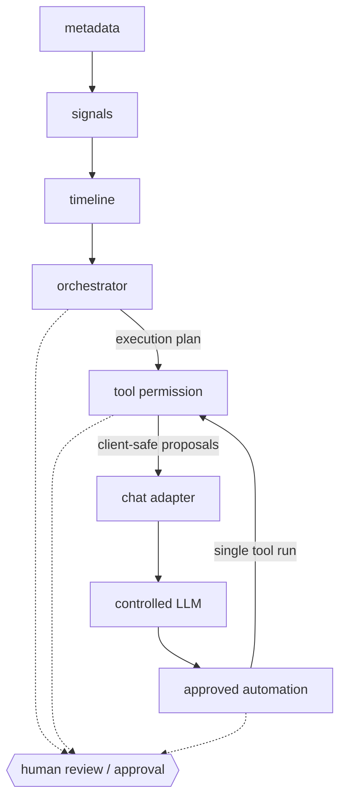

# Career Suite — Agent layer architecture

Technical consolidation of the agent/automation stack delivered across **PRs #114–#118**.
This document is a **presentation of existing boundaries** — it does not introduce or change any
endpoint, schema, policy, executor, feature flag, or functional code.

**Index:** [`README.md`](./README.md) · **Demo:** [`DEMO.md`](./DEMO.md) · **Product case:**
[`CAREER-SUITE-PRODUCT-AND-ARCHITECTURE-CASE.md`](./CAREER-SUITE-PRODUCT-AND-ARCHITECTURE-CASE.md)

Per-boundary deep docs live in [`agents/`](./agents/) and the decisions in
[`../adr/`](../adr/) (ADR-005 … ADR-009).

---

## End-to-end flow

```txt
metadata
→ signals
→ timeline
→ orchestrator
→ tool permission
→ chat adapter
→ controlled LLM
→ approved automation
```

Each stage is **deterministic-first** and **server-authoritative**. Nothing flows forward
without passing the policy of the stage below it, and every stage emits a **client-safe**,
**non-executable**, **review-required** result.

| Stage | What it produces | Source of truth |
|-------|------------------|-----------------|
| **metadata** | Limited, user-owned application/profile metadata (no raw provider payloads, no tokens) | Client-side, sandboxed |
| **signals** | Provider-derived read-only signals, manually reviewed before use | `@devflow/career-sync` (read-only lifecycle) |
| **timeline** | Deterministic ordering/grouping of applications and reviewed signals | Provider-derived insights (in-memory) |
| **orchestrator** | Typed request → policy → deterministic agent selection → execution plan | `career-agents` (PR #114) |
| **tool permission** | Allowlisted tool contracts + permission decision + pure local execution | `career-tools` (PR #115) |
| **chat adapter** | LibreChat-compatible payload → deterministic intent → orchestration → proposals | `career-chat` (PR #116) |
| **controlled LLM** | Structured content **inside a known schema**, no authority over decisions | `career-llm` (PR #117) |
| **approved automation** | One allowlisted, non-destructive tool run, only after explicit approval | `career-automation` (PR #118) |



The orchestrator never emits final advice; the tool layer never registers tools from the client;
the chat adapter never executes tools; the LLM never chooses intent/agent/tool/approval; and
automation never runs without a request-scoped human approval.

---

## PR map (#114–#118)

| PR | Boundary | Responsibility | Endpoint | Guarantees | Doc / ADR |
|----|----------|----------------|----------|------------|-----------|
| **#114** | Career Agent Orchestration | Validate typed request, evaluate policy, deterministically select agent, record rationale, build execution plan (no final advice) | `POST /career-agents/orchestrate` | No LLM, no provider calls, no persistence, no mutation; stable block codes; client-safe trace | [orchestration](./agents/CAREER-AGENT-ORCHESTRATION.md) · [ADR-005](../adr/ADR-005-CAREER-AGENT-ORCHESTRATION-BOUNDARY.md) |
| **#115** | Tool Permission Boundary | Static server-owned tool registry + permission engine; pure local tool execution after policy pass | `POST /career-tools/invoke` | Allowlist only; client cannot register tools or alter capability/risk/approval; export tools need explicit approval; `persisted:false`, `executedExternally:false` | [tool boundary](./agents/CAREER-MCP-TOOL-BOUNDARY.md) · [ADR-006](../adr/ADR-006-CAREER-MCP-TOOL-PERMISSION-BOUNDARY.md) |
| **#116** | LibreChat Chat Adapter | Normalize LibreChat-compatible chat into a server-built orchestration request, resolve tool proposals (no execution) | `POST /career-chat/librechat` | Deterministic intent mapping (no inference); cannot execute tools, pick capabilities, forge approval, or persist | [librechat adapter](./agents/CAREER-LIBRECHAT-ADAPTER.md) · [ADR-007](../adr/ADR-007-CAREER-LIBRECHAT-ADAPTER-BOUNDARY.md) |
| **#117** | Controlled LLM Boundary | Produce structured content within a known schema for an already-selected agent/task | `POST /career-llm/generate` | LLM has no authority over intent/agent/tool/risk/approval/execution; server-owned prompt; validated structured output; mock provider default | [controlled LLM](./agents/CAREER-LLM-CONTROLLED-BOUNDARY.md) · [ADR-008](../adr/ADR-008-CONTROLLED-LLM-EXECUTION-BOUNDARY.md) |
| **#118** | Approved Automation Boundary | Run exactly one allowlisted, non-destructive tool after explicit, request-scoped approval | `POST /career-automation/execute` | Deny by default; fixed `kind → tool` allowlist; server-derived proposal; revocable approval; no schedule/background/persistence; flag off by default | [automation boundary](./agents/CAREER-AUTOMATION-APPROVAL-BOUNDARY.md) · [ADR-009](../adr/ADR-009-APPROVED-AUTOMATION-EXECUTION-BOUNDARY.md) |

The chat, LLM, and automation endpoints are **feature-flagged**. All five endpoints are
**server-side**, return **client-safe JSON**, and reject `GET` with `405`. Routing governance:
[`../architecture/ROUTING_POLICY.md`](../architecture/ROUTING_POLICY.md).

---

## Key concepts

### Deterministic-first
Agent selection, intent mapping, tool resolution, and proposals are computed by deterministic
rules and fixed allowlists — never inferred by a model. The LLM (PR #117) is an **enrichment**
layer on top of an already-decided plan, not a decision-maker. The same input always yields the
same plan, which makes the system testable and auditable.

### Server-authoritative
The server reconstructs the `agentRequestId`, execution plan, proposal, tool input, and approval.
The client cannot register tools, choose capabilities, set `requestedTool`/`riskLevel`/
`executionMode`, send an execution plan, or forge an approval. Anything the client tries to
inject that looks like an execution parameter is scanned and rejected (forbidden-key scan).

### Human-in-the-loop
Every boundary emits `reviewRequired: true`. The orchestrator produces a plan **for review**, the
tool layer requires explicit approval for export-risk tools, and automation cannot run a single
step without a matching, request-scoped human approval. There is no path that bypasses human
review.

### No auto-apply
There is no auto-submit, auto-apply, send email, send WhatsApp, resume/application mutation, or
provider mutation anywhere in the stack. Forbidden kinds/capabilities are documented but **never
registered** (`unsupported_automation_kind`, `capability_not_allowed`, …). Outputs are proposals
and structured content only.

### No silent persistence
No boundary writes provider data, conversations, approvals, proposals, or results to durable
storage. Results carry `persisted: false` and `executedExternally: false`. The UI keeps state
in-memory only; nothing is remembered after the request.

### Temporary approvals
Approvals are **request-scoped** (`single_execution` | `single_request`). They are not persisted,
not reused, and not transferable between proposals. Scopes like `session`, `workspace`, `always`,
`permanent`, or `remembered` are explicitly forbidden. After each completion a new run requires a
new approval — approval is **revocable intent**, not a standing grant.

### LLM without authority
The controlled LLM only fills a known structured schema for a task the server already resolved
from the selected agent. The client never sends the task; the provider never receives the tool
registry, capabilities, approval, or full execution plan. The default provider is a deterministic
**mock** (no network, no cost); OpenAI is opt-in behind a flag. Invalid structured output is
rejected, never executed.

### Automation without permanent autonomy
Automation executes **one** allowlisted, non-destructive tool and stops. There is no
self-scheduling, no background execution, no unbounded retries, no permanent or remembered
approval, and no recurrent scheduling (any scheduling concept is, at most, a simulated in-memory
contract). The external provider adapter (OpenClaw) is a server-side, flag-gated placeholder that
still delegates to local pure execution and reports `executedExternally: false` in this layer.

---

## Boundary invariants (shared)

Every stage upholds the same client-safe contract:

- `reviewRequired: true` — nothing is final without human review
- `safeForClient: true` — no tokens, secrets, raw provider payloads, or executable commands returned
- `hasToken: false` — provider tokens never reach analyzers, the LLM, or the client
- `persisted: false` — no silent durable writes
- `executedExternally: false` — no external mutation in this layer
- Stable, enumerated **block codes** for every deny path (deny by default)

---

## Non-goals

- No autonomous agents, no auto-apply, no auto-submit, no provider mutation.
- No real MCP server, no production LibreChat transport, no real OpenClaw execution in this layer.
- No mandatory LLM, network, filesystem, shell, or external SDK at install/CI/runtime.
- No persistent or remembered approvals; no background or self-scheduling loops.
