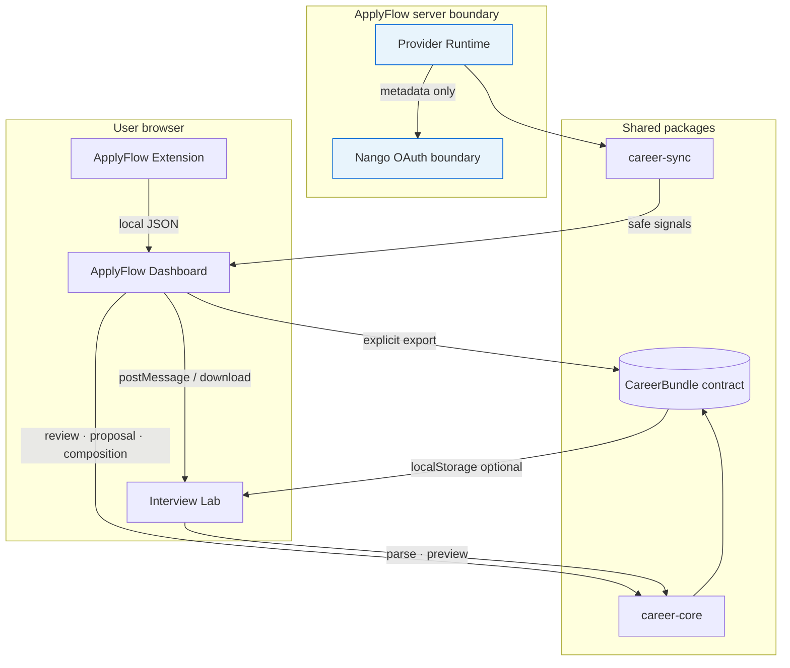

# DevFlow Career Suite — Product and Architecture Case

**Audience:** recruiters, engineers, potential partners, portfolio reviewers.  
**Status:** read-only provider-derived lifecycle **complete**; enrichment **apply** and proposal **import** **explicitly deferred**.

**Related:** [Career Suite landing](./README.md) · [Public case](../public-cases/CAREER-SUITE.md) · [Roadmap](./ROADMAP-EXECUTION.md)

---

## 1. Executive summary

**DevFlow Career Suite** is a modular, **local-first** and **privacy-first** ecosystem for organizing job applications, enriching career context from authorized providers, and preparing for role-specific interviews — with **human review** and **explicit user action** at every sensitive step.

| Question | Answer |
|----------|--------|
| **What is it?** | ApplyFlow (applications) + Interview Lab (practice) + shared typed contracts (`CareerBundle`) + optional provider-derived enrichment (read-only today). |
| **What problem does it solve?** | Scattered application history, disconnected interview prep, repeated form work, and risky “black box” automation on career data. |
| **Who is the user?** | Individual candidates, career coaches, and teams building privacy-conscious career tooling. |
| **What is the differentiator?** | Cross-product **typed handoff**, **auditable AI-assisted workflow** (signals → review → proposal → preview → export), **no mandatory backend** for the core loop, and **engineering governance** (ADRs, contracts, tests). |

Conceptual positioning:

> A modular career workflow where applications become deliberate preparation — local-first, human-reviewed, and explicitly exported — not silently synced or auto-applied.

---

## 2. Product problem

Problems the suite addresses (qualitative — not backed by formal user research metrics):

| Problem | How Career Suite responds |
|---------|---------------------------|
| Career data scattered across tabs and tools | ApplyFlow dashboard + extension; single funnel view |
| Application history fragmented from prep | `CareerBundle` handoff to Interview Lab |
| Repeated Easy Apply metadata entry | Extension-assisted autofill (user confirms each action) |
| Prep disconnected from the actual role | Role-specific practice from application rows |
| Risk of excessive automation | No auto-submit; no automatic enrichment persistence |
| Cloud-first AI defaults | Deterministic core; AI opt-in only where implemented |
| Opaque provider data use | Derived signals only; raw provider payloads blocked from client |

---

## 3. Product principles

| Principle | In the product today |
|-----------|---------------------|
| **Local-first** | Applications in browser storage; export explicit; no Career Suite backend required for core loop |
| **Privacy-first** | No CareerBundle in URLs; provider raw not in UI; safe display values |
| **Human-in-the-loop** | Manual review of derived signals; user selects/dismisses before proposal |
| **Read-only before write** | Provider-derived path ends at export/handoff; Apply deferred ([ADR-003](../adr/ADR-003-PROVIDER-DERIVED-ENRICHMENT-APPLICATION-DEFERRED.md)) |
| **Explicit action** | Buttons for preview, export, handoff — no background sync |
| **Modular architecture** | Apps share only `packages/*`; boundaries documented |
| **Deterministic-first** | `@devflow/career-agents` for scores/gaps; provider enrichment is derived metadata |
| **Server-authoritative boundaries** | Provider runtime server-only; client receives safe signals |

---

## 4. Product ecosystem

| Module | Responsibility | Input | Output | Dependencies | Current state |
|--------|----------------|-------|--------|--------------|---------------|
| **ApplyFlow** (`apps/applyflow`) | Dashboard, provider runtime UI, CareerBundle export, handoff | Extension JSON / demo; optional Nango (flags) | CareerBundle, postMessage, download | `applyflow-core`, `career-core`, `career-sync` | **Implemented** — local-first MVP + provider-derived read-only path |
| **ApplyFlow Extension** (`apps/applyflow-extension`) | LinkedIn Easy Apply capture | LinkedIn DOM | `chrome.storage.local`, export JSON | `applyflow-core`, `applyflow-linkedin` | **Implemented** — MV3; no auto-submit |
| **Interview Lab** (`apps/interview-lab`) | Import, Resume Match, practice, sync preview | CareerBundle JSON | Practice session, localStorage prep | `career-core`, `career-agents` | **Implemented** — no sync persistence |
| **`@devflow/career-core`** | Zod schemas, parse/validate, handoff envelopes, enrichment adapter | CareerBundle JSON | Validated types, prep builders | `career-sync` (types) | **Implemented** |
| **`@devflow/career-sync`** | Signal contracts, enrichment builder, export validation, provider adapters | Fixtures / server metadata | `CareerBundleUnifiedSyncEnrichment`, proposals | — | **Implemented** — contracts + sandbox/runtime helpers |
| **`@devflow/career-agents`** | Deterministic job/resume/ATS analysis | Text in browser | Scores, gaps, questions | — | **Implemented** — optional in Interview Lab |
| **`@devflow/applyflow-core`** | Application types, metrics, import validation | Extension export | Dashboard models | — | **Implemented** |

---

## 5. End-to-end user journey

**Core path (implemented):**

```txt
User organizes applications (ApplyFlow dashboard / extension import)
  → optional: connect provider (explicit consent + feature flags)
  → server fetches metadata → client-safe derived signals
  → user reviews signals (select / dismiss)
  → enrichment proposal (in-memory)
  → eligibility + stale validation
  → transient CareerBundle composition
  → composition source visibility (none | demo | provider-derived-proposal)
  → change preview (current vs proposed)
  → Interview Lab handoff OR explicit JSON download
  → lifecycle ends (no persistence of enrichment apply)
```

**Interview Lab branch (implemented):**

```txt
CareerBundle import (postMessage · clipboard · file)
  → optional sync enrichment read-only preview
  → Resume Match (/career/ats) — optional
  → Train for role → practice session
```

Steps **not** in the journey today: automatic apply, save enrichment to server, proposal import, background export.

---

## 6. Architecture overview



### Trust boundaries

| Boundary | What crosses it | What does not |
|----------|-----------------|---------------|
| Provider → server | OAuth tokens, metadata API responses | — |
| Server → client-safe signals | Redacted derived signals | Raw email bodies, meeting links, provider IDs |
| Manual review → proposal | User-selected signal ids | Unreviewed signals |
| Proposal → preview/export | Transient composition | Persisted CareerBundle mutation |
| Export/handoff | Validated CareerBundle JSON | Full proposal, review state, provider raw |
| Proposal → mutation | **Not implemented** | ADR-003 deferred |

---

## 7. Local-first architecture

**Local-first (accurate today):**

- Application history lives in the browser (`chrome.storage.local`, `localStorage` after import).
- CareerBundle is built and exported in the browser.
- Handoff uses `postMessage`, clipboard, or file — user-initiated.
- Provider-derived proposals are **in-memory** until explicit export.
- No silent upload of career history to a mandatory DevFlow Career Suite API.

**Not claimed:**

- **Offline-first** — apps require dev server or deployment; no service-worker offline bundle sync.
- **Full offline provider runtime** — provider preview requires server routes when enabled.

Distinction: **local-first** = user controls artifacts on device; **offline-first** = full functionality without network (not supported).

---

## 8. Trust and privacy model

| Control | Status |
|---------|--------|
| Provider raw blocked from UI | **Implemented** — adapters redact |
| Sensitive IDs forbidden in client proposals | **Implemented** — validation |
| Manual review required | **Implemented** — `userReviewRequired: true` |
| Export auditable (explicit download/handoff) | **Implemented** |
| Proposal import | **Explicitly deferred** — [ADR-002](../adr/ADR-002-ENRICHMENT-PROPOSAL-EXPORT-ONLY.md) |
| Enrichment apply / persistence | **Explicitly deferred** — [ADR-003](../adr/ADR-003-PROVIDER-DERIVED-ENRICHMENT-APPLICATION-DEFERRED.md) |
| Future mutation contracts | **Proposed only** — [ADR-004](../adr/ADR-004-ENRICHMENT-APPLICATION-CONTRACT-ARCHITECTURE-PROPOSED.md) |

See also: [threat model](./integrations/PROVIDER-DERIVED-ENRICHMENT-APPLICATION-THREAT-MODEL.md) · [contract architecture](./integrations/PROVIDER-DERIVED-ENRICHMENT-APPLICATION-CONTRACT-ARCHITECTURE.md) · [sync data boundaries](./integrations/SYNC-DATA-BOUNDARIES.md).

---

## 9. Provider-derived lifecycle

```mermaid
flowchart LR
  PM[Provider metadata] --> DS[Derived signals]
  DS --> RP[Runtime preview]
  RP --> MR[Manual review]
  MR --> EP[Enrichment proposal]
  EP --> EV[Eligibility + stale check]
  EV --> TC[Transient composition]
  TC --> SV[Source visibility]
  SV --> CP[Change preview]
  CP --> HO[Handoff / export]
  HO --> END[Lifecycle ends]

  style END fill:#d4edda
```



**Explicitly absent:** automatic apply, automatic save, background export, import of exported proposals as trusted input.

Source precedence (export composition): `provider-derived-proposal > demo > none` (mutually exclusive).

---

## 10. CareerBundle

**What it is:** A versioned JSON document (`devflow.careerBundle.v1`) validated by `@devflow/career-core` (Zod) carrying applications, metadata, and optional `syncEnrichment`.

**Role:** Portable contract between ApplyFlow and Interview Lab — no shared database.

**Interoperability:** Single schema for clipboard, file, postMessage, and download paths.

**Handoff:** ApplyFlow opens Interview Lab without `noopener`; sends `devflow.careerBundle.v1` envelope; Interview Lab ACKs with `devflow.careerBundle.ack.v1`. Origins allowlisted via env vars. **No bundle data in URL query strings.**

**Provider-derived export:** Dashboard uses one canonical composition function (`deriveDashboardCareerBundleExportComposition`) for preview, handoff, and download — documented in [handoff validation](./integrations/PROVIDER-DERIVED-EXPORT-HANDOFF-VALIDATION.md).

---

## 11. Engineering decisions

| Decision | Evidence |
|----------|----------|
| Package ownership | `career-sync` contracts; `career-core` bundle validation; apps consume packages only |
| Versioned contracts | `devflow.careerBundle.v1`, proposal export v1, proposed `devflow.enrichment-apply@1` |
| Forbidden keys guard | `collectForbiddenKeysInDocument` in change preview path |
| Source precedence | `provider-derived-proposal > demo > none` |
| Stale proposal protection | `isEnrichmentProposalStale`, fingerprint checks (client); server checks proposed for future apply |
| Safe display values | Change preview uses normalized safe strings |
| Explicit export only | ADR-002 |
| postMessage handshake | ACK + timeout + popup-blocked fallback to clipboard |
| Routing governance | CI `check-routing-governance.sh` |
| Design-system validation | `pnpm check:buttons`, `lint:design-system` baseline |

---

## 12. Testing strategy

**Counts verified** (`pnpm --filter <pkg> test`, June 2026):

| Package | Test files | Tests |
|---------|------------|-------|
| `@devflow/career-sync` | 28 | **443** |
| `@devflow/career-core` | 7 | **54** |
| `applyflow` | 51 | **396** |
| `@devflow/app-interview-lab` | 26 | **152** |
| **Career Suite total** | **112** | **1,045** |

### By category

| Category | Examples | Packages |
|----------|----------|----------|
| Unit / domain | Signal IDs, enrichment validation, stale checks | `career-sync` |
| Domain | `parseCareerBundle`, sync enrichment extract | `career-core` |
| Component / lib | Export composition, handoff, change preview VM | `applyflow` |
| Integration | PostMessage ACK, session consistency | `applyflow` |
| Handoff | `career-bundle-postmessage-handoff.test.ts` | `applyflow` |
| Governance | Routing, design-system (CI) | monorepo scripts |

**E2E limitation:** ApplyFlow has **no Playwright browser E2E suite**. Handoff and export paths are covered by **Vitest** integration tests, not full browser automation. Documented as a known limitation.

```bash
pnpm --filter @devflow/career-sync test
pnpm --filter @devflow/career-core test
pnpm --filter applyflow test
pnpm --filter @devflow/app-interview-lab test
```

---

## 13. Security posture

### Implemented controls

- Trust boundaries (server provider runtime vs client-safe signals)
- Data minimization in proposals and handoff payloads
- Client-safe contract types with safety flags
- Manual review before proposal
- Fail-closed product decisions (no apply endpoint)
- Origin allowlist for postMessage

### Documented for future mutation (not implemented)

- Server-authoritative validation pipeline
- Optimistic concurrency (revision + CAS)
- Idempotency keys
- Audit fail-closed commit
- Demo/import hard-block on write
- Field-level consent

See [threat model](./integrations/PROVIDER-DERIVED-ENRICHMENT-APPLICATION-THREAT-MODEL.md) and [contract architecture](./integrations/PROVIDER-DERIVED-ENRICHMENT-APPLICATION-CONTRACT-ARCHITECTURE.md).

---

## 14. Current capabilities

| Capability | Status | Evidence |
|------------|--------|----------|
| Application capture (extension) | **Implemented** | `apps/applyflow-extension` |
| Dashboard funnel / metrics | **Implemented** | `apps/applyflow` |
| CareerBundle export | **Implemented** | `career-core`, ApplyFlow export card |
| Interview Lab handoff (postMessage) | **Implemented** | `career-bundle-postmessage-handoff.test.ts` |
| Sync enrichment demo export | **Implemented** | Opt-in checkbox |
| Provider-derived runtime preview | **Implemented** | Behind flags + consent |
| Manual signal review | **Implemented** | In-memory UI |
| Enrichment proposal (ephemeral) | **Implemented** | No persistence |
| Proposal export (download) | **Implemented** | ADR-002 export-only |
| Change preview | **Implemented** | Read-only comparison |
| Export composition + source visibility | **Implemented** | PR #101 |
| Interview Lab sync preview | **Implemented** | Read-only, not persisted |
| Resume Match | **Implemented** | `/career/ats` |
| Proposal import | **Deferred** | ADR-002 |
| Enrichment apply | **Deferred** | ADR-003 |
| Mutation contract implementation | **Blocked** | ADR-004 Proposed |

---

## 15. Product matrix

| Feature | User value | Technical owner | Status | Trust level | Next action |
|---------|------------|-----------------|--------|-------------|-------------|
| Application dashboard | Organize funnel | ApplyFlow | implemented | High (local) | Maintain |
| CareerBundle handoff | Seamless prep | `career-core` + both apps | implemented | High | Maintain |
| Provider-derived preview | Informed decisions | `career-sync` + ApplyFlow | implemented | Medium (review required) | Maintain |
| Change preview | Compare before export | `career-core` + ApplyFlow | implemented | High (read-only) | Maintain |
| Composition source badge | Transparency | ApplyFlow | implemented | High | Maintain |
| Proposal JSON export | Offline audit | ApplyFlow + `career-sync` | implemented | Medium (user-held file) | Maintain |
| Threat model | Security baseline | Docs | documented | — | Review sign-off |
| Contract architecture | Future apply gates | Docs | proposed | — | Review ADR-004 |
| Enrichment apply | Persist enrichment | — | deferred | — | Requires Accepted ADR |
| Proposal import | Re-import exports | — | deferred | — | Separate ADR |

---

## 16. Non-goals

- Automated job application / auto-submit
- Automatic profile or CareerBundle mutation
- Background synchronization of enrichment
- Trusted proposal import from exported files
- Provider raw data exposure in UI or exports
- Automatic enrichment persistence
- Enterprise deployment claims without evidence

---

## 17. Business use cases

| Scenario | Classification |
|----------|----------------|
| Individual candidate managing LinkedIn applications | **Current use** |
| Portfolio demo for product engineering roles | **Current use** |
| Career coach reviewing client-exported bundles (manual file) | **Near-term use** (manual export) |
| Recruitment consultancy white-label | **Future potential** (requires productization) |
| Internal talent mobility platform | **Future potential** |
| SaaS with mandatory cloud sync | **Not planned** (conflicts with local-first) |

No named customers or production deployments are claimed.

---

## 18. Product differentiation

Compared to a typical applications CRUD:

| Differentiator | Detail |
|----------------|--------|
| Cross-product contracts | Typed `CareerBundle` between distinct apps |
| Auditable AI-assisted workflow | Signals → review → proposal → preview → export |
| Local-first trust model | No mandatory central career API |
| Manual review | User selects signals; no auto-apply |
| Modular packages | `career-sync` / `career-core` reusable boundaries |
| Export/handoff interoperability | postMessage + ACK, clipboard, file |
| Engineering governance | ADRs, threat model, CI gates |

---

## 19. Portfolio value

This case demonstrates:

| Skill area | Evidence in repo |
|------------|------------------|
| Product engineering | End-to-end journey, explicit deferred decisions |
| Fullstack architecture | Apps + packages + server provider boundary |
| AI integration | Derived signals, opt-in coaching (Interview Lab) |
| Security thinking | Threat model, ADRs, safe types |
| Contract design | Zod schemas, versioned envelopes, proposed mutation contract |
| Frontend UX | Dashboard panels, change preview, source visibility |
| Testing | 1,045 Vitest tests across Career Suite packages |
| Documentation | 45+ files under `docs/career-suite/` |
| Governance | Routing + design-system CI checks |

---

## 20. Known limitations

| Limitation | Detail |
|------------|--------|
| No ApplyFlow Playwright E2E | Browser flows tested via Vitest; manual demo for recordings |
| Provider runtime needs configuration | Feature flags default-off; Nango/env required for real providers |
| Session in memory | Proposals not persisted server-side |
| Popup may be blocked | Handoff falls back to clipboard |
| Clipboard fallback | User must paste manually in Interview Lab |
| Apply deferred | ADR-003 — no enrichment persistence |
| Import deferred | ADR-002 — exported proposals not trusted inputs |
| No persisted CareerBundle identity | Future apply requires server identity model |
| Offline-first not supported | Network required for provider preview when enabled |

---

## 21. Roadmap

### Completed

- CareerBundle handoff ApplyFlow ↔ Interview Lab
- Sync enrichment contracts + demo loop
- Provider-derived read-only lifecycle through export/handoff
- Threat model (ADR-003) + contract architecture proposed (ADR-004)

### Next product-facing work (no Apply)

- Capture Career Suite screenshots per [assets checklist](./assets/README.md)
- Security/privacy review of ADR-004 gates
- Provider runtime hardening behind flags

### Future research

- LibreChat / MCP lab over deterministic signals
- Field allowlist approval for hypothetical apply

### Explicitly deferred

- Enrichment apply ([ADR-003](../adr/ADR-003-PROVIDER-DERIVED-ENRICHMENT-APPLICATION-DEFERRED.md))
- Proposal import ([ADR-002](../adr/ADR-002-ENRICHMENT-PROPOSAL-EXPORT-ONLY.md))
- Automatic or background application

**Apply is not the next delivery.**

---

## 22. Running the project

### Requirements

- Node.js 20+
- pnpm 9+
- Chrome (for extension; optional for dashboard demo)

### Install

```bash
pnpm install
```

### Build shared packages

```bash
pnpm --filter @devflow/applyflow-core build
pnpm --filter @devflow/career-core build
pnpm --filter @devflow/career-sync build
```

### ApplyFlow dashboard

```bash
pnpm --filter applyflow dev
# → http://localhost:3010/dashboard
```

Load **Carregar demo** for safe fictional data.

### Interview Lab

```bash
pnpm --filter @devflow/app-interview-lab dev
# → http://localhost:3015/import/applyflow
```

### Tests

```bash
pnpm --filter @devflow/career-sync test    # 443 tests
pnpm --filter @devflow/career-core test    # 54 tests
pnpm --filter applyflow test               # 396 tests
pnpm --filter @devflow/app-interview-lab test  # 152 tests
```

### Feature flags

Provider runtime is **default-off**. See [PROVIDER-RUNTIME-FEATURE-FLAGS.md](./integrations/PROVIDER-RUNTIME-FEATURE-FLAGS.md). Do not commit secrets; use `.env.local` per app READMEs.

### Handoff env vars (optional)

| Variable | App | Purpose |
|----------|-----|---------|
| `NEXT_PUBLIC_INTERVIEW_LAB_URL` | ApplyFlow | Handoff target origin |
| `NEXT_PUBLIC_APPLYFLOW_URL` | Interview Lab | postMessage allowlist |

---

## 23. Demo walkthrough

Reproducible path (sandbox data):

1. **Open ApplyFlow** — `http://localhost:3010/dashboard` → **Carregar demo**
2. **Optional provider path** — enable documented flags → run derived preview → review signals → select → build proposal
3. **Change preview** — compare current vs proposed enrichment (read-only)
4. **Composition source** — note badge: `none` / `demo` / `provider-derived-proposal`
5. **Handoff** — **Prepare in Interview Lab** (postMessage + ACK) or **Exportar** JSON
6. **Interview Lab** — import screen shows bundle summary; optional sync enrichment preview
7. **Practice** — **Train for this role** or Resume Match branch

Extended scripts: [demo/CAREER-SUITE-WALKTHROUGH.md](./demo/CAREER-SUITE-WALKTHROUGH.md) · [public demo script](../public-cases/CAREER-SUITE-DEMO-SCRIPT.md)

---

## 24. Screenshots and media

**Career Suite–specific screenshots:** not yet in repo — see [assets/README.md](./assets/README.md) for capture checklist.

**Existing ApplyFlow assets** (reusable for dashboard context):

| Asset | Path |
|-------|------|
| Dashboard overview | [`docs/applyflow/assets/02-applyflow-dashboard-overview.png`](../applyflow/assets/02-applyflow-dashboard-overview.png) |
| Applications table | [`docs/applyflow/assets/04-applyflow-applications-table.png`](../applyflow/assets/04-applyflow-applications-table.png) |

Pending captures: provider review, career insights, change preview, composition source, Interview Lab handoff.

---

## 25. References

| Document | Topic |
|----------|-------|
| [ADR-002](../adr/ADR-002-ENRICHMENT-PROPOSAL-EXPORT-ONLY.md) | Export-only; import deferred |
| [ADR-003](../adr/ADR-003-PROVIDER-DERIVED-ENRICHMENT-APPLICATION-DEFERRED.md) | Apply deferred |
| [ADR-004](../adr/ADR-004-ENRICHMENT-APPLICATION-CONTRACT-ARCHITECTURE-PROPOSED.md) | Contract architecture proposed |
| [Threat model](./integrations/PROVIDER-DERIVED-ENRICHMENT-APPLICATION-THREAT-MODEL.md) | Security analysis |
| [Contract architecture](./integrations/PROVIDER-DERIVED-ENRICHMENT-APPLICATION-CONTRACT-ARCHITECTURE.md) | Mutation prerequisites |
| [Export lifecycle](./integrations/PROVIDER-DERIVED-ENRICHMENT-PROPOSAL-LIFECYCLE.md) | Proposal trust model |
| [Handoff validation](./integrations/PROVIDER-DERIVED-EXPORT-HANDOFF-VALIDATION.md) | Composition consistency |
| [Roadmap](./ROADMAP-EXECUTION.md) | Execution plan |
| [Integrations index](./integrations/README.md) | Provider contracts |
| [Public case](../public-cases/CAREER-SUITE.md) | Recruiter-facing narrative |

---

## Positioning language

**Use:** designed with · validated by · currently supports · explicitly deferred · proposed for review

**Avoid without formal evidence:** enterprise-ready · production-grade · fully secure · GDPR compliant · complete AI agent · fully autonomous
