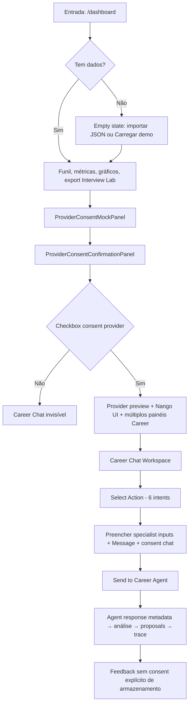

# Career Suite Product & UX Readiness Review

**Date:** 2026-06-18  
**Branch audited:** `main` @ `8cb4ab54b5b77eabc110a0fb9c12ff77b51ad389`  
**Environment:** ApplyFlow Preview (controlled pilot; providers off)  
**Pilot tracking issue:** [#129](https://github.com/devflow-modules/devflow/issues/129)  
**Scope:** Product and UX audit only — no runtime changes in this review.

---

## Executive summary

The Career Suite specialist agents (`analyze_resume`, `analyze_ats_compatibility`, `plan_career_strategy`) are **technically implemented** and covered by operational docs, but the **participant-facing experience is not ready** for the first closed-pilot session (P01).

The primary blockers are **discoverability**, **journey continuity**, and **result comprehension**: Career Chat is buried behind a provider-consent gate on a dashboard oriented to application tracking; the three pilot flows appear as one option among six in an English-heavy developer UI; results lead with agent metadata and execution traces before actionable recommendations.

**Decision:** **UX REMEDIATION REQUIRED** — do not start P01 until P1 items in the remediation backlog are resolved and this document is updated to **READY FOR P01**.

**Phase 1 (2026-06-21):** P1-01, P1-02, P1-03, P1-04, and P1-06 implemented in ApplyFlow pilot UI — **pending re-audit**. P1-05 and P1-07 remain open (Phase 2).

**Phase 2 (2026-06-21):** P1-05 (participant result hierarchy + progressive disclosure) and P1-07 (explicit feedback-storage consent) implemented — **pending merge and Preview smoke**.

---

## Product status

| Area | State | Notes |
|------|-------|-------|
| Specialist agents (3 pilot intents) | Implemented | Deterministic results, review proposals, no execution |
| Pilot mode badge + notice | Implemented | Visible when `CAREER_PILOT_MODE=true` |
| Feedback API | Implemented | `consentToStore` contract; UI always sends `false` |
| Operational health / system-status | Implemented | Operator surface, not participant journey |
| Participant journey (guided 3-step) | **Missing** | No sequential UX; tools feel disconnected |
| Value proposition (≤10 s) | **Missing** | Dashboard communicates application funnel, not career analysis |
| Provider panels in pilot path | **Misaligned** | Gmail/Calendar consent UI visible; pilot excludes providers |
| Documentation ↔ UI alignment | **Partial** | Runbook says “Career Chat → three specialist intents”; UI requires provider checkbox first |

---

## Primary user

**Pilot primary user (P01–P05):**

> Profissional buscando recolocação ou mudança de cargo, com currículo existente e pelo menos uma vaga real para comparar.

**Secondary personas (future — out of scope for P01):**

| Persona | Status |
|---------|--------|
| Recrutadores / RH / empresas | Future |
| Coaches / universidades / agências | Future |
| Candidatos sem currículo | Future |
| Usuários avançados de automação | Future |

---

## Value proposition

**Recommended proposition (audit baseline):**

> A Career Suite transforma currículo, vaga e objetivo profissional em um plano de ação revisável para melhorar posicionamento, compatibilidade e preparação de carreira.

### Ten-second comprehension check

| Question | Answer | Evidence |
|----------|--------|----------|
| O usuário entende o que o produto faz? | **No** | `/dashboard` headline and sections describe application tracking, funil, export to Interview Lab — not resume/ATS/strategy analysis |
| O usuário entende para quem serve? | **No** | No participant-facing copy targeting job seekers in recolocação |
| O usuário entende o que precisa fornecer? | **Partial** | Specialist inputs exist (bullets, skills, job requirements) but are hidden deep in the page and require unexplained prerequisites |
| O usuário entende o que receberá? | **Partial** | Results render after send, but structure/score labels are English and mixed with agent metadata |
| O usuário entende que nada será enviado automaticamente? | **Partial** | Pilot notice states no application submitted; provider OAuth UI undermines this message |
| O usuário entende que os resultados exigem revisão humana? | **Partial** | “Manual review” / “Review required” badges exist but sit alongside “Approve once” and tool proposal flows that read as executable |

**Proposta de valor score:** **2 / 5**

---

## Current journey



### Stage assessment

| Stage | Clarity | Cognitive load | Decisions | Abandon risk | Trust |
|-------|---------|----------------|-----------|--------------|-------|
| Entrada | Low | High | Import vs demo vs empty | High | Medium (privacy notice on import) |
| Escolha de fluxo | Low | High | 6 intents + provider provider | High | Low (OAuth adjacent) |
| Envio de dados | Medium | High | Consent ×2, message required, specialist fields | Medium | Medium |
| Processamento | Medium | Low | 0 | Low | Medium |
| Resultado | Low | High | Review proposal / approve once | Medium | Medium |
| Revisão | Low | High | Tool proposals, JSON preview | High | Low for non-technical users |
| Próxima ação | **Absent** | — | No “step 2 of 3” | High | — |
| Feedback | Low | Low | 3 buttons, no storage consent | Low | Low (runbook expects Q9 consent) |

---

## Recommended journey

The pilot should present **one coherent sequence**, not three disconnected tools:

```text
1. Analise seu currículo
2. Compare com uma vaga
3. Monte seu plano de ação
```

### Recommended information architecture (documentation only — not implemented)

#### Entrada

- Explicação curta do benefício (proposta de valor em PT)
- Explicação de privacidade (“dados usados só nesta análise…”)
- CTA principal: “Começar análise do currículo”
- Duração estimada: ~20–30 min para os 3 passos
- Indicação de piloto fechado (Preview, sem envio de candidatura)

#### Etapa 1 — Currículo

- Input claro (bullets + skills); orientação de formato; exemplo mínimo
- Aviso: dados não persistidos sem autorização
- Análise → **Resultado 1:** resumo, 3 pontos fortes, 3 problemas prioritários, 3 próximas ações; scores em seção secundária

#### Etapa 2 — Vaga

- Descrição da vaga colada manualmente; explicar comparação ATS
- **Resultado 2:** score, keywords, requisitos atendidos/ausentes, riscos, ações de melhoria

#### Etapa 3 — Estratégia

- Objetivo, prazo, disponibilidade, restrições
- **Resultado 3:** plano 30/60/90, prioridades, riscos

#### Encerramento

- Resumo consolidado; prioridades; feedback com **consent explícito** para armazenar; export/copy somente se já existir de forma segura

---

## Surface inventory

### Routes (`apps/applyflow/src/app`)

| Route | Objective | Audience | Primary action | Pilot relevance |
|-------|-----------|----------|----------------|-----------------|
| `/` | Marketing / entry | Public | Navigate to dashboard | Low |
| `/dashboard` | Application tracking + Career panels | Participant (intended) | Import/demo → analysis | **High** — main entry |
| `/dashboard/system-status` | Ops diagnostics | Operator | View health/flags/commit | Operator only |
| `/documentacao` | Product docs | Mixed | Read documentation | Medium |

### Career-related UI components (embedded in `/dashboard`)

| Surface | Location | Objective | Pilot flow |
|---------|----------|-----------|------------|
| **Career Chat Workspace** | `ProviderDerivedRuntimePreviewPanel` → `career-chat-workspace.tsx` | Chat adapter → specialist agents | **Primary** — 3 pilot intents |
| Career Agent Workspace | Same panel | Direct orchestration (non-chat) | Out of pilot scope |
| Career AI Draft | Same panel | LLM structured draft | Out of pilot scope |
| Approved Automation Review | Same panel | Automation proposals | Out of pilot scope |
| Provider Consent Confirmation | `provider-consent-confirmation-panel.tsx` | OAuth consent gate | **Gate** — must check to reveal Career Chat |
| Provider Consent Mock | `provider-consent-mock-panel.tsx` | Demo provider capabilities | Confusing in pilot |
| Provider-derived preview / timeline | `provider-derived-runtime-preview-panel.tsx` | Signal preview | Noise for pilot |
| Career tool permission review | `career-tool-permission-review.tsx` | Post-approval tool review | Advanced; exposes tool names |

### Per-surface detail — Career Chat Workspace

| Dimension | Current behavior |
|-----------|------------------|
| **Entrada exigida** | `CareerBundle` with ≥1 application (demo import or JSON); provider consent checkbox on parent panel |
| **Ação principal** | Select intent → fill specialist fields + message → consent → “Send to Career Agent” |
| **Resultado** | Agent metadata, resume/ATS/strategy blocks, review proposal, tool proposals, execution trace |
| **Próxima ação** | None guided; user must change Action dropdown manually |
| **Empty states** | “Load dashboard applications…”, idle/blocked/validating messages (English) |
| **Loading** | “Sending…”, “Validating chat request…” |
| **Error** | “Career chat adapter failed safely.” (generic English) |
| **Confiança** | Pilot notice (EN); badges Read-only / Manual review / In-memory only |
| **Feedback** | 3 rating buttons; `consentToStore: false` always; no comment field in UI |

---

## Heuristic review

| # | Heuristic | Finding | Surface | Severity |
|---|-----------|---------|---------|----------|
| 1 | Visibilidade do estado | Status messages exist but English-only; blocked state conflates adapter flag with consent | Career Chat | P2 |
| 2 | Linguagem do usuário | Mixed PT/EN; “Career Chat Workspace”, “Send to Career Agent” | Career Chat, dashboard | P1 |
| 3 | Controle e liberdade | “Approve once” + tool review panels suggest execution path | Career Chat | P2 |
| 4 | Consistência | Runbook PT scenarios vs EN UI chrome | Docs vs UI | P1 |
| 5 | Prevenção de erros | Message required even when specialist fields carry content; default message is dev English | Career Chat | P2 |
| 6 | Reconhecimento vs memória | User must remember to load demo, check provider consent, scroll past provider UI | Dashboard | P1 |
| 7 | Eficiência | ~5+ scroll sections before Career Chat; no wizard | Dashboard | P1 |
| 8 | Design minimalista | 4+ Career panels + provider panels on same page | Provider preview panel | P2 |
| 9 | Recuperação de erros | Generic adapter failure message; no retry guidance | Career Chat | P2 |
| 10 | Ajuda contextual | DEMO.md describes engineer walkthrough, not participant script | Docs | P2 |
| 11 | Acessibilidade | Labels on inputs; 11px text; mixed language hurts screen reader consistency | Career Chat | P2 |
| 12 | Responsividade | Mobile tests exist (`career-chat-workspace-pilot.test.tsx`) | Career Chat | P3 |
| 13 | Confiança | Pilot notice good; OAuth/Gmail/Calendar UI adjacent | Provider + Career | P1 |
| 14 | Privacidade percebida | “In-memory only” badge; provider scopes preview visible | Mixed | P1 |

---

## Language review

| Term (exposed) | Classification | Product suggestion |
|----------------|----------------|-------------------|
| `Career Chat Workspace` | Ocultar / traduzir | “Análise de carreira” |
| `Action` | Traduzir | “Tipo de análise” |
| `Send to Career Agent` | Traduzir | “Analisar” |
| `Agent response` | Ocultar (diagnóstico) | — |
| `Status` / `Agent:` | Ocultar | — |
| `Review required` | Traduzir | “Revise antes de usar” |
| `Review proposal` | Traduzir | “Sugestão de melhoria” |
| `Proposal tool` / `Export tool` | Ocultar | — |
| `Tool proposals` | Ocultar ou colapsar | “Sugestões (somente leitura)” |
| `Execution trace` | Ocultar (diagnóstico) | — |
| `toolName`, `riskLevel` | Ocultar | — |
| `Approve once` | Traduzir + clarificar | “Marcar como revisado (não executa)” |
| `Copy structured response` | Traduzir | “Copiar resultado” |
| `CareerBundle` | Ocultar | “Seus dados de candidaturas (sessão)” |
| `LibreChat adapter` | Ocultar | Mensagem amigável se desabilitado |
| `structureScore` (docs) | Diagnóstico | “Qualidade da estrutura” |
| `keyword stuffing` (docs) | Diagnóstico | “Excesso artificial de palavras-chave” |
| `executedExternally` (API) | Não expor | “Nenhuma ação foi executada” |
| `persisted` (API) | Não expor | “Seus dados não foram armazenados” |
| Specialist intents (3) | Adequado (PT) | Manter PT consistente em todo o painel |

**Internal contracts remain unchanged** — translations apply to UI copy only.

---

## Result hierarchy review

**Recommended order:** summary → achados → ações → riscos → scores → evidências → detalhes técnicos → metadados segurança

**Current order (Career Chat completed state):**

1. Agent response (`Status`, `Agent`, `Summary`) — **technical first**
2. Resume/ATS/Strategy blocks (score early, lists as semicolon strings)
3. Review proposal (`proposalTool`, `exportTool`, `Executed`)
4. Tool proposals (`toolName`, `status`, `riskLevel`)
5. Proposal review (JSON `input preview`)
6. Execution trace
7. Feedback

**Classification:** **P1** — metadata and tool names appear before prioritized, scannable recommendations; pilot success criterion “understand results without technical help” is at risk.

---

## Trust and privacy review

| Commitment | Communicated? | Gap |
|------------|---------------|-----|
| Nenhum envio de candidatura | Partial | Pilot notice (EN); buried below fold |
| Nenhum acesso a e-mail | **Undermined** | Gmail/Calendar provider UI visible |
| Nenhuma ação externa | Partial | Tool proposals + “Approve once” imply execution |
| Nenhum armazenamento silencioso | Partial | “In-memory only” badge; demo persists in localStorage |
| Revisão humana obrigatória | Partial | Badges exist; hierarchy emphasizes agent automation |
| IA controlada / mock | Not to participant | system-status only |
| Piloto Preview | Partial | Pilot badge on Career Chat only |
| Limitações dos resultados | Partial | Notice mentions suggestions may need correction |

### Proposed microcopy (documentation only — not added to code in this review)

**Antes da análise:**

> Seus dados são usados apenas nesta análise e não são armazenados sem sua autorização.

**Antes do resultado:**

> As recomendações são sugestões para revisão. Nenhuma alteração ou candidatura foi executada.

**Feedback:**

> Seu feedback só será registrado com sua autorização.

---

## Accessibility review

| Aspect | Assessment | Severity |
|--------|------------|----------|
| Form labels | Present on selects/textareas | OK |
| Text size | Predominantly 11px | P2 |
| Language | Mixed PT/EN | P2 |
| Focus / keyboard | Standard controls; no skip link to Career Chat | P2 |
| Color contrast | Dark theme with muted text; badges readable | P3 |
| Mobile | Test coverage exists; long scroll on small viewports | P2 |

**Accessibility score:** **3 / 5**

---

## Severity matrix

### P0 — Critical

| ID | Issue | Status |
|----|-------|--------|
| — | None identified in UX audit (security architecture assumes no P0 in Preview with flags off) | — |

### P1 — Blocking for P01

| ID | Surface | Description | Remediation |
|----|---------|-------------|-------------|
| P1-01 | Dashboard / provider gate | Career Chat only renders after **provider consent checkbox** — contradicts pilot scope (providers off) and runbook quick reference | **implemented — pending re-audit** (Phase 1: `CareerPilotExperience` decouples chat from provider consent) |
| P1-02 | Dashboard entry | No participant onboarding: value prop, 3-step journey, or CTA visible within 10 s | **implemented — pending re-audit** (Phase 1: `CareerPilotOnboarding`) |
| P1-03 | Dashboard prerequisite | “Load dashboard applications” / demo import required before analysis — not explained for user with own résumé-only workflow | **implemented — pending re-audit** (Phase 1: inline inputs + optional “Preencher com exemplo”) |
| P1-04 | Career Chat | Pilot’s 3 intents buried in 6-option dropdown; default intent is `prepare_interview` (out of pilot scope) | **implemented — pending re-audit** (Phase 1: three pilot intents only; default `analyze_resume`) |
| P1-05 | Career Chat results | Technical metadata (Agent, Status, tools, trace) before actionable recommendations | **implemented — pending re-audit** (Phase 2: `CareerPilotResultView` hierarchy + collapsed technical details) |
| P1-06 | Trust | Provider OAuth / Gmail / Calendar panels visible during closed pilot — erodes “no email access” message | **implemented — pending re-audit** (Phase 1: provider panels hidden when `NEXT_PUBLIC_CAREER_PILOT_MODE=true`) |
| P1-07 | Feedback | In-app feedback submits with `consentToStore: false` and no consent UI — misaligned with runbook Q9 and explicit consent requirement | **implemented — pending re-audit** (Phase 2: `CareerPilotFeedback` consent gate + `consentToStore: true` only on explicit submit) |

### P2 — Validate during P01/P02 or fix before P02

| ID | Surface | Description |
|----|---------|-------------|
| P2-01 | Career Chat | Mixed PT/EN across labels, buttons, errors, empty states |
| P2-02 | Career Chat | Required free-text “Message” unclear for specialist flows; default dev placeholder |
| P2-03 | Career Chat | Review proposal exposes `proposalTool`, `exportTool`, `Executed` |
| P2-04 | Career Chat | Execution trace and tool proposals visible to participants |
| P2-05 | Dashboard | No guided “step 2 / step 3” between flows |
| P2-06 | Dashboard | Multiple Career panels (Agent, AI Draft, Automation) add noise |
| P2-07 | Docs vs UI | Runbook operator path oversimplifies navigation |
| P2-08 | Errors | Generic “adapter failed safely” without recovery steps |
| P2-09 | Results | Long semicolon-joined lists reduce scannability |
| P2-10 | system-status | Could be linked for operators but must not be participant entry |

### P3 — Backlog

| ID | Surface | Description |
|----|---------|-------------|
| P3-01 | Visual | Refine badge copy and hierarchy styling |
| P3-02 | UX | Optional comment field on feedback |
| P3-03 | UX | Estimated duration indicator on entry |
| P3-04 | A11y | Increase base font size in Career panels |

---

## Readiness score

Re-audit date: **2026-06-21** (after Phase 1 + Phase 2 code; Preview smoke pending merge).

| Dimensão | Nota | Rationale |
|----------|-----:|-----------|
| Proposta de valor | 4 | Pilot onboarding communicates benefit, journey, and privacy within first viewport |
| Clareza do onboarding | 4 | PT entry block, three steps, CTA, optional example data |
| Clareza dos inputs | 3.5 | Inline specialist fields with hints; no hidden CareerBundle prerequisite |
| Continuidade da jornada | 3.5 | Guided three-step shell; user selects flow explicitly |
| Qualidade dos resultados | 4 | Summary → findings → actions → risks → scores; technical details collapsed |
| Priorização das ações | 4 | Up to three prioritized actions surfaced before evidence |
| Confiança e privacidade | 4 | Provider UI hidden in pilot; privacy copy; feedback consent explicit |
| Estados de erro | 3 | Safe PT messages; limited recovery guidance |
| Feedback | 4 | Consent required before submit; no resume/job payload |
| Acessibilidade | 3.5 | Headings order, labels, keyboard-native `<details>` disclosure |
| Responsividade | 3.5 | Layout tests; mobile-friendly stacks |
| Prontidão para P01 | 3.5 | All P1 code-complete; await merged Preview smoke |

**Média geral:** **3.8 / 5**

### READY FOR P01 criteria

| Criterion | Met? |
|-----------|------|
| No P0 | Yes |
| No open P1 | **Yes (code)** — pending merge + Preview smoke confirmation |
| Média geral ≥ 3.5 | **Yes** (3.8) |
| Proposta de valor ≥ 4 | **Yes** (4) |
| Onboarding ≥ 3 | **Yes** (4) |
| Confiança ≥ 4 | **Yes** (4) |
| Fluxo principal completo | **Yes** (entry → analysis → results → optional feedback) |
| Preview validado | **Pending** — ApplyFlow Preview must be smoke-tested after Phase 2 merge |

---

## Blocking issues

All **P1** items are **addressed in code** (Phase 1 + Phase 2). Operator must confirm ApplyFlow Preview smoke on merged `main` before scheduling P01.

| ID | Status |
|----|--------|
| P1-01 | Resolved — Career Chat in `CareerPilotExperience` without provider gate |
| P1-02 | Resolved — `CareerPilotOnboarding` |
| P1-03 | Resolved — inline inputs + optional example |
| P1-04 | Resolved — three pilot intents; default `analyze_resume` |
| P1-05 | Resolved — `CareerPilotResultView` participant hierarchy |
| P1-06 | Resolved — provider panels hidden in pilot mode |
| P1-07 | Resolved — `CareerPilotFeedback` explicit storage consent |

---

## Non-blocking issues

See **P2** and **P3** tables above. Address P2 during remediation sprint or validate during P01 observation with operator assistance (not ideal).

---

## Recommended remediation sequence

1. **Unblock path** — Career Chat reachable without provider consent in pilot mode (P1-01, P1-06)  
2. **Entry + journey shell** — Value prop, privacy line, 3-step progress indicator (P1-02, P1-03, P2-05)  
3. **Scope the tool** — Three intents only, PT copy, default resume analysis (P1-04, P2-01)  
4. **Result layout** — Participant-first hierarchy; collapse trace/tools (P1-05, P2-03, P2-04)  
5. **Feedback consent** — Checkbox + accurate thank-you copy (P1-07)  
6. **Docs sync** — Update DEMO.md operator steps after UI changes (P2-07)  
7. **Re-audit** — Update this document; target **READY FOR P01**  

---

## Decision

```text
READY FOR P01 — pending Phase 2 merge and ApplyFlow Preview smoke
```

All seven P1 items are resolved in the codebase (Phase 1 + Phase 2). Objective readiness thresholds pass the re-audit (2026-06-21). **Do not schedule P01** until:

1. Phase 2 PR merges to `main`
2. ApplyFlow Preview deploy is **Ready** with pilot flags active
3. Operator completes protected Preview smoke per [`PILOT-VALIDATION.md`](./PILOT-VALIDATION.md) (including result hierarchy and feedback consent UI)
4. Pilot owner updates this document to **`READY FOR P01`** without the pending qualifier

**Remediation tracking:** [#131](https://github.com/devflow-modules/devflow/issues/131) · pilot [#129](https://github.com/devflow-modules/devflow/issues/129)

---

## Contradictions (documentation · UI · routes · contracts)

| Topic | Documentation | UI / routes | Severity |
|-------|---------------|-------------|----------|
| Career Chat access | Runbook: “/dashboard → Career Chat → three specialist intents” | Requires provider consent checkbox + scroll | P1 |
| Pilot flows | Runbook: only 3 intents | UI: 6 intents; default `prepare_interview` | P1 |
| Feedback consent | Runbook Q9 + PILOT-VALIDATION `consentToStore` | UI: no consent; always `false` | P1 |
| User journey | README/case: applications → provider → export | Pilot user: résumé + job posting, no providers | P1 |
| Language | Runbook scenarios in PT | Career Chat chrome in EN | P2 |
| `toolExecutionOccurred` vs `executedExternally` | PILOT-VALIDATION notes divergence | Not participant-visible | P3 (internal) |

---

## Audit metadata

| Field | Value |
|-------|-------|
| Auditor | Automated product/UX readiness review (2026-06-18) |
| Code changes in this review | None (documentation only) |
| Runtime / providers / deploy | Not modified |
| Related docs | [`PILOT-RUNBOOK.md`](./PILOT-RUNBOOK.md), [`PILOT-VALIDATION.md`](./PILOT-VALIDATION.md), [`DEMO.md`](./DEMO.md), [`ARCHITECTURE.md`](./ARCHITECTURE.md) |
