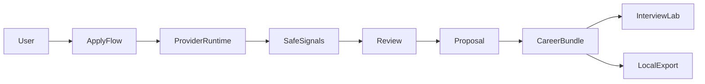

# DevFlow Career Suite

> **Local-first · privacy-first · human-reviewed** — modular career workflow connecting applications, provider-derived context, and interview preparation.

**Full product & architecture case (recruiters, engineers, partners):**  
**[CAREER-SUITE-PRODUCT-AND-ARCHITECTURE-CASE.md](./CAREER-SUITE-PRODUCT-AND-ARCHITECTURE-CASE.md)**

**Public portfolio narrative:** [`../public-cases/CAREER-SUITE.md`](../public-cases/CAREER-SUITE.md)  
**Portfolio launch package (LinkedIn, CV, interviews):** [`CAREER-SUITE-PORTFOLIO-LAUNCH-PACKAGE.md`](./CAREER-SUITE-PORTFOLIO-LAUNCH-PACKAGE.md)

---

## Overview

| Piece | Role |
|-------|------|
| **ApplyFlow** | Applications dashboard + provider-derived read-only enrichment path |
| **Interview Lab** | Import, Resume Match, practice |
| **CareerBundle** | Typed JSON handoff (`@devflow/career-core`) |
| **career-sync** | Provider signal contracts + enrichment builder |

**Current product posture:** read-only provider-derived lifecycle **complete** through export/handoff. **Apply** and proposal **import** are **explicitly deferred** (ADR-002, ADR-003).


*Dashboard com ~20 candidaturas fictícias. Galeria completa e estados bloqueados: [assets checklist](./assets/README.md).*

---

## User journey (summary)

```txt
Organize applications → optional provider signals → manual review
→ proposal → change preview → CareerBundle composition
→ Interview Lab handoff / export → lifecycle ends
```

Detail: [case §5](./CAREER-SUITE-PRODUCT-AND-ARCHITECTURE-CASE.md#5-end-to-end-user-journey)

---

## Architecture



Boundaries and packages: [case §6](./CAREER-SUITE-PRODUCT-AND-ARCHITECTURE-CASE.md#6-architecture-overview)

---

## Trust model

- Provider raw does not reach the UI
- Manual review before proposals
- Explicit export/handoff only
- Import deferred · Apply deferred · mutation blocked

ADRs: [002](../adr/ADR-002-ENRICHMENT-PROPOSAL-EXPORT-ONLY.md) · [003](../adr/ADR-003-PROVIDER-DERIVED-ENRICHMENT-APPLICATION-DEFERRED.md) · [004](../adr/ADR-004-ENRICHMENT-APPLICATION-CONTRACT-ARCHITECTURE-PROPOSED.md) (Proposed)

---

## Current status

| Area | State |
|------|--------|
| CareerBundle handoff | **Implemented** |
| Provider-derived preview → export | **Implemented** |
| Change preview + composition source | **Implemented** |
| Threat model | **Documented** |
| Contract architecture | **Proposed** |
| Enrichment apply | **Deferred** |
| Proposal import | **Deferred** |

Capability table: [case §14](./CAREER-SUITE-PRODUCT-AND-ARCHITECTURE-CASE.md#14-current-capabilities)

---

## Quickstart

```bash
pnpm install
pnpm --filter @devflow/career-core build
pnpm --filter @devflow/career-sync build
pnpm --filter applyflow dev          # http://localhost:3010/dashboard
pnpm --filter @devflow/app-interview-lab dev  # http://localhost:3015
```

Tests (1,045 across Career Suite packages): [case §12](./CAREER-SUITE-PRODUCT-AND-ARCHITECTURE-CASE.md#12-testing-strategy)

---

## Deep documentation

| Topic | Link |
|-------|------|
| **Product & architecture case** | [CAREER-SUITE-PRODUCT-AND-ARCHITECTURE-CASE.md](./CAREER-SUITE-PRODUCT-AND-ARCHITECTURE-CASE.md) |
| **Portfolio launch package** | [CAREER-SUITE-PORTFOLIO-LAUNCH-PACKAGE.md](./CAREER-SUITE-PORTFOLIO-LAUNCH-PACKAGE.md) · [LinkedIn](./portfolio/LINKEDIN-LAUNCH-POSTS.md) · [Video](./portfolio/VIDEO-SCRIPTS.md) · [Evidence](./portfolio/EVIDENCE-AND-CLAIMS-MATRIX.md) |
| Roadmap execution | [ROADMAP-EXECUTION.md](./ROADMAP-EXECUTION.md) |
| Provider integrations | [integrations/README.md](./integrations/README.md) |
| Demo walkthrough | [demo/CAREER-SUITE-WALKTHROUGH.md](./demo/CAREER-SUITE-WALKTHROUGH.md) |
| Resume Match case | [RESUME-MATCH-CASE-STUDY.md](./RESUME-MATCH-CASE-STUDY.md) |
| Screenshot checklist | [assets/README.md](./assets/README.md) |
| Verified screenshots | [01 dashboard](./assets/01-applyflow-dashboard.png) · [05 composition](./assets/05-export-composition-source.png) · [06 handoff](./assets/06-interview-lab-handoff.png) |
| Agent architecture | [AGENT-ARCHITECTURE.md](./AGENT-ARCHITECTURE.md) |

---

## App READMEs

- [`apps/applyflow/README.md`](../../apps/applyflow/README.md)
- [`apps/interview-lab/README.md`](../../apps/interview-lab/README.md)
- [`apps/applyflow-extension/README.md`](../../apps/applyflow-extension/README.md)
