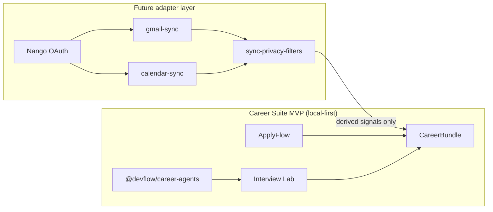

# Nango Gmail/Calendar Plan for Career Suite

> **Future integration adapter — not implemented.** [Nango](https://www.nango.dev/) is planned as the OAuth and sync layer for Gmail and Google Calendar signals. It is **not** part of the Career Suite MVP runtime and is **not** added to this monorepo in Phase 1.

## Purpose

Use Nango as the **OAuth and integration layer** for future Gmail and Google Calendar sync that enriches career workflows (application tracking, interview prep timing, follow-ups).

Nango is an **integration adapter**, not the Career Suite core. Scoring, job/resume analysis, and ATS-style matching remain in **`@devflow/career-agents`**.

## Existing core (do not replace)

| Layer | Role |
|-------|------|
| **`@devflow/career-agents`** | Deterministic job/resume/ATS analysis |
| **`@devflow/career-agents-mcp`** | Local MCP lab over the same core |
| **`CareerBundle` JSON** | Typed handoff (`@devflow/career-core`) |
| **ApplyFlow** | Application capture and export |
| **Interview Lab** | Import, Resume Match, practice prep |

Nango-derived signals may **enrich** metadata later; they must not replace user-controlled application rows or deterministic scores.

**Phase 2 foundation:** `@devflow/career-sync` defines deterministic sync signal contracts before Nango OAuth integration.

### Phase 2 — Nango adapter sandbox

`@devflow/career-sync` includes simulated Nango payload mappers that convert Gmail and Google Calendar provider-like objects into safe local contracts before signal extraction.

### Phase 3 — Gmail read-only sync prototype

`@devflow/career-sync` can build a local Gmail sync preview from Gmail-like or Nango-like message fixtures. The prototype returns derived signals and enrichment metadata only; no OAuth, provider calls, raw body persistence, or auto-send behavior is included.

### Phase 4 — Calendar read-only sync prototype

`@devflow/career-sync` can build a local Calendar sync preview from Calendar-like or Nango-like event fixtures. The prototype returns derived signals and enrichment metadata only; no OAuth, provider calls, raw event persistence, meeting-link retention, or event creation behavior is included.

### Phase 5 — CareerBundle sync enrichment

`@devflow/career-sync` can combine Gmail and Calendar derived signals into a unified CareerBundle sync enrichment contract. This contract contains only normalized, redacted, reviewable signals and does not retain raw provider payloads, raw messages, raw events, attachments, or meeting links.

### Phase 6 — CareerBundle sync enrichment adapter

`@devflow/career-core` can optionally attach and validate `CareerBundleUnifiedSyncEnrichment` from `@devflow/career-sync`. The adapter preserves existing CareerBundle fields, rejects unsafe privacy flags, and does not fetch provider data or persist raw payloads.

## Provider consent architecture

Before adding real Nango/OAuth runtime, Career Suite defines provider consent, revocation, least-data, raw payload discard, and derived-signal-only boundaries in [`PROVIDER-CONSENT-ARCHITECTURE.md`](./PROVIDER-CONSENT-ARCHITECTURE.md).

Nango should be treated as a **provider adapter layer**, not as a core dependency of CareerBundle, `@devflow/career-core`, ApplyFlow, or Interview Lab.

### Provider adapter interface contracts

Before adding the Nango SDK, Career Suite defines provider adapter interfaces in `@devflow/career-sync`.

Nango should later implement these interfaces instead of leaking provider-specific payloads into apps or CareerBundle.

## Why Nango

- **Centralize OAuth** — avoid bespoke Google OAuth in ApplyFlow and Interview Lab
- **Provider isolation** — Gmail/Calendar API quirks stay in sync adapters, not product apps
- **Reusable sync jobs** — scheduled or on-demand fetch with consistent token refresh
- **Clear boundary** — integration logic lives behind adapters documented in [Sync Data Boundaries](./SYNC-DATA-BOUNDARIES.md)

## Gmail sync candidates

### Potential derived signals (read-only, filtered)

- Recruiter / hiring-manager messages (domain + role hints)
- Interview invitations and scheduling links (metadata only by default)
- Application status updates (received, rejected, next steps)
- Take-home assignment notifications
- Company/domain metadata for matching to `CareerApplication` rows

### Non-goals

- Reading the **entire inbox** by default
- Storing **raw email bodies** by default
- **Sending** emails automatically
- **Auto-applying** to jobs or replying on behalf of the user
- Using Gmail sync as a **required** login path for Career Suite MVP

## Calendar sync candidates

### Potential derived signals (read-only, filtered)

- Interview events (time window, title hints, company hint)
- Study / prep blocks the user already created
- Follow-up reminder **candidates** (suggestions only)
- Availability windows for scheduling (coarse blocks, not full detail)

### Non-goals

- **Modifying** calendar events without explicit user confirmation
- **Creating** events automatically in MVP
- Exposing private event descriptions, attendee lists, or meeting URLs unless the user explicitly opts in per field
- Calendar sync as mandatory backend for current local-first MVP

## CareerBundle relationship

- Nango sync produces **derived signals** (see [Sync Data Boundaries](./SYNC-DATA-BOUNDARIES.md)).
- Enrichment may attach optional metadata to applications (e.g. `lastRecruiterEmailAt`, `interviewScheduledAt`) — **schema changes require explicit approval** and Zod updates in `@devflow/career-core`.
- **CareerBundle in URL remains forbidden** — sync metadata travels through export/handoff channels the user controls, not query strings.
- User-authored ApplyFlow rows remain authoritative; sync cannot overwrite status without user review.

## Proposed modules (future packages)

| Module | Responsibility |
|--------|----------------|
| `gmail-sync` | Nango Gmail connection, fetch, normalize to derived signals |
| `calendar-sync` | Nango Calendar connection, fetch, normalize to derived signals |
| `sync-normalizers` | Provider payload → Career Suite DTOs |
| `sync-privacy-filters` | Drop PII, unrelated mail, attachments; least-data rules |

These packages **do not exist yet**. Names are planning placeholders.

## Integration phases

| Phase | Scope | In repo? |
|-------|--------|----------|
| **1 — Docs and boundaries** | This plan + [SYNC-DATA-BOUNDARIES.md](./SYNC-DATA-BOUNDARIES.md) | Docs only |
| **2 — Nango local sandbox** | Developer OAuth sandbox outside prod apps | Future |
| **3 — Gmail read-only prototype** | Filtered derived signals, user review UI | Future |
| **4 — Calendar read-only prototype** | Interview/reminder candidates, user review | Future |
| **5 — CareerBundle enrichment** | Optional metadata fields, explicit export opt-in | Future |
| **6 — Agent consumption** | MCP/agents read **derived** signals only | Future |

Phases 2–6 require separate PRs, security review, and no regression to local-first defaults.

## Architecture sketch

## Validation checklist (before any code ships)

- [ ] OAuth and tokens isolated in Nango — not embedded in apps or committed to the repo
- [ ] Raw provider payloads minimized; [Sync Data Boundaries](./SYNC-DATA-BOUNDARIES.md) enforced
- [ ] User can **review and delete** synced signals
- [ ] **No auto-submit** and no auto-send email
- [ ] **No mandatory AI** — agents consume derived signals; LLM remains opt-in
- [ ] **No required backend** for current MVP — sync is an explicit opt-in layer
- [ ] No CareerBundle in URL
- [ ] Deterministic `@devflow/career-agents` scores unchanged by sync metadata unless user explicitly uses both inputs in UI

## Related

- [Sync Data Boundaries](./SYNC-DATA-BOUNDARIES.md)
- [Integrations overview](./README.md)
- [MCP server candidates](./MCP-SERVER-CANDIDATES.md) — Gmail/Calendar MCP deferred until Nango plan is stable
