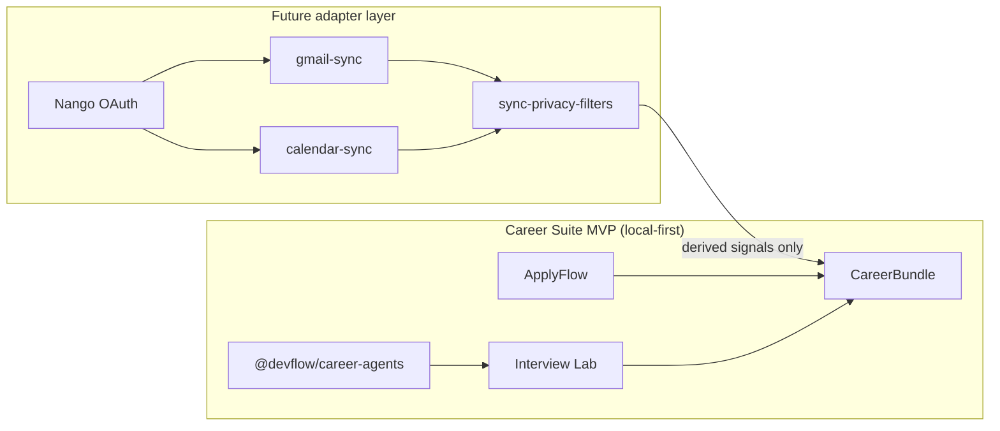

# Nango Gmail/Calendar Plan for Career Suite

> **Future integration adapter — not implemented.** [Nango](https://www.nango.dev/) is planned as the OAuth and sync layer for Gmail and Google Calendar signals. It is **not** part of the Career Suite MVP runtime and is **not** added to this monorepo in Phase 1.

## Purpose

Use Nango as the **OAuth and integration layer** for future Gmail and Google Calendar sync that enriches career workflows (application tracking, interview prep timing, follow-ups).

Nango is an **integration adapter**, not the Career Suite core. Scoring, job/resume analysis, and ATS-style matching remain in **`@devflow/career-agents`**.

## Existing core (do not replace)

| Layer | Role |
|-------|------|
| **`@devflow/career-agents`** | Deterministic job/resume/ATS analysis |
| **`@devflow/career-agents-mcp`** | Local MCP lab over the same core |
| **`CareerBundle` JSON** | Typed handoff (`@devflow/career-core`) |
| **ApplyFlow** | Application capture and export |
| **Interview Lab** | Import, Resume Match, practice prep |

Nango-derived signals may **enrich** metadata later; they must not replace user-controlled application rows or deterministic scores.

**Phase 2 foundation:** `@devflow/career-sync` defines deterministic sync signal contracts before Nango OAuth integration.

### Phase 2 — Nango adapter sandbox

`@devflow/career-sync` includes simulated Nango payload mappers that convert Gmail and Google Calendar provider-like objects into safe local contracts before signal extraction.

### Phase 3 — Gmail read-only sync prototype

`@devflow/career-sync` can build a local Gmail sync preview from Gmail-like or Nango-like message fixtures. The prototype returns derived signals and enrichment metadata only; no OAuth, provider calls, raw body persistence, or auto-send behavior is included.

### Phase 4 — Calendar read-only sync prototype

`@devflow/career-sync` can build a local Calendar sync preview from Calendar-like or Nango-like event fixtures. The prototype returns derived signals and enrichment metadata only; no OAuth, provider calls, raw event persistence, meeting-link retention, or event creation behavior is included.

### Phase 5 — CareerBundle sync enrichment

`@devflow/career-sync` can combine Gmail and Calendar derived signals into a unified CareerBundle sync enrichment contract. This contract contains only normalized, redacted, reviewable signals and does not retain raw provider payloads, raw messages, raw events, attachments, or meeting links.

### Phase 6 — CareerBundle sync enrichment adapter

`@devflow/career-core` can optionally attach and validate `CareerBundleUnifiedSyncEnrichment` from `@devflow/career-sync`. The adapter preserves existing CareerBundle fields, rejects unsafe privacy flags, and does not fetch provider data or persist raw payloads.

## Provider consent architecture

Before adding real Nango/OAuth runtime, Career Suite defines provider consent, revocation, least-data, raw payload discard, and derived-signal-only boundaries in [`PROVIDER-CONSENT-ARCHITECTURE.md`](./PROVIDER-CONSENT-ARCHITECTURE.md).

Nango should be treated as a **provider adapter layer**, not as a core dependency of CareerBundle, `@devflow/career-core`, ApplyFlow, or Interview Lab.

### Provider adapter interface contracts

Before adding the Nango SDK, Career Suite defines provider adapter interfaces in `@devflow/career-sync`.

Nango should later implement these interfaces instead of leaking provider-specific payloads into apps or CareerBundle.

### Nango adapter sandbox

The Nango adapter sandbox proves the provider adapter interface with fake payloads only.

It does not connect to Nango, does not perform OAuth, does not fetch Gmail or Calendar data, does not store tokens, and does not retain raw provider payloads.

### Provider connection status model

Before real Nango runtime is introduced, Career Suite models connection status and capabilities as pure domain data.

This allows future UI and adapter work to reason about connection state without storing tokens or calling providers.

### Runtime feature flag plan

Real Nango runtime must not be introduced without feature flags.

The first runtime implementation must remain disabled by default and must require explicit user consent before any OAuth or provider call can start.

See [`PROVIDER-RUNTIME-FEATURE-FLAGS.md`](./PROVIDER-RUNTIME-FEATURE-FLAGS.md).

### Disabled runtime shell

Before real Nango runtime is introduced, Career Suite includes a disabled provider runtime shell.

The shell proves the gate hierarchy and consent checks without adding Nango SDK, OAuth, provider calls, token storage, or sync jobs.

### Real runtime readiness checklist

Real Nango OAuth must not be introduced until the readiness checklist is satisfied.

The first runtime PR must be disabled by default and limited to OAuth initiation behind explicit feature flags and consent.

See [`REAL-PROVIDER-RUNTIME-READINESS-CHECKLIST.md`](./REAL-PROVIDER-RUNTIME-READINESS-CHECKLIST.md).

### Environment and secrets boundary

Real Nango OAuth must not be introduced until runtime flags and secrets boundaries are documented.

Future Nango and Google secrets must remain server/runtime-only.

See [`PROVIDER-RUNTIME-ENV-SECRETS-BOUNDARY.md`](./PROVIDER-RUNTIME-ENV-SECRETS-BOUNDARY.md).

### First real Nango OAuth boundary

Career Suite includes a first minimal OAuth boundary for Nango behind explicit runtime flags and consent.

This boundary may only initiate OAuth readiness. It does not import Gmail or Calendar data, does not run sync jobs, does not persist raw provider payloads, and does not expose tokens to the client.

Server adapters should implement `NangoOAuthUrlProvider` using Nango's current connect-session flow (`@nangohq/node` `createConnectSession`) without returning secrets or tokens to apps.

Public exports: `evaluateNangoOAuthBoundary`, `createNangoOAuthBoundaryResult`.

### ApplyFlow Nango connect session server boundary

ApplyFlow includes a server/runtime boundary for future Nango connect sessions.

The boundary is protected by feature flags and explicit consent, returns only client-safe results, and does not import Gmail or Calendar data.

Implementation: `apps/applyflow/src/lib/provider-runtime/nango-connect-session-boundary.ts` with server-only `nango-server-provider.ts` (`@nangohq/node` `createConnectSession`).

### ApplyFlow Nango connect session launcher

ApplyFlow includes a server-side launcher route for future Nango connect sessions.

The route is protected by feature flags and consent gates, returns only client-safe JSON, and does not import Gmail or Calendar data.

Implementation: `apps/applyflow/src/app/provider-runtime/nango/connect/route.ts` with handler `nango-connect-session-launcher.ts`. Server-side consent gates remain enforced on the route; client UI collects explicit confirmation before calling the launcher.

### Explicit provider consent UI

ApplyFlow includes an explicit provider consent UI before any real Connect UI is enabled.

The consent UI explains scopes, data boundaries, token boundaries, and the fact that Gmail/Calendar data import is not part of this step.

Implementation: `apps/applyflow/src/components/dashboard/provider-consent-confirmation-panel.tsx` with client-safe launcher fetch helper. React local state only — no OAuth token storage, no provider data import.

### Nango Connect UI integration

ApplyFlow integrates Nango Connect UI behind explicit provider consent and runtime flags.

This starts the provider connection flow only. It does not import Gmail or Calendar data, run sync jobs, persist raw provider payloads, or expose OAuth tokens.

Implementation: `apps/applyflow/src/components/dashboard/provider-nango-connect-ui.tsx` with `@nangohq/frontend` `openConnectUI` and short-lived `connectSessionToken` from the server launcher. Session token is client-safe per Nango docs (30-minute connect session); it is not persisted in browser storage or CareerBundle.

### Provider connection status

ApplyFlow can represent a client-safe provider connection status after the Nango Connect UI flow.

This status does not import Gmail or Calendar data, run sync jobs, persist raw provider payloads, or expose provider tokens.

Implementation: `@devflow/career-sync` `provider-connection/runtime-status.ts` with `ProviderRuntimeConnectionStatus` and ApplyFlow `provider-connection-status-panel.tsx` wired to Connect UI events. Status is local/ephemeral React state only — no backend persistence, no token storage, no CareerBundle changes.

### Server-side connection verification

ApplyFlow can verify provider connection existence through a server-only Nango runtime boundary.

The verification returns only a client-safe connection state. It does not import Gmail or Calendar data, expose OAuth credentials, run sync jobs, or persist raw provider payloads.

Implementation: `@devflow/career-sync` `provider-connection/runtime-verification.ts` with `ProviderConnectionVerificationResult`; ApplyFlow `nango-connection-verification-provider.ts` uses `@nangohq/node` `listConnections` (no credentials) filtered by stable `end_user_id` tag and integration ID; `POST /provider-runtime/nango/connection-status` route returns sanitized snapshot; UI exposes explicit **Verify connection** button after local Connect UI completion.

Official Nango method: `listConnections({ integrationId, tags: { end_user_id }, limit })` — returns connections **without credentials**. Discarded fields: `connection_id`, `metadata`, `tags`, `errors` details, provider payloads. Client-safe fields: `state` (`connected` | `not_connected` | `error`), invariant safety flags, messages/warnings.

### Gmail read-only adapter contract

Career Suite defines a privacy-first Gmail read-only adapter contract for future derived career signals.

The contract does not call Gmail, import messages, retain bodies or snippets, expose provider tokens, or update applications automatically.

Implementation: `@devflow/career-sync` `gmail-readonly-adapter/` — request/result types, safety policy, block reasons, and `GmailReadOnlyAdapter` interface. Sandbox implementation: `createGmailReadOnlySandboxAdapter` with fake metadata fixtures — see [GMAIL-READONLY-SANDBOX-ADAPTER.md](./GMAIL-READONLY-SANDBOX-ADAPTER.md).

### Gmail read-only sandbox adapter

Career Suite includes a deterministic Gmail read-only sandbox adapter using fake metadata fixtures.

The sandbox adapter does not call Gmail, import real messages, retain bodies or snippets, expose provider tokens, or update applications automatically.

### Gmail read-only Nango runtime adapter

Career Suite includes a server-only Gmail read-only runtime adapter through Nango.

The adapter processes limited Gmail metadata without retaining message bodies, snippets, attachments, provider identifiers or OAuth credentials. Derived signals remain review-required, and this runtime is not connected to automatic CareerBundle enrichment.

Implementation: ApplyFlow `apps/applyflow/src/lib/provider-runtime/gmail-readonly-runtime-boundary.ts` — see [GMAIL-READONLY-NANGO-RUNTIME-ADAPTER.md](./GMAIL-READONLY-NANGO-RUNTIME-ADAPTER.md).

### Calendar read-only adapter contract

Career Suite defines a privacy-first Calendar read-only adapter contract for future derived career signals.

The contract does not call Calendar, import events, retain descriptions, locations, attendee addresses or meeting links, expose provider tokens, or update applications automatically.

Implementation: `@devflow/career-sync` `calendar-readonly-adapter/` — request/result types, safety policy, block reasons, and `CalendarReadOnlyAdapter` interface. Sandbox implementation: `createCalendarReadOnlySandboxAdapter` with fake event metadata fixtures — see [CALENDAR-READONLY-SANDBOX-ADAPTER.md](./CALENDAR-READONLY-SANDBOX-ADAPTER.md).

### Calendar read-only sandbox adapter

Career Suite includes a deterministic Calendar read-only sandbox adapter using fake event metadata fixtures.

The sandbox adapter does not call Calendar, import real events, retain descriptions, locations, attendee addresses or meeting links, expose provider tokens, or update applications automatically.

### Calendar read-only Nango runtime adapter

Career Suite includes a server-only Calendar read-only runtime adapter through Nango.

The adapter processes limited Calendar metadata without retaining event titles, descriptions, locations, attendee addresses, meeting links, provider identifiers or OAuth credentials. Derived signals remain review-required, and this runtime is not connected to automatic CareerBundle enrichment.

Implementation: ApplyFlow `apps/applyflow/src/lib/provider-runtime/calendar-readonly-runtime-boundary.ts` — see [CALENDAR-READONLY-NANGO-RUNTIME-ADAPTER.md](./CALENDAR-READONLY-NANGO-RUNTIME-ADAPTER.md).

### Provider-derived sandbox composition

Career Suite can deterministically compose review-required derived signals from fake Gmail and Calendar sandbox metadata.

The composition does not access real provider data, retain raw payloads, expose tokens, update CareerBundle, or make automatic career decisions.

Implementation: `@devflow/career-sync` `provider-derived-signals/` — see [PROVIDER-DERIVED-SANDBOX-COMPOSITION.md](./PROVIDER-DERIVED-SANDBOX-COMPOSITION.md).

### Provider-derived runtime composition

Career Suite can compose client-safe, review-required derived signals from server-only Gmail and Calendar read-only runtime boundaries.

The runtime composition does not retain raw provider data, expose OAuth credentials, modify CareerBundle, persist results, run in the background, or update applications automatically.

Implementation: ApplyFlow `apps/applyflow/src/lib/provider-runtime/provider-derived-runtime-boundary.ts` — see [PROVIDER-DERIVED-RUNTIME-COMPOSITION.md](./PROVIDER-DERIVED-RUNTIME-COMPOSITION.md).

### Provider-derived enrichment adapter

Career Suite includes a deterministic compatibility adapter from sandbox provider-derived signals to the existing sync enrichment contract.

The adapter does not access real provider data, modify the CareerBundle schema, retain raw provider payloads, expose tokens, or update applications automatically.

Implementation: `@devflow/career-sync` `adaptProviderDerivedSignalsToSyncEnrichment` — see [PROVIDER-DERIVED-ENRICHMENT-ADAPTER.md](./PROVIDER-DERIVED-ENRICHMENT-ADAPTER.md).

## Why Nango

- **Centralize OAuth** — avoid bespoke Google OAuth in ApplyFlow and Interview Lab
- **Provider isolation** — Gmail/Calendar API quirks stay in sync adapters, not product apps
- **Reusable sync jobs** — scheduled or on-demand fetch with consistent token refresh
- **Clear boundary** — integration logic lives behind adapters documented in [Sync Data Boundaries](./SYNC-DATA-BOUNDARIES.md)

## Gmail sync candidates

### Potential derived signals (read-only, filtered)

- Recruiter / hiring-manager messages (domain + role hints)
- Interview invitations and scheduling links (metadata only by default)
- Application status updates (received, rejected, next steps)
- Take-home assignment notifications
- Company/domain metadata for matching to `CareerApplication` rows

### Non-goals

- Reading the **entire inbox** by default
- Storing **raw email bodies** by default
- **Sending** emails automatically
- **Auto-applying** to jobs or replying on behalf of the user
- Using Gmail sync as a **required** login path for Career Suite MVP

## Calendar sync candidates

### Potential derived signals (read-only, filtered)

- Interview events (time window, title hints, company hint)
- Study / prep blocks the user already created
- Follow-up reminder **candidates** (suggestions only)
- Availability windows for scheduling (coarse blocks, not full detail)

### Non-goals

- **Modifying** calendar events without explicit user confirmation
- **Creating** events automatically in MVP
- Exposing private event descriptions, attendee lists, or meeting URLs unless the user explicitly opts in per field
- Calendar sync as mandatory backend for current local-first MVP

## CareerBundle relationship

- Nango sync produces **derived signals** (see [Sync Data Boundaries](./SYNC-DATA-BOUNDARIES.md)).
- Enrichment may attach optional metadata to applications (e.g. `lastRecruiterEmailAt`, `interviewScheduledAt`) — **schema changes require explicit approval** and Zod updates in `@devflow/career-core`.
- **CareerBundle in URL remains forbidden** — sync metadata travels through export/handoff channels the user controls, not query strings.
- User-authored ApplyFlow rows remain authoritative; sync cannot overwrite status without user review.

## Proposed modules (future packages)

| Module | Responsibility |
|--------|----------------|
| `gmail-sync` | Nango Gmail connection, fetch, normalize to derived signals |
| `calendar-sync` | Nango Calendar connection, fetch, normalize to derived signals |
| `sync-normalizers` | Provider payload → Career Suite DTOs |
| `sync-privacy-filters` | Drop PII, unrelated mail, attachments; least-data rules |

These packages **do not exist yet**. Names are planning placeholders.

## Integration phases

| Phase | Scope | In repo? |
|-------|--------|----------|
| **1 — Docs and boundaries** | This plan + [SYNC-DATA-BOUNDARIES.md](./SYNC-DATA-BOUNDARIES.md) | Docs only |
| **2 — Nango local sandbox** | Developer OAuth sandbox outside prod apps | Future |
| **3 — Gmail read-only prototype** | Filtered derived signals, user review UI | Future |
| **4 — Calendar read-only prototype** | Interview/reminder candidates, user review | Future |
| **5 — CareerBundle enrichment** | Optional metadata fields, explicit export opt-in | Future |
| **6 — Agent consumption** | MCP/agents read **derived** signals only | Future |

Phases 2–6 require separate PRs, security review, and no regression to local-first defaults.

## Architecture sketch

## Validation checklist (before any code ships)

- [ ] OAuth and tokens isolated in Nango — not embedded in apps or committed to the repo
- [ ] Raw provider payloads minimized; [Sync Data Boundaries](./SYNC-DATA-BOUNDARIES.md) enforced
- [ ] User can **review and delete** synced signals
- [ ] **No auto-submit** and no auto-send email
- [ ] **No mandatory AI** — agents consume derived signals; LLM remains opt-in
- [ ] **No required backend** for current MVP — sync is an explicit opt-in layer
- [ ] No CareerBundle in URL
- [ ] Deterministic `@devflow/career-agents` scores unchanged by sync metadata unless user explicitly uses both inputs in UI

## Related

- [Sync Data Boundaries](./SYNC-DATA-BOUNDARIES.md)
- [Integrations overview](./README.md)
- [MCP server candidates](./MCP-SERVER-CANDIDATES.md) — Gmail/Calendar MCP deferred until Nango plan is stable
