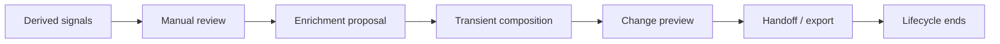
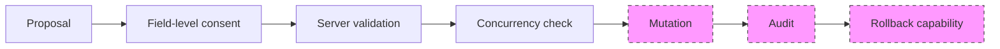

# Provider-Derived Enrichment Application — Contract Architecture (Proposed)

This document defines a **candidate architecture** and **versioned contracts** for a possible future manual application of provider-derived enrichment to `CareerBundle.syncEnrichment`.

It is **not** implementation. It does **not** approve Apply. It does **not** alter [ADR-003](../../adr/ADR-003-PROVIDER-DERIVED-ENRICHMENT-APPLICATION-DEFERRED.md). It does **not** create endpoints or select database technology.

**Related:**

- [ADR-003: Application deferred](../../adr/ADR-003-PROVIDER-DERIVED-ENRICHMENT-APPLICATION-DEFERRED.md)
- [ADR-004: Contract architecture proposed](../../adr/ADR-004-ENRICHMENT-APPLICATION-CONTRACT-ARCHITECTURE-PROPOSED.md)
- [PROVIDER-DERIVED-ENRICHMENT-APPLICATION-THREAT-MODEL.md](./PROVIDER-DERIVED-ENRICHMENT-APPLICATION-THREAT-MODEL.md)
- [UNIFIED-SYNC-ENRICHMENT-CONTRACT.md](./UNIFIED-SYNC-ENRICHMENT-CONTRACT.md)

---

## 1. Purpose

Answer:

> What contracts, policies, and architectural mechanisms would need to be **approved** before any enrichment mutation implementation?

This transforms the 16 threat-model prerequisites into concrete artifacts, gates, and proposed contracts for objective review.

---

## 2. Current baseline

| Decision | Status |
|----------|--------|
| Read-only provider-derived lifecycle | **Complete** — through handoff/export |
| Proposal export | **Export-only** — [ADR-002](../../adr/ADR-002-ENRICHMENT-PROPOSAL-EXPORT-ONLY.md) |
| Import workflow | **Explicitly deferred** — ADR-002 |
| Enrichment application | **Explicitly deferred** — ADR-003 |
| Mutation endpoint | **Does not exist** |
| Persisted CareerBundle identity | **Does not exist** |
| Bundle revision / ETag | **Does not exist** |
| Mutation contract | **Does not exist** |
| Audit contract | **Does not exist** |
| Rollback model | **Does not exist** |

### Current lifecycle (implemented)



### Future boundary under analysis (not implemented)



---

## 3. Architectural gates

Maps threat model §27 prerequisites to gates:

| Gate | Purpose | Required artifact | Owner | Status | Blocks implementation? |
|------|---------|-------------------|-------|--------|------------------------|
| G1 — Threat model accepted | Risk baseline | [THREAT-MODEL](./PROVIDER-DERIVED-ENRICHMENT-APPLICATION-THREAT-MODEL.md) sign-off | Security / Privacy | Documented; review pending | **Yes** |
| G2 — Implementation ADR | Approve mutation scope | Future **Accepted** ADR (not ADR-004) | Architecture | **Blocked** | **Yes** |
| G3 — Field allowlist | Define mutable fields | `devflow.enrichment-apply-field-allowlist@1` | `@devflow/career-sync` + Security | **Proposed** | **Yes** |
| G4 — Mutation contract | Versioned request/response | `devflow.enrichment-apply@1` | ApplyFlow server + `career-sync` | **Proposed** | **Yes** |
| G5 — Server validator | Authoritative validation | Validator spec + tests | ApplyFlow server | **Proposed** | **Yes** |
| G6 — Authorization policy | User/tenant/bundle binding | AuthZ policy doc | ApplyFlow / platform auth | **Pending** | **Yes** |
| G7 — Concurrency | Stale baseline protection | Revision + compare-and-swap spec | Persistence service (future) | **Proposed** | **Yes** |
| G8 — Idempotency | Duplicate/retry safety | Idempotency contract | ApplyFlow server | **Proposed** | **Yes** |
| G9 — Audit trail | Fail-closed evidence | `devflow.enrichment-application-audit@1` | Platform audit | **Proposed** | **Yes** |
| G10 — Rollback | Reversibility | Rollback model + retention | Persistence service (future) | **Proposed** | **Yes** |
| G11 — Consent UX | Per-field opt-in | UX review record | ApplyFlow product | **Pending** | **Yes** |
| G12 — Stale proposal (server) | Freshness enforcement | Server binding spec | ApplyFlow server | **Proposed** | **Yes** |
| G13 — Demo hard-block | Prevent demo persistence | Server classifier | ApplyFlow server | **Proposed** | **Yes** |
| G14 — Integration tests | Stale/replay/tamper | Test plan | Engineering | **Pending** | **Yes** |
| G15 — Security tests | AuthZ/mass-assignment | Test plan | Security | **Pending** | **Yes** |
| G16 — Privacy review | Payload/retention audit | Privacy sign-off | Privacy | **Pending** | **Yes** |

---

## 4. Proposed application scope v1

**In scope (conceptual):**

- `CareerBundle.syncEnrichment` allowlisted fields only

**Explicitly excluded:**

- `applications[]`
- `candidate`
- Candidature status, notes, dates, company, role, resume artifacts
- Interview Lab practice rows
- Automatic or background application

**No individual field is approved** for v1 persistence by this document.

---

## 5. Versioned field allowlist (proposed)

**Contract identifier (proposed):**

```txt
devflow.enrichment-apply-field-allowlist
version: 1
status: proposed — not approved
```

### Allowlist matrix

| Field | Current domain meaning | Candidate operation | User-authored risk | Provider-derived risk | Destructive risk | Provenance requirement | Recommended classification | Blocks v1? |
|-------|------------------------|---------------------|--------------------|-----------------------|------------------|------------------------|----------------------------|------------|
| `stats.totalSignals` | Aggregate count of derived signals | `set` | Low — rarely user-edited | Medium — derived from signals | Low if recalculated | Source + signal count | **requires further review** — prefer server recalculation over persist | **Yes** |
| `stats.actionRequiredCount` | Count of action-required signals | `set` | Low | Medium | Low if recalculated | Source + signal count | **requires further review** — prefer recalculation | **Yes** |
| `stats.upcomingCount` | Upcoming calendar-related count | `set` | Low | Medium | Low if recalculated | Source + signal count | **requires further review** — prefer recalculation | **Yes** |
| `stats.sourceCounts` | Per-source signal counts | `set` | Low | Medium | Low if recalculated | Per-source provenance | **derived-only** — should be computed, not directly persisted | **Yes** |
| `stats.companyHints` | Normalized company name hints | `append` only (proposed) | Medium — user may have manual list | Medium — provider inference | **High** if replace/remove | Source + confidence | **candidate** — additive-only if ever approved; never destructive | **Yes** |
| `combinedSignals.count` / list | Full signal list in enrichment | `set` / `append` | High | High | High — list semantics | Full provenance | **derived-only** — too complex for v1 direct persist | **Yes** |
| `summary` | Human-readable enrichment summary | `replace` | **High** — user may author text | Medium — LLM/derived text | **High** — full text replacement | Source + confidence | **requires further review** — may be too derived for direct replace | **Yes** |
| `gmail` nested | Gmail-shaped enrichment block | — | N/A | High — provider-shaped | High | Display/provenance | **display-only** | **Yes** |
| `calendar` nested | Calendar-shaped enrichment block | — | N/A | High — provider-shaped | High | Display/provenance | **display-only** | **Yes** |
| `privacy` | Privacy invariant flags | — | N/A | Must not change | Critical | Provenance-only | **provenance-only** / **never mutable** | **Yes** |
| `source` | Must be `"sync"` | — | N/A | System constant | Critical | Provenance-only | **provenance-only** / **never mutable** | **Yes** |
| `generatedAt` | Generation timestamp | `set` (system) | N/A | System metadata | Low | System | **never mutable via user apply** — server sets on commit | **Yes** |

### Open questions on allowlist

1. **`stats.*`** — Should aggregates be **recalculated server-side** from approved signal subset instead of persisted as independent values?
2. **`summary`** — Is direct text replacement acceptable, or should summary remain derived-only at apply time?
3. **`companyHints`** — Can v1 support **additive-only** merges with explicit conflict surfacing?

**Allowlist approval status: Pending** — no field approved for mutation.

---

## 6. Mutation contract candidate

**Contract identifier (proposed):**

```txt
devflow.enrichment-apply
version: 1
status: proposed — not approved
```

### Minimum conceptual request payload

| Field | Purpose |
|-------|---------|
| `contractVersion` | `"devflow.enrichment-apply@1"` |
| `target.bundleRef` | Server-issued CareerBundle reference (not client-invented) |
| `target.expectedRevision` | Compare-and-swap baseline |
| `idempotencyKey` | Server-validated deduplication key |
| `proposalRef` | Opaque server-issued proposal/session token |
| `fieldIntents[]` | Per-field apply intents (see §7) |
| `consentEvidence` | Per-field consent records (see §20) |
| `clientMetadata` | Minimal: `clientRequestId`, `userAgent` (optional), timestamp |

### Explicitly excluded from request

- Full enrichment proposal
- Full CareerBundle
- `applications[]`, `candidate`
- Provider raw payloads
- Tokens, OAuth secrets
- Provider IDs (message/thread/event/calendar)
- Review state (selected/dismissed signal lists)

### Example shape (documentation only — not authorized API)

```json
{
  "contractVersion": "devflow.enrichment-apply@1",
  "target": {
    "bundleRef": "server-issued-ref",
    "expectedRevision": 42
  },
  "idempotencyKey": "uuid-or-server-token",
  "proposalRef": "server-issued-proposal-token",
  "fieldIntents": [],
  "consentEvidence": [],
  "clientMetadata": {
    "clientRequestId": "uuid"
  }
}
```

---

## 7. Field-level intent contract

Each intent describes one allowlisted field mutation:

| Property | Description |
|----------|-------------|
| `field` | Allowlist path (e.g. `stats.companyHints`) |
| `operation` | `set` \| `append` \| `replace` |
| `expectedCurrentFingerprint` | Hash of current server value at preview time |
| `proposedSafeValue` | Server-validated safe value (or reference to server-known value) |
| `consentTimestamp` | ISO-8601 when user confirmed |
| `provenanceRef` | Opaque server reference to proposal/signal provenance |

### Operation policy (proposed v1)

| Operation | v1 support |
|-----------|------------|
| `set` | Allowed only for approved scalar fields |
| `append` | Allowed only for `companyHints` if field ever approved |
| `replace` | **Blocked by default** — requires explicit override policy |
| `remove` | **Not supported** in first release |

**Recommendation:** `remove` not supported in v1; destructive `replace` blocked by default.

---

## 8. Mutation response contract

Domain result required — HTTP 2xx alone is insufficient.

| Result state | Meaning |
|--------------|---------|
| `accepted` | Mutation committed; returns new revision |
| `rejected` | Validation failed; no write |
| `conflict` | Concurrent edit; baseline mismatch |
| `stale` | Target or proposal stale |
| `duplicate` | Idempotency key replay; prior result returned |
| `unauthorized` | AuthZ failure |
| `validation_failed` | Schema/allowlist/consent failure |
| `audit_failed` | Audit not persisted — mutation rolled back |
| `rollback_required` | Partial failure requiring compensating action |

Response should include: `result`, `reasonCode`, `newRevision` (if accepted), `fieldResults[]` (per intent).

---

## 9. CareerBundle identity

### Current state

Exported CareerBundle JSON today:

- Has `schemaVersion` for document shape
- May include transient `syncEnrichment`
- **Does not** have server-persisted `bundleId`
- **Does not** have `revision`, `ETag`, or `updatedAt` for concurrency
- Identity is **session-local** / export-file scoped

### Required for future mutation (proposed)

| Identifier | Role |
|------------|------|
| `bundleRef` | Server-issued stable reference |
| `ownerId` | Authenticated user |
| `tenantId` | Multi-tenant isolation |
| `revision` | Monotonic integer for compare-and-swap |
| `updatedAt` | Server timestamp (advisory) |
| `contentFingerprint` | Hash of allowlisted subset (validation aid) |

**Do not invent client-side bundle identity.** Server must issue `bundleRef` and `revision` when persistence layer exists.

---

## 10. Concurrency model

| Mechanism | Assessment |
|-----------|------------|
| Revision integer | **Recommended primary** — simple compare-and-swap |
| ETag | Compatible wrapper over revision |
| `updatedAt` alone | **Insufficient** — clock skew, coarse granularity |
| Content fingerprint alone | **Insufficient on client** — client cannot prove server state |
| Compare-and-swap | **Required pattern** — `expectedRevision` must match |

### Recommendation

**Server-issued monotonic `revision` + compare-and-swap.**

Client sends `expectedRevision` from last known server state (preview baseline). Server rejects with `STALE_TARGET` / `conflict` if mismatch.

Fingerprint may supplement revision for audit but **cannot replace** server revision authority.

---

## 11. Idempotency contract

| Aspect | Proposed policy |
|--------|-----------------|
| Key format | UUID v4 client-generated **or** server-preissued token |
| Scope | Per `bundleRef` + user + operation window |
| Retention | 24–72 hours (open decision) |
| Same key + same payload | Return cached `accepted` / `duplicate` result |
| Same key + different payload | Reject with `validation_failed` |
| Retry after timeout | Safe retry with same key |
| ACK lost | Client retries; server deduplicates |

**Recommendation:** Server validates and may reissue idempotency tokens at consent confirmation time.

---

## 12. Authorization boundary

Server must validate:

| Check | Rationale |
|-------|-----------|
| Authenticated user | Active session |
| Tenant membership | Multi-tenant isolation |
| CareerBundle ownership | `bundleRef` belongs to user/tenant |
| Role permission | If RBAC exists |
| Active session | Not expired/revoked |
| Proposal/session binding | `proposalRef` matches user session |
| Field allowlist permission | Field in approved allowlist |

**A proposal object in the browser is not a credential.** Authorization derives from server session + server-issued references only.

---

## 13. Server-authoritative validation pipeline

Conceptual sequence (not implemented):

```txt
1.  authenticate
2.  authorize (user, tenant, bundleRef)
3.  validate contract version
4.  validate target (bundleRef exists, owned)
5.  validate revision (compare-and-swap)
6.  validate proposalRef (session binding, not expired)
7.  validate freshness (selection fingerprint, stale checks)
8.  validate field allowlist (versioned)
9.  validate safe values (schema, forbidden keys)
10. validate consent evidence (per-field)
11. validate idempotency (dedup or reject mismatch)
12. validate demo/import hard-block (server-resolved source)
13. persist atomically (allowlisted fields only)
14. commit audit event (fail-closed)
15. return domain result
```

If step 14 fails → rollback step 13 (no acknowledged mutation).

---

## 14. Persistence options

| Option | Integrity | Rollback | Complexity | Auditability | Operational cost | Recommendation |
|--------|-----------|----------|------------|--------------|------------------|----------------|
| In-place update | Moderate | Poor | Low | Poor | Low | Not recommended |
| Versioned snapshots | Good | Good | Medium | Good | Medium | Viable |
| Append-only revisions | Excellent | Excellent | High | Excellent | Medium–high | Viable |
| Event sourcing | Excellent | Excellent | Very high | Excellent | High | Overkill for v1 |
| **Hybrid: current state + immutable audit** | Good | Good | Medium | Excellent | Medium | **Proposed** |

### Hybrid model (proposed, not decided)

- **Current state table/document** — fast reads for export composition
- **Immutable revision records** — before/after snapshots (allowlisted fields)
- **Audit events** — append-only, reference revisions

Enables rollback via new revision without silent history rewrite.

---

## 15. Audit contract

**Contract identifier (proposed):**

```txt
devflow.enrichment-application-audit
version: 1
status: proposed — not approved
```

### Minimum event fields

| Field | Notes |
|-------|-------|
| `eventType` | e.g. `mutation_committed`, `mutation_rejected`, `rollback_committed` |
| `actorRef` | User id (not email) |
| `targetBundleRef` | Server bundle reference |
| `revisionBefore` | Integer |
| `revisionAfter` | Integer (if committed) |
| `fieldNames` | Allowlist paths only |
| `operationTypes` | `set` / `append` / `replace` |
| `proposalRef` | Opaque server token |
| `timestamp` | Server ISO-8601 |
| `result` | Domain result state |
| `reasonCode` | If rejected |

**Do not store** full field values when hash or classification suffices. Never store provider raw, tokens, or PII.

---

## 16. Rollback model

| Model | Assessment |
|-------|------------|
| Technical rollback | Server restores `revisionBefore` snapshot via new revision |
| User-facing undo | Product action → triggers technical rollback |
| New corrective revision | User manual edit without proposal — separate flow |

### Recommendation

**Rollback creates a new revision** — append-only history; no silent rewrite.

### Rollback eligibility prerequisites (proposed)

- Within rollback window (open decision: e.g. 30 days)
- Actor is original user or authorized admin
- Target revision exists and is not superseded by incompatible edits
- Audit record for original mutation exists

---

## 17. Provenance record

Per applied field (conceptual metadata):

| Field | Included |
|-------|----------|
| `sourceKind` | e.g. `provider-derived` (never `demo`) |
| `proposalVersion` | Server proposal schema version |
| `signalCount` | Aggregate only |
| `confidenceBucket` | e.g. `high` / `medium` / `low` |
| `reviewActor` | User id |
| `reviewTimestamp` | ISO-8601 |
| `applicationTimestamp` | ISO-8601 |
| `applicationRevision` | Revision after commit |

**Excluded:** provider message/thread/event/calendar IDs.

---

## 18. Demo and imported data hard-block

| Control | Enforcement |
|---------|-------------|
| Demo source cannot enter mutation contract | Server rejects `sourceKind: demo` |
| Imported proposal file cannot authorize mutation | [ADR-002](../../adr/ADR-002-ENRICHMENT-PROPOSAL-EXPORT-ONLY.md) — no file upload path |
| Client flags cannot override source | Server ignores `appliedToCareerBundle`, `persisted`, etc. |
| Server resolves source independently | From `proposalRef` + session, not client JSON |

Reason codes: `DEMO_SOURCE_FORBIDDEN`, `IMPORTED_SOURCE_FORBIDDEN`.

---

## 19. Stale protection

Server-side freshness requirements:

| Mechanism | Purpose |
|-----------|---------|
| Proposal/session binding | `proposalRef` tied to user + session |
| Selection fingerprint | Hash of selected signal ids at review time |
| Target revision | Must match preview baseline |
| Expiration | Proposal token TTL (open decision) |
| Replay policy | Single-use or idempotent replay only |

Client `isEnrichmentProposalStale` is advisory; server is authoritative.

---

## 20. Consent evidence

Valid consent requires (per field):

| Evidence | Required |
|----------|----------|
| Field explicitly selected | Yes |
| Current value shown | Yes |
| Proposed value shown | Yes |
| Operation shown (`set`/`append`) | Yes |
| Warnings shown (destructive/conflict) | Yes |
| Source shown (not demo) | Yes |
| Timestamp recorded | Yes |
| No preselection | Yes — no default-checked fields |

**Page-level generic consent is insufficient.**

Consent evidence format remains an **open decision** (see §26).

---

## 21. Error model

| Reason code | Typical cause |
|-------------|---------------|
| `STALE_TARGET` | `expectedRevision` mismatch |
| `STALE_PROPOSAL` | Proposal token expired or fingerprint changed |
| `FIELD_NOT_ALLOWED` | Not on approved allowlist |
| `DEMO_SOURCE_FORBIDDEN` | Demo enrichment |
| `IMPORTED_SOURCE_FORBIDDEN` | Untrusted import source |
| `CONFLICT` | Concurrent edit |
| `LOW_CONFIDENCE` | Below threshold |
| `UNAUTHORIZED` | AuthZ failure |
| `DUPLICATE_REQUEST` | Idempotency replay |
| `AUDIT_FAILURE` | Audit not persisted |
| `PERSISTENCE_FAILURE` | Storage error |

All failures: **fail closed** — no partial unauthorized persist.

---

## 22. Observability contract

### Permitted (count-only)

- `application_attempted`
- `application_succeeded`
- `application_rejected` (by `reasonCode`)
- `conflict_detected`
- `rollback_attempted`

### Prohibited in logs/metrics

- Field content values
- Provider raw payloads
- PII (email, names, snippets)
- Tokens
- Full proposal or bundle JSON

---

## 23. Retention model questions

Open decisions for future ADR:

| Topic | Question |
|-------|----------|
| Idempotency retention | 24h vs 72h vs 7d |
| Audit retention | Compliance vs storage cost |
| Revision/snapshot retention | Rollback window vs erasure |
| Proposal reference retention | After successful apply |
| Rollback window | 7d vs 30d vs unlimited |
| Account deletion | Cascade vs anonymize audit |
| Tenant deletion | Multi-tenant policy |
| Provider disconnect | Effect on stored enrichment |
| Privacy erasure | GDPR right vs audit immutability |

---

## 24. Security test gates

Minimum tests before implementation:

| Test | Validates |
|------|-----------|
| Mass assignment | Extra JSON keys rejected |
| Cross-user | User A cannot mutate User B bundle |
| Cross-tenant | Tenant isolation |
| Stale proposal | Expired/fingerprint mismatch blocked |
| Replay | Old proposal token rejected |
| Duplicate request | Idempotency dedup |
| Demo source | `DEMO_SOURCE_FORBIDDEN` |
| Imported file | No upload mutation path |
| Low confidence | Below threshold blocked |
| Destructive replace | Default block |
| Concurrent edit | Revision mismatch |
| Audit failure | Mutation not committed |
| Rollback failure | Escalation path |

---

## 25. Privacy review gates

Mandatory review of:

- Payload minimization (mutation request)
- Retention periods (audit, snapshots, idempotency)
- Audit data classification
- Provenance metadata scope
- Deletion / erasure interaction
- Telemetry (count-only enforcement)
- Cross-product handoff (Interview Lab receives export only — no mutation)

---

## 26. Open decisions

| Decision | Status |
|----------|--------|
| Approved allowlist fields | **Open** — none approved |
| Persistent CareerBundle identity | **Open** — `bundleRef` model TBD |
| Persistence model | **Proposed hybrid** — not accepted |
| Revision mechanism | **Proposed integer** — not accepted |
| Rollback window | **Open** |
| Audit retention | **Open** |
| Proposal server identity | **Open** — `proposalRef` format TBD |
| Consent evidence wire format | **Open** |

---

## 27. Current decision

```txt
Architecture proposal documented.
Implementation remains blocked.
Enrichment application remains explicitly deferred (ADR-003).
```

This document and [ADR-004](../../adr/ADR-004-ENRICHMENT-APPLICATION-CONTRACT-ARCHITECTURE-PROPOSED.md) are **Proposed** for review — not Accepted for implementation.

---

## 28. Implementation gate

Binary checklist — **all must be Approved** before mutation code:

| # | Gate | Status |
|---|------|--------|
| 1 | ADR mutation (implementation) Accepted | **Blocked** |
| 2 | Allowlist approved | **Pending** |
| 3 | Contract version approved | **Proposed** |
| 4 | Identity/revision defined | **Open** |
| 5 | Persistence model chosen | **Proposed** |
| 6 | Idempotency defined | **Proposed** |
| 7 | Audit contract approved | **Proposed** |
| 8 | Rollback approved | **Proposed** |
| 9 | AuthZ approved | **Pending** |
| 10 | Server validator designed | **Proposed** |
| 11 | Consent UX approved | **Pending** |
| 12 | Security review complete | **Pending** |
| 13 | Privacy review complete | **Pending** |
| 14 | Test plan approved | **Pending** |

**No mutation code may start until all items are Approved.**

---

## 29. Non-goals

- Implement endpoints or APIs
- Create database or migrations
- Create Apply / Save button or UI
- Apply to `applications[]`
- Permit proposal import for mutation
- Permit automatic apply
- Select persistence framework (Prisma, Supabase, etc.)
- Alter ADR-002 or ADR-003 decisions

---

## 30. Product boundaries

| Component | Role in future apply |
|-----------|---------------------|
| **ApplyFlow** | Collect per-field consent; submit minimal mutation request; display results — **not** write authority |
| **`@devflow/career-sync`** | Pure contracts: allowlist types, validation helpers, reason codes — **no** persistence |
| **`@devflow/career-core`** | CareerBundle parse/validate; extract `syncEnrichment` — **no** mutation |
| **Interview Lab** | Consumes exported CareerBundle — **must not** execute mutation |
| **Provider integrations** | Produce derived signals server-side — **must not** write directly to CareerBundle |
| **Future persistence service** | Owns `bundleRef`, revision, audit, rollback — **not designed in this PR** |

```txt
ApplyFlow (consent UI) → future ApplyFlow server (validate) → future persistence
                              ↑
                    career-sync / career-core (pure contracts)
```

Provider → Nango → ApplyFlow server → signals only. No direct CareerBundle write from provider layer.

---

## 31. Persistence comparison matrix

| Criterion | In-place | Versioned snapshots | Append-only revisions | Event sourcing | Hybrid |
|-----------|----------|---------------------|----------------------|----------------|--------|
| Rollback | Poor | Good | Excellent | Excellent | Good |
| Auditability | Poor | Good | Excellent | Excellent | Excellent |
| Query simplicity | Excellent | Good | Moderate | Poor | Good |
| Implementation complexity | Low | Medium | High | Very high | Medium |
| Storage cost | Low | Medium | Medium–high | High | Medium |
| Migration complexity | Low | Medium | High | Very high | Medium |
| Privacy deletion complexity | Hard | Medium | Medium | Hard | Medium |
| Operational burden | Low | Medium | High | Very high | Medium |

---

## 32. Blockers remaining after this PR

Even after this document is reviewed:

1. No **Accepted** implementation ADR
2. No approved allowlist fields
3. No persisted CareerBundle identity
4. No server validator implementation
5. No idempotency store
6. No audit persistence
7. No rollback implementation
8. No consent UX approval
9. Security and privacy reviews not completed
10. ADR-003 deferral still in force

---

## References

- [ADR-002](../../adr/ADR-002-ENRICHMENT-PROPOSAL-EXPORT-ONLY.md)
- [ADR-003](../../adr/ADR-003-PROVIDER-DERIVED-ENRICHMENT-APPLICATION-DEFERRED.md)
- [ADR-004](../../adr/ADR-004-ENRICHMENT-APPLICATION-CONTRACT-ARCHITECTURE-PROPOSED.md)
- [PROVIDER-DERIVED-ENRICHMENT-APPLICATION-THREAT-MODEL.md](./PROVIDER-DERIVED-ENRICHMENT-APPLICATION-THREAT-MODEL.md)
- [PROVIDER-DERIVED-ENRICHMENT-CHANGE-PREVIEW.md](./PROVIDER-DERIVED-ENRICHMENT-CHANGE-PREVIEW.md)
- [UNIFIED-SYNC-ENRICHMENT-CONTRACT.md](./UNIFIED-SYNC-ENRICHMENT-CONTRACT.md)
- [SYNC-DATA-BOUNDARIES.md](./SYNC-DATA-BOUNDARIES.md)
