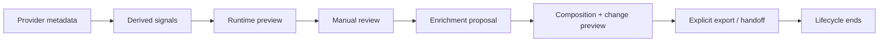

# Provider-Derived Enrichment Application — Threat Model and Decision Criteria

This document evaluates a **possible future** workflow for **manual**, **consented**, **auditable**, and **reversible** application of provider-derived enrichment to allowlisted `CareerBundle.syncEnrichment` fields.

It is **not** an implementation specification. It does **not** approve Apply. It does **not** change the current read-only lifecycle. It does **not** alter [ADR-002](../../adr/ADR-002-ENRICHMENT-PROPOSAL-EXPORT-ONLY.md).

**Related:**

- [ADR-003: Application explicitly deferred](../../adr/ADR-003-PROVIDER-DERIVED-ENRICHMENT-APPLICATION-DEFERRED.md)
- [PROVIDER-DERIVED-ENRICHMENT-PROPOSAL-LIFECYCLE.md](./PROVIDER-DERIVED-ENRICHMENT-PROPOSAL-LIFECYCLE.md)
- [PROVIDER-DERIVED-ENRICHMENT-EXPORT-COMPOSITION.md](./PROVIDER-DERIVED-ENRICHMENT-EXPORT-COMPOSITION.md)
- [PROVIDER-DERIVED-EXPORT-HANDOFF-VALIDATION.md](./PROVIDER-DERIVED-EXPORT-HANDOFF-VALIDATION.md)
- [PROVIDER-DERIVED-ENRICHMENT-CHANGE-PREVIEW.md](./PROVIDER-DERIVED-ENRICHMENT-CHANGE-PREVIEW.md)

---

## 1. Purpose

Answer:

> Under what conditions, if any, could a reviewed enrichment proposal **future** be applied manually in a safe, auditable, reversible, and consented way?

This analysis informs product and security decisions only. No code, API, or UI is authorized by this document.

---

## 2. Current safe baseline

### Read-only lifecycle (implemented)

```txt
provider metadata (server, Nango)
  → client-safe derived signals
  → explicit runtime preview
  → manual review (select/dismiss)
  → enrichment proposal (in-memory)
  → eligibility + stale validation
  → transient CareerBundle composition
  → composition source visibility (none | demo | provider-derived-proposal)
  → enrichment change preview
  → Interview Lab handoff / explicit export/download
  → lifecycle ends
```

### Current guarantees

| Guarantee | Mechanism |
|-----------|-----------|
| No Apply / Save | No mutation endpoints or CTAs |
| No persistence | In-memory proposal; export ends at download |
| No import | [ADR-002](../../adr/ADR-002-ENRICHMENT-PROPOSAL-EXPORT-ONLY.md) |
| No CareerBundle mutation | `appliedToCareerBundle: false` enforced |
| No application mutation | `appliedToApplications: false` enforced |
| No auto-export | Explicit buttons only |
| No background sync | No jobs or storage |
| Stale proposal excluded | `isEnrichmentProposalStale`, fingerprint checks |
| Source precedence | `provider-derived-proposal > demo > none` (mutually exclusive) |
| Handoff = export shape | Single `deriveDashboardCareerBundleExportComposition` policy |

### Safety flags (in-memory and export v1)

From `@devflow/career-sync` / ApplyFlow proposal types:

- `safeForClient: true`
- `ephemeral: true`
- `userReviewRequired: true`
- `persisted: false` / `persistedByApplyFlow: false`
- `appliedToCareerBundle: false`
- `appliedToApplications: false`

### Diagram — current (implemented)



---

## 3. Proposed future capability under analysis

**Conceptual definition:** convert a **human-reviewed**, **session-valid** enrichment suggestion into a **persisted** change to **allowlisted** fields within `CareerBundle.syncEnrichment` only.

**Explicitly not in scope for a first apply release:**

- Mutating `applications[]`
- Mutating `candidate`
- Mutating application status, notes, or job metadata
- Automatic or background application
- Importing exported proposal files as mutation authority

---

## 4. Assets to protect

| Asset | Why it matters |
|-------|----------------|
| Candidate data | PII in `CareerBundle.candidate` |
| CareerBundle integrity | User trust in export/handoff contract |
| `applications[]` | Job search history — must not be altered by enrichment apply |
| Manual user-authored values | Must not be silently overwritten |
| User preferences | Consent and demo opt-in state |
| Proposal integrity | Stale/tampered proposals must not drive writes |
| Signal provenance | Must remain attributable without leaking provider raw |
| Tokens and credentials | Nango/OAuth secrets — server-only |
| Audit trail | Evidence for compliance and rollback |
| User trust | Misleading “sync” or “saved” copy erodes consent model |

---

## 5. Actors

| Actor | Role |
|-------|------|
| Authenticated user | Intended operator of manual apply |
| Legitimate user in stale session | May hold outdated proposal in memory |
| External provider (Gmail/Calendar) | Untrusted data source — already redacted at boundary |
| Nango | OAuth/token broker — server boundary only |
| ApplyFlow client | Must not be write authority |
| ApplyFlow server | Future mutation validator (not implemented) |
| Career Suite packages | `career-sync` (contracts), `career-core` (bundle validation) |
| Interview Lab | Consumer of handoff bundle — read-only consumer |
| Edited export file | Untrusted if ever used as input — **blocked by ADR-002** |
| Attacker with browser access | XSS, extension injection, DevTools tampering |
| Malicious browser extension | DOM/state injection |
| Internal operator | Support/debug — must not bypass audit |

---

## 6. Trust boundaries

| Boundary | Today | Future (under analysis) |
|----------|-------|-------------------------|
| Provider → server | Metadata only; no raw retention | Unchanged |
| Server → client | Client-safe signals | Unchanged |
| Review → proposal | In-memory; no persistence | Unchanged until apply |
| Proposal → preview/composition | Read-only diff | Unchanged |
| **Proposal → mutation** | **Does not exist** | **Primary new boundary** |
| Client → server (write) | No write endpoints | Would require new contract |
| Server → persistence | No enrichment persistence | Would require new store model |
| Export file → product | No import ([ADR-002](../../adr/ADR-002-ENRICHMENT-PROPOSAL-EXPORT-ONLY.md)) | Must remain blocked for mutation |

### Diagram — future boundary (not implemented)


Dashed/red styling indicates **not implemented**.

---

## 7. Threat categories

Categories analyzed: spoofed/tampered/stale/replay proposals; cross-session/user apply; overwriting user data; silent field expansion; privilege escalation; mass assignment; partial mutation; duplicate apply; concurrent edits; rollback failure; audit omission; sensitive leakage; unsafe telemetry; provider raw leakage; incorrect provenance; low-confidence apply; demo apply; imported-file apply.

See **§8 Threat matrix** for structured entries.

---

## 8. Threat matrix

| Threat | Attack or failure scenario | Affected asset | Current mitigation | Missing mitigation | Severity | Likelihood | Required control | Blocks implementation? |
|--------|---------------------------|----------------|--------------------|--------------------|----------|------------|------------------|--------------------------|
| Spoofed proposal | Client crafts fake `ready` proposal | Proposal integrity | Types require safety flags; no write path | Server-side proposal/session binding | High | Medium | Server revalidation + auth | **Yes** |
| Tampered proposal | DevTools alters `enrichment` before apply | CareerBundle | No apply endpoint | Server schema + allowlist validator | Critical | Medium | Server-authoritative validation | **Yes** |
| Stale proposal | User applies after preview/review changed | CareerBundle | `isEnrichmentProposalStale` clears client proposal | Server freshness token / fingerprint | High | High | Server stale check | **Yes** |
| Replay | Same idempotency key or proposal reapplied | Audit / integrity | N/A | Idempotency store | High | Medium | Idempotency key + dedup | **Yes** |
| Cross-session proposal | Proposal from prior login applied later | User data | Session-local memory only | Server session + proposal binding | High | Low | Session-scoped proposal IDs | **Yes** |
| Cross-user proposal | Tenant A proposal applied to tenant B bundle | All user data | No multi-tenant persistence today | AuthZ on bundle ownership | Critical | Low | Tenant-scoped authorization | **Yes** |
| Overwrite user-authored data | Provider-derived replaces manual value | User trust | Change preview shows diff (read-only) | Precedence policy + per-field consent | High | Medium | User-authored wins without explicit override | **Yes** |
| Silent field expansion | Apply writes fields outside allowlist | CareerBundle | Change preview allowlist in comparison only | Versioned apply allowlist | Critical | Medium | Strict allowlist enforcement | **Yes** |
| Privilege escalation | User without consent applies | User trust | Explicit review + flags | Server consent record per field | High | Low | Per-field consent audit | **Yes** |
| Mass assignment | Extra JSON keys persisted | CareerBundle | `collectForbiddenKeysInDocument` in preview | Server reject unknown keys | High | Medium | Schema + forbidden key guard | **Yes** |
| Partial mutation | Half the fields written before failure | Integrity | N/A (no writes) | Transaction or compensating rollback | High | Medium | Atomicity policy | **Yes** |
| Duplicate application | Double-click Apply | Data integrity | No Apply button | Idempotency + UI debounce | Medium | High | Idempotency key | **Yes** |
| Concurrent edits | Two tabs apply different baselines | CareerBundle | N/A | Optimistic concurrency (ETag/revision) | High | Medium | Compare-and-swap | **Yes** |
| Rollback failure | Undo cannot restore prior state | User trust | N/A | Before-snapshot + rollback API | High | Low | Rollback design + tests | **Yes** |
| Audit log omission | Mutation without event | Compliance | N/A | Mandatory audit before ACK | High | Low | Fail-closed if audit fails | **Yes** |
| Sensitive data leakage | Provider raw in logs | Privacy | Redaction at adapter; preview safe types | Log scrubbing on mutation path | Critical | Low | Data minimization in audit | **Yes** |
| Unsafe telemetry | Field values in analytics | Privacy | Minimal metrics today | Prohibit content in metrics | Medium | Medium | Count-only observability | No |
| Provider raw leakage | gmail/calendar raw in mutation payload | Privacy | Not in client proposal | Server reject raw fields | Critical | Low | Validator | **Yes** |
| Incorrect provenance | Applied value lacks source metadata | Audit | `source: "sync"` on enrichment | Per-field provenance record | Medium | Medium | Provenance model | **Yes** |
| Low-confidence apply | Low-confidence signals persisted | User trust | Change preview `insufficient_confidence` | Block apply below threshold | High | Medium | Confidence gate per field | **Yes** |
| Demo data application | Demo enrichment persisted as real | Data integrity | Demo source labeled; not persisted | Hard server block on demo source | Critical | Medium | Demo hard-block on write | **Yes** |
| Imported-file application | User uploads edited export JSON | Integrity | [ADR-002](../../adr/ADR-002-ENRICHMENT-PROPOSAL-EXPORT-ONLY.md) — no import | Keep import separate; never trust file | Critical | Medium | No file-based mutation authority | **Yes** |

---

## 9. Field-level consent

Minimum requirements for any future apply UX:

| Requirement | Rationale |
|-------------|-----------|
| Each allowlisted field individually selectable | Prevents blanket consent |
| Current value visible | Informed decision |
| Suggested value visible | Matches change preview |
| Source visible (`provider-derived`, not `demo`) | Prevents demo persistence |
| Confidence visible when applicable | Blocks low-confidence silent apply |
| Warnings visible | Conflict/destructive replacement |
| Explicit opt-in per field | No pre-selected apply-all by default |

**Recommendation:** prohibit batch “apply all fields” in the **first** apply release. Introduce grouped apply only after field-level path is proven in security review.

---

## 10. Allowed field policy

Only **versioned allowlist** fields may be mutation candidates. Current change-preview compared fields (v1) for evaluation:

| Field / area | Classification | Notes |
|--------------|----------------|-------|
| `stats.*` (aggregates) | Potentially mutable | Derived; overwrite risk if user had different counts |
| `stats.companyHints` | Potentially mutable | List merge conflicts |
| `combinedSignals.count` / list | Derived-only | High conflict risk; list semantics complex |
| `summary` | Potentially mutable | Text replacement — destructive risk |
| `gmail` / `calendar` nested payloads | Display-only / provenance-only | Provider-shaped; not for naive merge |
| `privacy` | Provenance-only | Must not be user-editable via apply |
| `generatedAt` | Never mutable via apply | System metadata |
| `source` | Provenance-only | Must remain `"sync"` |

**No field is auto-approved** for mutation by this document. Allowlist requires dedicated ADR + security sign-off.

---

## 11. Precedence rules

Candidate sources:

| Source | Precedence (recommended) |
|--------|--------------------------|
| User-authored | Highest — never overwritten without explicit per-field override |
| Explicitly approved provider-derived | Second — only after field consent |
| System-derived (future) | Third |
| Demo | **Never persistable as real data** |
| Imported file | **Not a trusted source** ([ADR-002](../../adr/ADR-002-ENRICHMENT-PROPOSAL-EXPORT-ONLY.md)) |

Recommended policy:

```txt
user-authored > explicitly approved provider-derived > system-derived > demo (never persisted)
```

---

## 12. Conflict model

| Conflict type | Description | Apply behavior (recommended) |
|---------------|-------------|------------------------------|
| Same value | Normalized equal | No-op; idempotent success |
| Additive | Suggestion superset of list | Allow with consent if low risk |
| Replacement | Different scalar/text | Require explicit consent + warning |
| Destructive replacement | Removes user value | Block or require strong confirmation |
| Disjoint lists | Non-overlapping company hints | Block or manual merge UI |
| Concurrent edit | Baseline changed since preview | **Block** — force refresh |
| Stale current value | Server bundle ≠ preview baseline | **Block** |
| Unsupported field | Not on allowlist | **Block** |
| Low confidence | Below minimum threshold | **Block** |

---

## 13. Optimistic concurrency

A future mutation **must** fail if the baseline used during preview does not match persisted state.

Candidate mechanisms (choose in future ADR):

- Bundle `exportedAt` / revision counter (if added server-side)
- Content fingerprint of allowlisted subset
- ETag / `updatedAt` on persisted enrichment record
- Compare-and-swap on server

**Requirement:** client-held proposal alone cannot prove freshness.

---

## 14. Idempotency

Every mutation request should carry an **idempotency key** (client-generated UUID or server-issued token).

Must handle:

- Double-click
- Network retry
- Timeout with unknown result
- Same proposal re-submitted

Duplicate requests must return the same outcome without double writes.

---

## 15. Atomicity

| Model | Tradeoff |
|-------|----------|
| Per-field apply | Safest UX; partial success visible |
| Per-group apply | Medium risk |
| Full transactional apply | Simplest integrity; higher blast radius on failure |

**Recommendation:** start with **per-field** or **small transactional groups** with explicit partial-failure surfacing. Full-bundle transactional apply is higher risk for partial provider errors.

On failure: **fail closed** — no silent partial state without user acknowledgment.

---

## 16. Rollback and undo

| Requirement | Detail |
|-------------|--------|
| Before snapshot | Allowlisted fields only |
| After snapshot | Stored with mutation record |
| Actor | Authenticated user id |
| Timestamp | Server clock |
| Reason | Optional user note |
| Proposal reference | Opaque server-side id — not full proposal in log |
| Field-level diff | Safe display values only |
| Rollback eligibility | Policy-defined; may expire |
| Rollback expiry | Prevent indefinite ambiguous state |

Distinguish:

- **Technical rollback** — server restores snapshot
- **User-facing undo** — product action triggering rollback
- **Manual correction** — user edits without using proposal

---

## 17. Audit trail

Minimum events:

```txt
proposal_created (session)
proposal_reviewed
field_selected_for_apply
mutation_requested
mutation_validated
mutation_rejected
mutation_committed
rollback_requested
rollback_committed
```

**Prohibited in audit payload:** provider raw, tokens, emails, subjects, snippets, bodies, full proposal JSON, full CareerBundle, `applications[]`, `candidate`.

---

## 18. Provenance

Each applied value should retain (conceptual metadata):

- `source` (e.g. `provider-derived`)
- Proposal reference (server id, not client object)
- Signal count / confidence summary
- Review actor and timestamps
- Application timestamp

**Without** provider message/thread/event/calendar IDs.

---

## 19. Authorization

Application must be authorized for:

- Specific authenticated user
- Specific CareerBundle / tenant context
- Active session matching proposal origin
- Appropriate role (if roles exist)

**Client possession of a proposal object is insufficient** for authorization.

---

## 20. Server-authoritative validation

Future server must revalidate:

- Proposal/session binding and freshness
- Enrichment schema (`validateCareerBundleUnifiedSyncEnrichment`)
- Allowlist and forbidden keys
- Baseline concurrency
- Authorization
- Idempotency
- Demo source hard-block
- Confidence thresholds

Client validation is advisory only.

---

## 21. Data minimization (mutation request)

Minimum future request shape (conceptual):

- Bundle id / revision
- Idempotency key
- Per-field apply intents (field id + approved value hash or server-known value ref)
- Session/proposal reference token

**Must not send:** full proposal, full bundle, `applications[]`, `candidate`, review state, provider raw, tokens, provider IDs.

---

## 22. Persistence model (options — not decided)

| Option | Benefits | Risks |
|--------|----------|-------|
| In-place mutation | Simple reads | Destructive; weak history |
| Append-only revisions | Audit-friendly | Storage growth |
| Event sourcing | Full history | Complexity |
| Versioned snapshots | Rollback-friendly | Merge complexity |
| Field provenance records | Fine-grained audit | Schema overhead |

**No option selected.** Requires future ADR with operational cost analysis.

---

## 23. Retention and deletion

Open questions for future ADR:

- Proposal retention after apply
- Audit log retention period
- Snapshot retention for rollback
- Right to erasure (GDPR-style) vs audit requirements
- Rollback after user deletion request
- Effect of provider disconnect on stored enrichment
- Account deletion cascade

---

## 24. Observability

Permitted metrics (counts only):

- `application_attempted`
- `application_succeeded`
- `application_rejected`
- `conflict_detected`
- `rollback_attempted`

**Prohibited:** field values, enrichment content, provider identifiers, PII in logs.

---

## 25. Failure modes

All must **fail closed** (no partial unauthorized persist):

| Mode | Behavior |
|------|----------|
| Network failure | No assumed success; idempotency on retry |
| Validation failure | Reject with safe error |
| Authorization failure | Reject; audit attempt |
| Stale state | Reject; prompt refresh |
| Partial failure | Explicit user state; no silent half-apply |
| Timeout | Unknown result handling via idempotency |
| Duplicate request | Dedup |
| Audit failure | **Do not commit mutation** |
| Persistence failure | Roll back or mark failed |
| Rollback failure | Escalate; retain snapshots |

---

## 26. Abuse cases (concrete)

1. **User reapplies old proposal** after new runtime preview — must be blocked by stale/fingerprint checks.
2. **Edited export file** reintroduced via hypothetical import — blocked by [ADR-002](../../adr/ADR-002-ENRICHMENT-PROPOSAL-EXPORT-ONLY.md); must never authorize mutation.
3. **Demo enrichment persisted** — server must reject `sourceKind: demo` on write.
4. **Proposal from one application context affects another** — authorization must scope bundle.
5. **Client sets `appliedToCareerBundle: false`** while submitting apply — server ignores client flags; validates independently.
6. **Extension injects extra JSON fields** — mass-assignment guard rejects.
7. **Request retried after timeout** — idempotency prevents duplicate writes.

---

## 27. Required prerequisites (checklist)

Before **any** implementation:

- [ ] Dedicated ADR approving mutation contract (separate from this threat model)
- [ ] This threat model reviewed and accepted by security/privacy stakeholders
- [ ] Versioned field allowlist published
- [ ] Versioned mutation contract (`devflow.enrichment-apply` or equivalent)
- [ ] Server-side validator (not client-only)
- [ ] Authorization policy (user + tenant + bundle)
- [ ] Optimistic concurrency mechanism
- [ ] Idempotency store
- [ ] Audit trail with fail-closed commit
- [ ] Rollback design + retention policy
- [ ] Field-level consent UX reviewed
- [ ] Stale proposal server checks
- [ ] Demo hard-block on persistence
- [ ] Integration tests (stale, replay, tamper, demo)
- [ ] Security tests (authZ, mass assignment, forbidden keys)
- [ ] Privacy review of audit and provenance payloads

---

## 28. Decision matrix

| Criterion | A: Export-only (current) | B: Field-by-field apply | C: Batch reviewed apply | D: Automatic apply |
|-----------|--------------------------|-------------------------|-------------------------|---------------------|
| Security | Excellent | Good if prerequisites met | Moderate | **Poor** |
| Privacy | Excellent | Good with minimization | Moderate | Poor |
| UX clarity | High (no mutation) | High | Medium | Misleading |
| Reversibility | N/A (no writes) | Good with rollback | Harder | Poor |
| Auditability | Export audit only | Strong potential | Moderate | Weak |
| Implementation complexity | **Low (done)** | High | High | Very high |
| Operational cost | Low | Medium–high | Medium–high | High |
| Data integrity | High | High with concurrency | Moderate | Low |
| Regulatory exposure | Low | Medium | Medium | High |

**Option D (automatic apply)** is **incompatible** with current invariants (`userReviewRequired`, stale protection, explicit lifecycle).

---

## 29. Current decision

**Enrichment application remains explicitly deferred.**

Proceed only after all mandatory prerequisites (§27) are satisfied **and** a dedicated mutation ADR is approved.

See [ADR-003](../../adr/ADR-003-PROVIDER-DERIVED-ENRICHMENT-APPLICATION-DEFERRED.md).

---

## 30. Reconsideration criteria

Reopen when **all** apply:

1. Approved product requirement scoped to `CareerBundle.syncEnrichment` allowlist only
2. Prerequisites checklist (§27) complete
3. Dedicated mutation ADR accepted
4. Security and privacy sign-off recorded
5. Import remains a **separate** decision per [ADR-002](../../adr/ADR-002-ENRICHMENT-PROPOSAL-EXPORT-ONLY.md)

Automatic apply is **not** a reconsideration target.

---

## 31. Non-goals

- Implement Apply, Save, or mutation endpoints
- Define final API or database schema
- Design final apply UI
- Permit proposal import for mutation
- Apply to `applications[]` or candidate
- Background or automatic application
- Weaken [ADR-002](../../adr/ADR-002-ENRICHMENT-PROPOSAL-EXPORT-ONLY.md)

---

## 32. Relationship with applications and candidatures

**Out of scope** for first apply release:

- `applications[]` status, notes, dates, company, role
- Resume or submission artifacts
- Interview Lab practice row handoff (separate bundle shape)

Application to candidatures requires **independent** threat model and ADR.

---

## 33. Relationship with import

Reaffirmed:

```txt
exported proposal files are not trusted mutation inputs
```

Import and application are **separate** decisions. [ADR-002](../../adr/ADR-002-ENRICHMENT-PROPOSAL-EXPORT-ONLY.md) remains in force.

No upload, re-import, drag-and-drop, or export-file parser for mutation authority.

---

## 34. Proposed future invariants (not implemented)

| Invariant | Status |
|-----------|--------|
| No apply without per-field consent | Future requirement |
| No demo data persistence | Future requirement |
| No stale proposal apply | Partially client-only today; server required |
| No imported export as mutation input | **Current** ([ADR-002](../../adr/ADR-002-ENRICHMENT-PROPOSAL-EXPORT-ONLY.md)) |
| No client-only authorization | Future requirement |
| No apply without idempotency key | Future requirement |
| No apply without optimistic concurrency | Future requirement |
| No apply without confirmed audit event | Future requirement |
| No silent destructive replacement | Future requirement |
| No automatic apply | **Current product invariant** |

---

## 35. Contract ownership (reference)

| Concern | Owner package |
|---------|---------------|
| `CareerBundleUnifiedSyncEnrichment` schema | `@devflow/career-sync` |
| CareerBundle parse/validate | `@devflow/career-core` |
| Proposal builder / stale checks | ApplyFlow + `career-sync` adapters |
| Export composition (read-only) | ApplyFlow + `career-core` |
| Future mutation API | **Not assigned** — requires new ADR |

`career-sync` must not depend on `career-core` (existing boundary preserved).

---

## 36. Documentation consistency note

Phrases to use:

- `explicitly deferred`
- `requires dedicated ADR`
- `requires threat model prerequisites`
- `not part of the current lifecycle`

Avoid:

- `not implemented yet` (implies planned imminent ship)
- `coming next` / `will be persisted`
- `future Apply button` without ADR reference

---

## References

- [ADR-002](../../adr/ADR-002-ENRICHMENT-PROPOSAL-EXPORT-ONLY.md)
- [ADR-003](../../adr/ADR-003-PROVIDER-DERIVED-ENRICHMENT-APPLICATION-DEFERRED.md)
- [SYNC-DATA-BOUNDARIES.md](./SYNC-DATA-BOUNDARIES.md)
- [PROVIDER-DERIVED-ENRICHMENT-PROPOSAL.md](./PROVIDER-DERIVED-ENRICHMENT-PROPOSAL.md)
