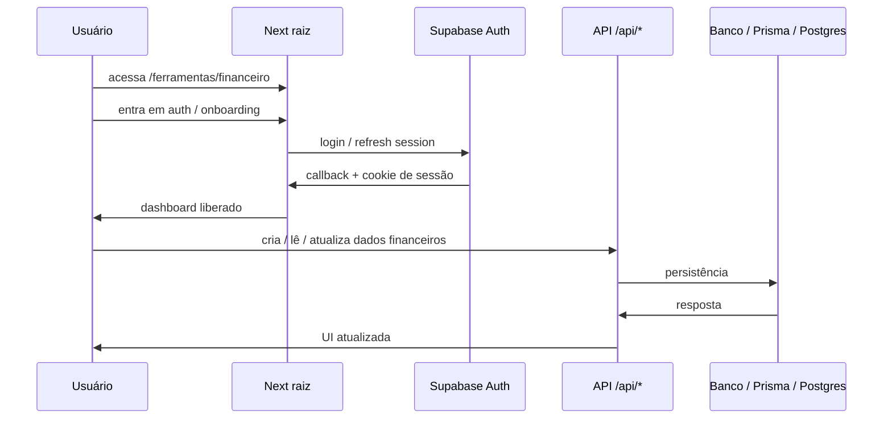

# Fluxograma — DevFlow Labs

Como **usuários** e **requests HTTP** trafegam no ecossistema: middleware, auth, billing, ferramentas e integrações.

- **Índice:** [README.md](./README.md)  
- **Irmão:** [TOPOLOGIA-DEVFLOW.md](./TOPOLOGIA-DEVFLOW.md) (onde cada parte roda)

---

## 1. Pipeline de request no app raiz

```mermaid
flowchart TD
  REQ[Request HTTP] --> MW{middleware.ts}

  MW -->|rota pública| PUB[Segue para página/rota]
  MW -->|rota protegida por JWT| JWT{JWT válido?}
  MW -->|rota com sessão Supabase| SB[updateSession]

  JWT -->|não| LOGIN[/login?next=...]
  JWT -->|sim| JWT_OK[segue autenticado]

  SB --> NEXT_SB[Next.js page / route]
  PUB --> NEXT_PUB[Next.js page / route]
  JWT_OK --> NEXT_JWT[Next.js page / route]
```

### Leitura prática

| Tipo | Exemplos | Comportamento |
|------|-----------|----------------|
| **Públicas (sem exigência de login)** | Home, landings, blog, produtos, demo, legal, hub de ferramentas sem sessão | Não passam pela ramificação **JWT** nem pela de **admin JWT**; seguem para o Next. |
| **JWT (produto WhatsApp “app”)** | Prefixos como `/inbox`, `/settings`, `/billing`, `/dashboard/whatsapp`, `/onboarding`, `/automation` (lista em `middleware.ts`) | Exigem cookie JWT; senão redirecionam para `/login`. |
| **Admin** | `/admin/*` exceto `/admin/login` | JWT (ou cookie de métricas em produção para subpaths específicos). |
| **Supabase session** | Fluxo padrão após ramificações acima | `updateSession` renova sessão Supabase quando há cookie (ex.: usuário do **Financeiro**). |

### Nota de engenharia (fidelidade ao código)

No código atual, **quase todas** as rotas que não são JWT nem admin passam por `updateSession` — ou seja, **não há um “atalho” que pula o middleware** para páginas públicas. Isso **não bloqueia** quem não está logado; apenas **atualiza a sessão** do Supabase quando aplicável. O diagrama acima separa **conceitualmente** “público” vs “área que depende de sessão Financeiro” para uso comercial e onboarding de time; tecnicamente, `PUB` e `SB` convergem no mesmo handler de sessão na implementação.

Fonte: `src/middleware.ts`.

---

## 2. Jornada principal do visitante

```mermaid
flowchart LR
  HOME[/ /] --> LANDINGS[Landings e SEO]
  HOME --> PRODUTOS[/produtos]
  HOME --> FERRAMENTAS[/ferramentas]
  HOME --> DEMO[/demo]

  LANDINGS --> CTA1[CTA comercial]
  PRODUTOS --> CTA2[CTA por produto]
  FERRAMENTAS --> CNPJ[/ferramentas/consulta-cnpj]
  FERRAMENTAS --> DIV[/ferramentas/divisao-de-contas]
  FERRAMENTAS --> FIN[/ferramentas/financeiro]

  CTA1 --> WHATSAPP[WhatsApp / contato]
  CTA1 --> DEMO
  CTA2 --> WHATSAPP
  CTA2 --> DEMO
  CNPJ --> TRY[Experimentação]
  DIV --> TRY
  FIN --> TRY
```

---

## 3. Estrutura pública do site (mapa de superfície)

```mermaid
flowchart TB
  ROOTSITE[devflowlabs.com.br] --> HOME[Home]
  ROOTSITE --> SEO[Landings SEO / automação WhatsApp]
  ROOTSITE --> BLOG[Blog / conteúdo]
  ROOTSITE --> PROD[Produtos]
  ROOTSITE --> TOOLS[Hub de ferramentas]
  ROOTSITE --> DEMO[Demo]
  ROOTSITE --> PRICING[/pricing /upgrade /billing]
  ROOTSITE --> CONTACT[Contato]
  ROOTSITE --> LEGAL[Privacidade / Termos / Cookies]
  ROOTSITE --> ADMIN[/admin/*]
```

---

## 4. Financeiro no domínio raiz



Callback canônico em produção: `https://devflowlabs.com.br/ferramentas/financeiro/auth/callback` (ver `ROTAS-ECOSSISTEMA-DEVFLOWLABS.md`).

---

## 5. Billing com Stripe

```mermaid
flowchart LR
  U[Usuário] --> PR[/pricing ou /upgrade]
  PR --> CHK["POST /api/billing/checkout"]
  CHK --> STRIPE[Stripe Checkout]
  STRIPE --> SUC[/billing / success / cancel]

  STRIPE --> WEBHOOK["POST /api/billing/webhook"]
  WEBHOOK --> BILLDB[(assinatura / usage / status)]

  U --> PORTAL["POST /api/billing/customer-portal"]
  PORTAL --> STRIPE
  STRIPE --> BILLRET[/billing?portal_return=1]
```

---

## 6. Produto WhatsApp em duas camadas

```mermaid
flowchart TB
  subgraph SITE["Site raiz — aquisição e entrada"]
    PAGES[Páginas públicas do produto]
    DEMOWA[/demo e /dashboard/whatsapp]
    ONB["POST /api/whatsapp/onboard"]
    CALLBACK["/api/whatsapp/onboard/callback"]
    WEBHOOK["POST /api/webhook/whatsapp"]
  end

  subgraph META["Meta / WhatsApp"]
    EMBED[Embedded Signup]
    CLOUD[WhatsApp Cloud API]
  end

  subgraph APP["apps/whatsapp-platform — operação SaaS"]
    INBOX[Inbox / automações / billing / time]
  end

  PAGES --> DEMOWA
  DEMOWA --> ONB
  ONB --> EMBED
  EMBED --> CALLBACK
  CLOUD --> WEBHOOK

  DEMOWA -. continuidade do produto .-> INBOX
```

---

## 7. O que mudou em relação a uma visão “só marketing”

1. **App raiz** = marketing **+** ferramentas **+** billing **+** APIs **+** parte do onboarding WhatsApp **+** Financeiro no mesmo domínio.  
2. **`apps/*`** = deploys **opcionais**; não descrevem o fluxo principal do visitante em `devflowlabs.com.br`.  
3. **`/api/*`** = backbone operacional (billing, webhook, CRUD, callbacks).  
4. **WhatsApp** = camada de **aquisição/entrada** no raiz **+** camada de **operação** no `apps/whatsapp-platform` quando deployado separado.

---

## 8. Versão curta para PR / commit

> Consolidamos o mapa do DevFlow Labs em dois níveis: **(1)** app raiz como centro público-operacional e **(2)** apps do monorepo como deploys independentes opcionais. O fluxograma explicita middleware, autenticação (JWT vs sessão Supabase vs superfície pública), billing, ferramentas e integrações externas de forma alinhada ao repositório.

---

*Última atualização: alinhado a `src/middleware.ts`, `ROTAS-ECOSSISTEMA-DEVFLOWLABS.md` e [TOPOLOGIA-DEVFLOW.md](./TOPOLOGIA-DEVFLOW.md).*
