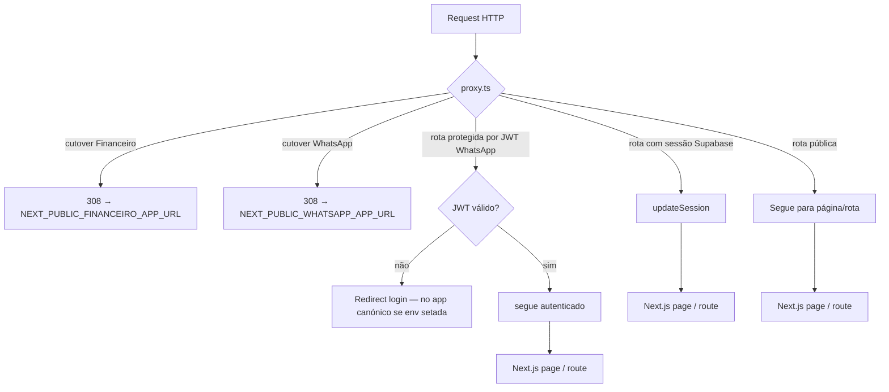
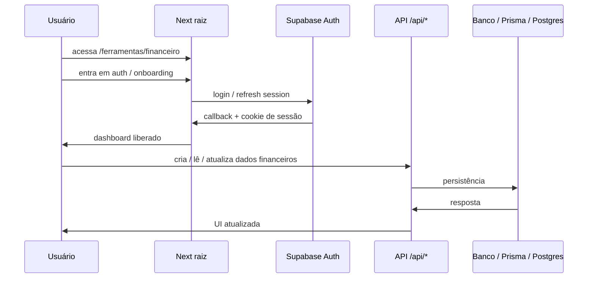
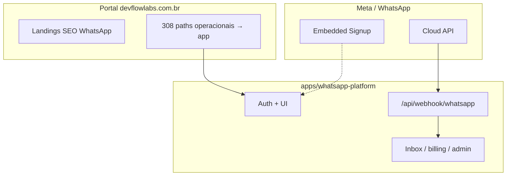

# Fluxograma — DevFlow Labs

Como **usuários** e **requests HTTP** trafegam no ecossistema: middleware, auth, billing, ferramentas e integrações.

- **Índice:** [README.md](./README.md)  
- **Irmão:** [TOPOLOGIA-DEVFLOW.md](./TOPOLOGIA-DEVFLOW.md) (onde cada parte roda)

---

## 1. Pipeline de request no app raiz



### Leitura prática

| Tipo | Exemplos | Comportamento |
|------|-----------|----------------|
| **Cutover 308** | Paths operacionais Financeiro (exceto landing/demo) e WhatsApp (lista em `@devflow/financeiro-routes` / `@devflow/whatsapp-routes`) | **Antes** de JWT/Supabase: redirect **308** para o host canónico do app quando `NEXT_PUBLIC_*_APP_URL` está definida. |
| **Públicas** | Home, landings WhatsApp, blog, produtos, demo, legal, hub ferramentas | Seguem para o Next (e `updateSession` quando aplicável). |
| **JWT (WhatsApp no portal)** | `/inbox`, `/settings`, … **só** se o request ainda não foi cortado para o app | Exigem cookie JWT; com cutover ativo estes paths recebem **308** primeiro. |
| **Admin** | `/admin/*` exceto `/admin/login` | JWT ou cookie de métricas (portal). |
| **Supabase** | Financeiro | `updateSession` após as ramificações acima. |

### Nota de engenharia (fidelidade ao código)

No código atual, **quase todas** as rotas que não são JWT nem admin passam por `updateSession` — ou seja, **não há um “atalho” que pula o middleware** para páginas públicas. Isso **não bloqueia** quem não está logado; apenas **atualiza a sessão** do Supabase quando aplicável. O diagrama acima separa **conceitualmente** “público” vs “área que depende de sessão Financeiro” para uso comercial e onboarding de time; tecnicamente, `PUB` e `SB` convergem no mesmo handler de sessão na implementação.

Fonte: `src/proxy.ts`.

---

## 2. Jornada principal do visitante

```mermaid
flowchart LR
  HOME[/ /] --> LANDINGS[Landings e SEO]
  HOME --> PRODUTOS[/produtos]
  HOME --> FERRAMENTAS[/ferramentas]
  HOME --> DEMO[/demo]

  LANDINGS --> CTA1[CTA comercial]
  PRODUTOS --> CTA2[CTA por produto]
  FERRAMENTAS --> CNPJ[/ferramentas/consulta-cnpj]
  FERRAMENTAS --> DIV[/ferramentas/divisao-de-contas]
  FERRAMENTAS --> FIN[/ferramentas/financeiro]

  CTA1 --> WHATSAPP[WhatsApp / contato]
  CTA1 --> DEMO
  CTA2 --> WHATSAPP
  CTA2 --> DEMO
  CNPJ --> TRY[Experimentação]
  DIV --> TRY
  FIN --> TRY
```

---

## 3. Estrutura pública do site (mapa de superfície)

```mermaid
flowchart TB
  ROOTSITE[devflowlabs.com.br] --> HOME[Home]
  ROOTSITE --> SEO[Landings SEO / automação WhatsApp]
  ROOTSITE --> BLOG[Blog / conteúdo]
  ROOTSITE --> PROD[Produtos]
  ROOTSITE --> TOOLS[Hub de ferramentas]
  ROOTSITE --> DEMO[Demo]
  ROOTSITE --> PRICING[/pricing /upgrade /billing]
  ROOTSITE --> CONTACT[Contato]
  ROOTSITE --> LEGAL[Privacidade / Termos / Cookies]
  ROOTSITE --> ADMIN[/admin/*]
```

---

## 4. Financeiro no domínio raiz



Callback canônico em produção: `https://devflowlabs.com.br/ferramentas/financeiro/auth/callback` (ver `ROTAS-ECOSSISTEMA-DEVFLOWLABS.md`).

---

## 5. Billing com Stripe

```mermaid
flowchart LR
  U[Usuário] --> PR[/pricing ou /upgrade]
  PR --> CHK["POST /api/billing/checkout"]
  CHK --> STRIPE[Stripe Checkout]
  STRIPE --> SUC[/billing / success / cancel]

  STRIPE --> WEBHOOK["POST /api/billing/webhook"]
  WEBHOOK --> BILLDB[(assinatura / usage / status)]

  U --> PORTAL["POST /api/billing/customer-portal"]
  PORTAL --> STRIPE
  STRIPE --> BILLRET[/billing?portal_return=1]
```

---

## 6. Produto WhatsApp — portal × app canónico



**Callback URL** e **Verify token** na Meta devem apontar para o **host do app**, não para o portal. Stripe webhook do produto: `POST /api/stripe/webhook` no mesmo app.

---

## 7. O que mudou em relação a uma visão “só marketing”

1. **App raiz** = portal **público-operacional**: marketing, ferramentas, Financeiro, **redirects 308** para apps canónicos.  
2. **`apps/whatsapp-platform`** = **runtime** do produto WhatsApp (webhook, auth, dados).  
3. **`/api/*` na raiz** = sobretudo Financeiro e ferramentas; **não** webhook WhatsApp do produto.  
4. **`apps/*`** = deploys independentes com domínio próprio quando aplicável.

---

## 8. Versão curta para PR / commit

> Mapa em dois níveis: **(1)** portal na raiz com cutover **308** para Financeiro e WhatsApp e **(2)** apps canónicos em `apps/*`. Proxy, JWT, Supabase e integrações Meta/Stripe alinhados ao código em `src/proxy.ts` e aos runbooks em `docs/architecture/`.

---

*Última atualização: cutover WhatsApp + Financeiro no `src/proxy.ts`, [ROTAS-ECOSSISTEMA-DEVFLOWLABS.md](./ROTAS-ECOSSISTEMA-DEVFLOWLABS.md), [TOPOLOGIA-DEVFLOW.md](./TOPOLOGIA-DEVFLOW.md).*
