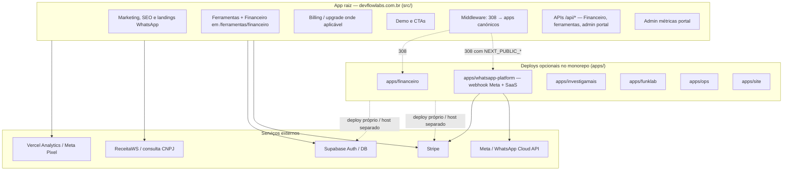
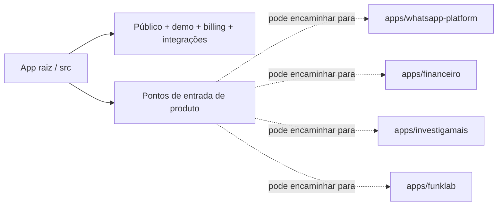

# Topologia — DevFlow Labs

Onde cada parte do ecossistema roda: **app raiz** como centro operacional em `devflowlabs.com.br`, **`apps/*`** como deploys independentes opcionais, e **serviços externos**.

- **Índice:** [README.md](./README.md)  
- **Irmão:** [FLUXOGRAMA-DEVFLOW.md](./FLUXOGRAMA-DEVFLOW.md) (como usuários e requests trafegam)

---

## 1. Visão geral

**Leitura:** o app raiz é **portal público-operacional** (marketing, ferramentas, Financeiro no mesmo domínio, APIs de dados do Financeiro). O **produto WhatsApp** opera no host do **`apps/whatsapp-platform`**; o portal só **redireciona 308** (e mantém landings SEO). Ver [CUTOVER-WHATSAPP-RUNBOOK-MAIN.md](../architecture/CUTOVER-WHATSAPP-RUNBOOK-MAIN.md).

---

## 2. App raiz vs monorepo

| Caminho | Papel típico |
|--------|----------------|
| **`src/` (raiz)** | **devflowlabs.com.br** — marketing, SEO, hub de ferramentas, Financeiro sob `/ferramentas/financeiro`, APIs de dados do Financeiro, billing onde existir na raiz; **sem** webhook/API operacional WhatsApp (cutover para o app). |
| **`apps/whatsapp-platform`** | Produto SaaS canónico (inbox, webhook Meta, Stripe, auth JWT, admin) — deploy típico em subdomínio dedicado. |
| **`apps/financeiro`** | Mesmo produto financeiro com base path próprio — deploy separado quando necessário. |
| **`apps/investigamais`**, **`apps/funklab`**, **`apps/ops`** | Produtos ou painéis com ciclo de release independente. |
| **`apps/site`** | Variante de build do marketing; o canônico de rotas públicas costuma ser a raiz. |

Referência de rotas: [ROTAS-ECOSSISTEMA-DEVFLOWLABS.md](./ROTAS-ECOSSISTEMA-DEVFLOWLABS.md).

---

## 3. Backbone `/api/*` no app raiz

Orquestra, entre outros:

- **Financeiro:** CRUD (despesas, regras, households, convites, etc.) — ver [ROTAS-ECOSSISTEMA-DEVFLOWLABS.md](./ROTAS-ECOSSISTEMA-DEVFLOWLABS.md)  
- **Ferramentas:** consulta CNPJ, leads, health  
- **Admin / analytics** do portal conforme rotas existentes  
- **WhatsApp (produto):** **não** na raiz após cutover — canónico em `apps/whatsapp-platform` (`/api/webhook/whatsapp`, `/api/auth/*`, etc.)

Detalhamento de fluxos: [FLUXOGRAMA-DEVFLOW.md](./FLUXOGRAMA-DEVFLOW.md).

---

## 4. Leitura executiva

| Camada | Papel |
|--------|--------|
| **App raiz (`src/`)** | Portal: marketing, SEO, ferramentas, Financeiro no domínio, middleware de cutover **308** para apps canónicos. |
| **`apps/*`** | Produtos com deploy próprio (Financeiro, WhatsApp Platform, etc.). |
| **`/api/*` (raiz)** | Backbone do Financeiro e ferramentas no portal; **webhook WhatsApp** no app dedicado. |
| **Externo** | Stripe, Supabase, Meta, ReceitaWS, analytics. |

---

## 5. Versão curta para PR / changelog

> Topologia: portal na raiz + produtos (WhatsApp, Financeiro, …) em `apps/*` com domínios próprios quando aplicável; Meta/Stripe do WhatsApp ligados ao app canónico.

---

*Última atualização: cutover WhatsApp (`@devflow/whatsapp-routes`, middleware), `ROTAS-ECOSSISTEMA-DEVFLOWLABS.md`, [ARCHITECTURE.md](../../ARCHITECTURE.md).*
