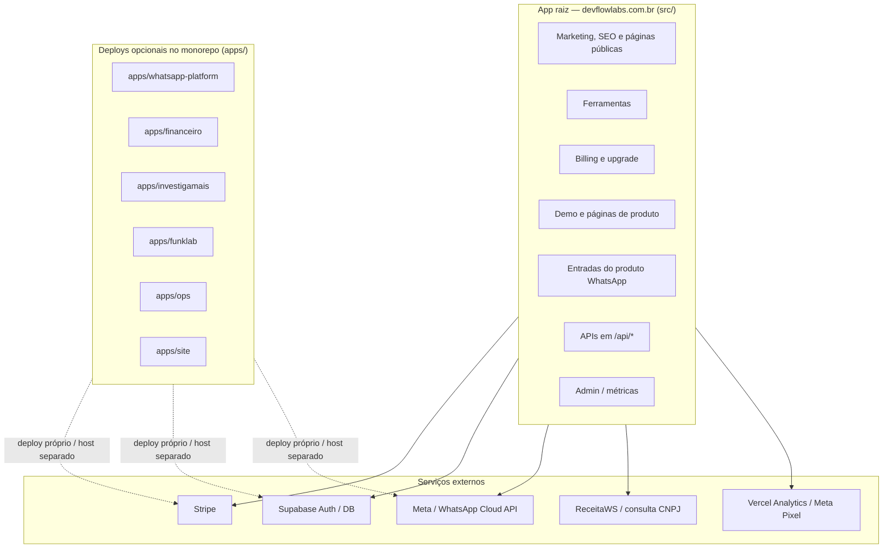
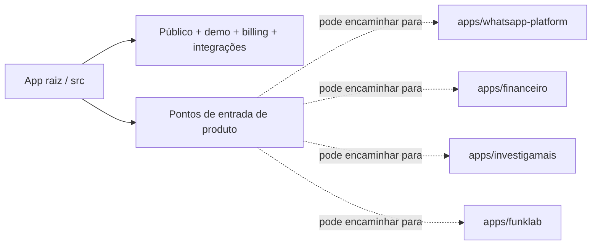

# Topologia — DevFlow Labs

Onde cada parte do ecossistema roda: **app raiz** como centro operacional em `devflowlabs.com.br`, **`apps/*`** como deploys independentes opcionais, e **serviços externos**.

- **Índice:** [README.md](./README.md)  
- **Irmão:** [FLUXOGRAMA-DEVFLOW.md](./FLUXOGRAMA-DEVFLOW.md) (como usuários e requests trafegam)

---

## 1. Visão geral

**Leitura:** o app raiz **não é só marketing** — concentra ferramentas, billing, parte do onboarding WhatsApp, webhooks, CRUD do Financeiro no mesmo domínio. Os diretórios em `apps/` são **cópias ou variantes deployáveis** do monorepo, não o fluxo principal do visitante em `devflowlabs.com.br`.

---

## 2. App raiz vs monorepo

| Caminho | Papel típico |
|--------|----------------|
| **`src/` (raiz)** | O que responde hoje em **devflowlabs.com.br** — marketing, SEO, hub de ferramentas, Financeiro sob `/ferramentas/financeiro`, `/api/*`, billing, demo, parte das entradas WhatsApp. |
| **`apps/whatsapp-platform`** | Produto SaaS completo (inbox, automações, billing do produto, time) — **deploy próprio** comum. |
| **`apps/financeiro`** | Mesmo produto financeiro com base path próprio — deploy separado quando necessário. |
| **`apps/investigamais`**, **`apps/funklab`**, **`apps/ops`** | Produtos ou painéis com ciclo de release independente. |
| **`apps/site`** | Variante de build do marketing; o canônico de rotas públicas costuma ser a raiz. |

Referência de rotas: [ROTAS-ECOSSISTEMA-DEVFLOWLABS.md](./ROTAS-ECOSSISTEMA-DEVFLOWLABS.md).

---

## 3. Backbone `/api/*` no app raiz

Orquestra, entre outros:

- **Billing:** checkout, customer portal, webhook Stripe  
- **Financeiro:** CRUD (despesas, regras, households, convites, etc.)  
- **WhatsApp:** onboard, callback, webhook unificado  
- **Ferramentas:** consulta CNPJ, leads, health  
- **Auth auxiliar** e **admin** conforme rotas existentes  

Detalhamento de fluxos: [FLUXOGRAMA-DEVFLOW.md](./FLUXOGRAMA-DEVFLOW.md).

---

## 4. Leitura executiva

| Camada | Papel |
|--------|--------|
| **App raiz (`src/`)** | Centro do ecossistema **público + operacional**: marketing, SEO, ferramentas, demo, billing, integrações e parte do onboarding. |
| **`apps/*`** | Produtos que **podem** rodar em deploy próprio sem depender do mesmo host. |
| **`/api/*`** | Backbone que conecta billing, webhooks, callbacks, CRUD e integrações. |
| **Externo** | Stripe, Supabase, Meta, ReceitaWS, analytics. |

---

## 5. Versão curta para PR / changelog

> Documentamos a **topologia** do DevFlow Labs: app raiz como centro público-operacional em `devflowlabs.com.br` e apps do monorepo como **deploys independentes opcionais**, com serviços externos explícitos.

---

*Última atualização: alinhado ao repositório e a `src/middleware.ts` + `ROTAS-ECOSSISTEMA-DEVFLOWLABS.md`.*
